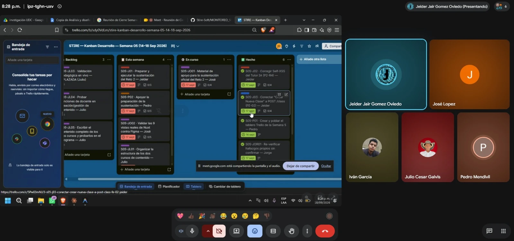
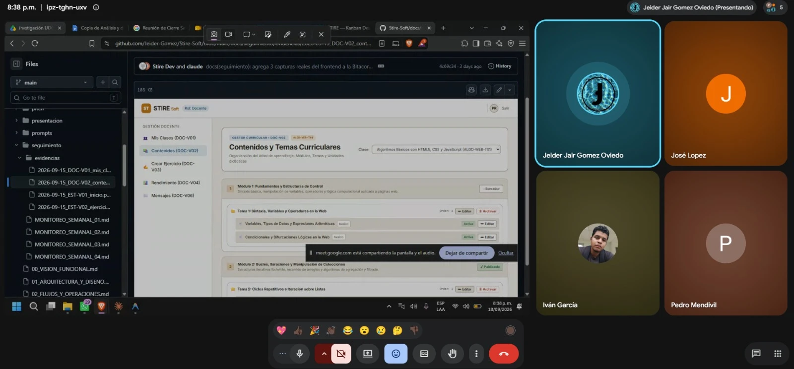

# 🚀 Bitácora de Monitoreo y Control N.º 6 — Proyecto: STIRE-Soft

**Curso:** DDSE3 — 2026-2  
**Grupo:** [G1 / G2]  
**Repositorio GitHub:** https://github.com/Jeider-Gomez/Stire-Soft  
**Semana:** 21 – 25 de septiembre de 2026  
**Cierre:** viernes 25 de septiembre, 8:00 p. m.  
**Tablero Kanban:** https://trello.com/b/H6uzX5Je/stire-kanban-desarrollo-semana-06-21-25-sep-2026

> **Regla de trabajo:** Trello contiene el flujo operativo y los checklists. GitHub contiene el código y las evidencias técnicas. Esta bitácora registra el resultado real de la semana y no duplica el detalle de las tarjetas.

> **Cierre (25/09):** la bitácora se cerró contra el Trello real y contra Git. El resultado está en la §7 y las
> evidencias de la reunión en la §6.1. En resumen: **ya se decidió cómo se despliega la aplicación, pero el
> despliegue no se hizo esta semana: pasa a la Semana 7**. José entregó el primer avance visual (paleta de colores),
> Jorge entregó su auditoría y la estructura de cursos de Julio también pasa a la Semana 7.

> **Bitácora anterior:** [`docs/seguimiento/MONITOREO_SEMANAL_05.md`](./docs/seguimiento/MONITOREO_SEMANAL_05.md) — cerrada el 18/09, actualizada el 19/09: el dueño del proyecto confirmó que la sustentación del Reto 2 sí se realizó (vía WhatsApp), lo que cierra 3 de los 4 pendientes (sustentación, apoyo de Pedro, material de José) — quedan 9 de 12 ítems con evidencia real. El único pendiente real que se traslada a esta semana en la §3 es la estructura de cursos de Julio.

---

## 👥 1. Estructura del equipo y roles

| Integrante | Rol principal y responsabilidades del Sprint | Horario de reunión individual | GitHub User |
| :--- | :--- | :--- | :--- |
| **Jeider Gómez** | **Líder Técnico:** frontend Nuxt, backend, integración y Tutor IA | **Miércoles 4:00–6:00 p. m.** | @Jeider-Gomez |
| **Jorge Cervantes** | **Gestión + Calidad:** QA general funcional, backend/API, integración, correcciones y resultado ejecutable | **Jueves 10:00 a. m.–12:00 p. m.** | @IvanGoats |
| **José López** | **UI/UX + Comunicación:** pruebas de usuario real, verificación de UI/UX y documentación visual del proyecto | **Miércoles 2:00–4:00 p. m.** | @JoseTheGoat90 |
| **Julio Galvis** | **Diseño Instruccional:** MODESEC, navegación y contenidos | **Jueves 4:00–6:00 p. m.** | @jcg0912 |
| **Pedro Romero** | **Documentación + Bitácora:** Trello, evidencias, seguimiento y cierre documental | **Jueves 4:00–6:00 p. m.** | @pedrorm20 |

**Reunión de equipo:** viernes 8:00 – 8:40 p. m.  
**Reportes:** martes y jueves, máximo 8:00 p. m.  
**Metodología:** [`docs/05_METODOLOGIA_Y_EQUIPO.md`](./docs/05_METODOLOGIA_Y_EQUIPO.md)

> **Nuevo en el Reto 3 (19/09):** además de avanzar el proyecto, el equipo practica y registra —de
> forma libre, sin exigir cubrir los 7 cada semana— "Los 7 Hábitos de la Gente Altamente Efectiva"
> (Covey), con checklist real en cada tarjeta de Trello — ver §3.1 abajo. Además, se tomó la
> decisión de arquitectura de despliegue del backend (ADR 09) — ver `S06-J03` en §3.

---

## 🎯 2. Objetivo del Sprint

Según el cronograma oficial (`docs/investigacion/fuentes-institucionales/cronograma.docx`), el Reto 3
ya se lanzó el viernes 18/09 (indicaciones entregadas al cierre de la Semana 5) y esta semana
(21–25/09) es **Semana B — trabajo autónomo**, dedicada a avanzar el Reto 3. En paralelo, el equipo
cierra el único pendiente real que la Semana 5 dejó sin evidencia (los otros 3 se confirmaron hechos
el 19/09 vía WhatsApp).

### Resultados esperados

1. Avance real y verificable del Reto 3 (alcance exacto a confirmar con el docente si las
   indicaciones del 18/09 no quedaron claras para todo el equipo).
2. Verificación manual del hallazgo BOLA cerrado por Codex el 16/09 (`activity-questions`) —
   quedó explícitamente pendiente en su propio informe (`docs/codex/informes/INFORME_2026-09-16_SESION_01.md` §5).
3. Estructura de los dos cursos organizada por Julio (único pendiente real que sigue de la Semana 5).
4. Pitch de sustentación del Reto 3 preparado (`S06-P04`).
5. Primer registro real de los 7 Hábitos por cada integrante (`S06-H-*`, ver §3.1).
6. Decisión de arquitectura de despliegue ejecutada: backend real accesible fuera de local
   (`S06-J03`, ver ADR 09).
7. Tablero Trello de la Semana 6 creado y bitácora cerrada el viernes, sin retraso.

> **Actualización 19/09:** el dueño del proyecto confirmó que la sustentación del Reto 2 sí se
> realizó, vía WhatsApp — ver `docs/seguimiento/MONITOREO_SEMANAL_05.md` §7. No queda pendiente de
> esta semana.

---

## 📋 3. Plan de trabajo semanal

> Tablero: https://trello.com/b/H6uzX5Je/stire-kanban-desarrollo-semana-06-21-25-sep-2026

### Jeider Gómez — Líder Técnico

- [x] **S06-J01 · Avanzar el Reto 3** según las indicaciones recibidas el 18/09 — confirmar alcance
  exacto si quedó ambiguo para el equipo.
- [x] **S06-J02 · Verificación manual del fix de Fase G (Codex, `activity-questions`)** — con backend
  y frontend reales levantados: un estudiante NO matriculado en la clase debe recibir `403` al pedir
  `GET /activity-questions/activity/:activityId`; uno matriculado con actividad publicada debe recibir
  las preguntas normalmente. Pasos exactos en `docs/codex/informes/INFORME_2026-09-16_SESION_01.md` §5.
- [ ] **S06-J03 · Ejecutar la decisión de despliegue** — frontend sin cambios en Vercel; backend +
  MariaDB a una plataforma con proceso persistente real (Railway recomendado, o una VM gratuita con
  el `docker-compose.yml` existente); el sandbox de ejecución se mantiene local, sin cambios de
  arquitectura. Detalle completo de la decisión y su justificación en
  `docs/ADR_DECISIONES_ARQUITECTURA.md` (ADR 09).
  *(Actualización 23–25/09: la decisión final es el ADR 13, que reemplaza a Railway porque cobra. Queda así:
  frontend estático en Cloudflare Pages o Vercel, backend y MariaDB en una VM de Oracle Always Free y correo
  por Gmail, a $0 y sin Pay As You Go.)*

### Pedro Romero — Gestión + Documentación

- [x] **S06-P01 · Tablero Trello de la Semana 6** — creado y poblado. *(19/09.)*
- [x] **S06-P02 · Bitácora** — mantenerla al día y cerrarla el viernes contra Trello **y Git**
  reales. Dar seguimiento a lo único que queda pendiente de la Semana 5 (estructura de cursos de
  Julio — los otros 3 ya se confirmaron hechos vía WhatsApp el 19/09) es parte de esta misma tarea
  de mantener la bitácora al día, no una tarea aparte.
- [x] **S06-P04 · Desarrollar el pitch de sustentación del Reto 3** — mismo formato que
  `docs/pitch/PITCH_SEMANA_03 Y 04.md`, actualizado con lo avanzado en las Semanas 5 y 6.

### José López — UI/UX + Comunicación

Responsabilidad explícita y semana por semana en Trello, para no saturarlo (una sola área del
proyecto por semana):

- [x] **S06-JO01 · Primer avance de la identidad visual: paleta institucional, encabezado y panel
  docente** — *objetivo ajustado el 25/09 a lo que José realmente trabajó esta semana:* paleta de colores
  `stire-*` (`tailwind.config.ts`, `main.css`), tipografía Poppins, encabezado (`HeaderNav.vue`) y panel docente
  `DOC-V01`. Todo está en el commit `7e9f314` del 21/09, con registro en `docs/identidad-visual/BITACORA.md`.
  *(El objetivo anterior, probar el Tutor IA como usuario y dejar capturas en `docs/material-visual/01-tutor-ia/`,
  pasa a la Semana 7, y el resto del plan se corre una semana.)*

### Julio Galvis — Diseño Instruccional

- [ ] **S06-JL01 · Organizar la estructura de los dos cursos de contenido** *(trasladada de
  `S05-JL01`. **Aplazada a la Semana 7** por decisión del equipo el 25/09)* — sigue siendo la tarea de mayor prioridad de Julio: bloquea
  `S05-JL05` (contenido completo) y da información real para decidir la progresión de Nivel 2 que
  Codex tiene pendiente (`docs/PLAN_MAESTRO.md` §6.2, candidato "progresión de 3 pasos para Nivel 2"
  — sigue esperando esta decisión, no es un olvido).

**En Backlog, sin cambios:**
- [ ] **S06-JL05** (antes `S05-JL05`) · Escribir el contenido completo de los dos cursos — depende de `S06-JL01`.
- [ ] **S06-JL03** · Validación pedagógica en vivo — aplazada hasta el despliegue en la nube.
- [ ] **S06-JL04** · Probar funciones de docente en creación/gestión de contenido — aplazada hasta el despliegue.

### Jorge Cervantes — Gestión + Calidad

- [x] **S06-JOR01 · Verificación manual del fix de Fase G** — mismo objetivo técnico que `S06-J02`,
  desde el ángulo de QA (reproducir el `403`/éxito con pasos documentados, no solo confirmar que
  "funciona").
- [x] **S06-JOR02 · Retomar 1-2 ángulos de `docs/ReportesQA/GUIA_AUDITORIA_2026-09-16.md` que la
  auditoría del 18/09 no alcanzó a cubrir** — no es obligatorio cubrirlos todos esta semana; prioridad
  sugerida: pruebas adversariales contra el Tutor IA (intentar que dé la respuesta completa de un
  ejercicio) y accesibilidad real con lector de pantalla en al menos 2 flujos.

> **Principio, sin cambios:** los agentes desarrollan/auditan el código; Jorge valida que el
> producto resultante funcione de forma general, esté correctamente integrado y pueda demostrarse.

### 3.1 Todo el equipo — Los 7 Hábitos de la Gente Altamente Efectiva (nuevo, Reto 3)

Además del proyecto, el Reto 3 pide que el equipo practique y registre "Los 7 Hábitos de la Gente
Altamente Efectiva" (Covey) — no leerlos, aplicarlos y dejar evidencia real. Es un registro libre:
no hay que cubrir los 7 hábitos todas las semanas, solo marcar los que de verdad se vivieron y
contar la historia real detrás.

**I. Victoria Privada** (autoconocimiento y disciplina personal): Hábito 1 · Ser Proactivo, Hábito 2
· Empezar con Fin en Mente, Hábito 3 · Poner Primero lo Primero.
**II. Victoria Pública** (cooperación efectiva): Hábito 4 · Pensar Ganar-Ganar, Hábito 5 · Primero
Entender (Luego Ser Entendido), Hábito 6 · Sinergizar.
**III. Renovación**: Hábito 7 · Afilar la Sierra (Física, Mental, Espiritual, Social/Emocional).

Cada integrante tiene su propia tarjeta de registro en Trello, con un checklist real de los 7
hábitos — se marcan los que se practicaron y se cuenta la anécdota real en un comentario de la
tarjeta. Se repite cada semana mientras dure el Reto 3:

- [x] **S06-H-JEIDER** · [`S06-H-JEIDER`](https://trello.com/c/cal309Mo) — hábitos 1, 5, 6 y 7, con su historia en la tarjeta.
- [ ] **S06-H-PEDRO** · [`S06-H-PEDRO`](https://trello.com/c/uA68ykbF)
- [ ] **S06-H-JOSE** · [`S06-H-JOSE`](https://trello.com/c/p30mm5MI)
- [ ] **S06-H-JULIO** · [`S06-H-JULIO`](https://trello.com/c/3oWs5vXe)
- [ ] **S06-H-JORGE** · [`S06-H-JORGE`](https://trello.com/c/QprA4Kd2)

---

## 🔄 4. Flujo Kanban del Sprint

```text
📥 BACKLOG → 📋 ESTA SEMANA → ⚙️ EN CURSO → ✅ HECHO
```

### Reglas del tablero

1. Máximo **3 tarjetas comprometidas por persona** en `Esta semana`.
2. Máximo **2 tarjetas simultáneas por persona** en `En curso`.
3. Las dependencias se escriben dentro de la tarjeta.
4. Una tarjeta bloqueada permanece en `En curso` y se marca con etiqueta roja + `🚧 BLOQUEADA`.
5. Una tarea no pasa a `Hecho` sin evidencia.
6. El código terminado debe tener respaldo en GitHub.
7. No se crean columnas adicionales para revisión, QA o bloqueos.
8. Las tareas operativas permanecen en Trello; la bitácora no copia sus checklists.

### Etiquetas visuales

- 🔵 **Azul:** desarrollo / frontend.
- 🔴 **Rojo:** riesgo, bloqueo o QA crítico.
- 🟣 **Morado:** diseño, contenidos y UI/UX.
- 🟠 **Naranja:** gestión y seguimiento.
- 🟢 **Verde:** trabajo estable.
- 🟡 **Amarillo:** trabajo en riesgo.

---

## ⚠️ 5. Riesgos vivos

1. **1 pendiente de la Semana 5 sin evidencia** (estructura de cursos de Julio) — se traslada como
   tarea real de esta semana (§3). Los otros 3 (sustentación, apoyo, material de José) se
   confirmaron hechos el 19/09 vía WhatsApp.
2. **Progresión de Nivel 2 y backend del panel de administrador** siguen bloqueados esperando
   decisiones del equipo (instruccional y de arquitectura respectivamente) — `docs/PLAN_MAESTRO.md`
   §6.2. Ninguna de las dos se resuelve sola con más tiempo; necesitan que alguien decida.
3. **Cobertura de auditoría QA parcial:** la pasada de Jorge del 18/09 no cubrió BOLA sistemático
   manual, pruebas adversariales del Tutor/Mastery, ni accesibilidad real — parte de eso ya se cerró
   por código (Fase G de Codex), pero la verificación manual/adversarial sigue abierta (`S06-JOR02`).
4. **Sandbox de tests:** fallos intermitentes por timing bajo memoria reducida en la máquina de
   desarrollo; repetir en aislado antes de declarar defecto. Distinto del sandbox de ejecución de
   código de estudiantes (`HardenedProcessSandboxAdapter`), que no tiene hallazgos abiertos — ver
   punto 6.
5. **Contenido:** unidades de aprendizaje sin sembrar más allá del currículo de demostración —
   depende de que Julio cierre `S06-JL01`.
6. **Despliegue real:** arquitectura ya decidida (ADR 09, 19/09) — backend + MariaDB fuera de
   Vercel, sandbox de ejecución se mantiene local. Lo que queda es la ejecución (`S06-J03`): crear
   la cuenta en la plataforma elegida y desplegar. La autorización OAuth del conector de Vercel
   sigue pendiente, ahora acotada solo al frontend.
   *(Al cierre, 25/09: **la forma de desplegar ya está decidida** en el ADR 13, a $0 y sin Pay As You Go, pero **el
   despliegue no se hizo esta semana y pasa a la Semana 7**. Lo técnico ya está preparado y verificado con Docker
   real: Dockerfile, `docker-compose.prod.yml`, `/health`, copia diaria, frontend estático y la guía
   `docs/DESPLIEGUE.md`. Falta crear las cuentas y seguir la guía. Riesgo aceptado: Oracle puede reclamar una máquina gratuita con poco uso. Por eso la copia semanal
   fuera de la máquina es obligatoria.)*

---

## 📅 6. Seguimiento

### Martes

- Qué terminó, qué está haciendo, qué falta, si hay bloqueo.

### Jueves

- Qué lleva terminado, qué puede cerrar el viernes, qué está en riesgo, qué necesita de otro.

### Viernes

- Revisar Trello y GitHub, validar evidencias, registrar riesgos nuevos, actualizar esta bitácora, preparar el siguiente sprint.

### 6.1 Evidencias de la reunión de arranque y cierre (viernes 18/09)

La reunión de equipo del **viernes 18/09 (8:00–8:40 p. m., Google Meet)** cerró la Semana 5 y arrancó esta
Semana 6. Las dos capturas son de ese día, **18/09**, no del 25/09.

| Hora | Qué se revisó | Captura |
|---|---|---|
| 8:28 p. m. | **Revisión del Trello de la Semana 5**: estado de cada tarjeta antes de cerrarla y de planear la Semana 6. Participantes en pantalla: Jeider Gómez (presentando), José López, Iván García, Julio César Galvis y Pedro Mendivil. | [`2026-09-18_reunion_2028_revision_trello_semana5.webp`](./docs/seguimiento/evidencias/2026-09-18_reunion_2028_revision_trello_semana5.webp) |
| 8:38 p. m. | **Revisión de la bitácora y de sus evidencias en GitHub**: capturas reales del frontend en `docs/seguimiento/evidencias/`, como la de la pantalla `DOC-V02`. Participantes en pantalla: Jeider Gómez (presentando), José López, Iván García y Pedro Mendivil. | [`2026-09-18_reunion_2038_revision_bitacora_y_evidencias.webp`](./docs/seguimiento/evidencias/2026-09-18_reunion_2038_revision_bitacora_y_evidencias.webp) |





---

## 🧾 7. Resultado del Sprint — verificado contra Trello y Git el 25/09/2026

> Mismo criterio que cerró las Semanas 4 y 5: **solo se marca `[x]` lo que tiene evidencia real**, sea un commit,
> un archivo o una prueba registrada. Las tarjetas de Trello se movieron a `✅ Hecho` con un comentario que cita esa
> evidencia.

### Jeider Gómez

- [x] Avance del Reto 3 documentado. *(En `main`: Fase 24 `4ca0301` (curso desde cero, 6 tipos de ejercicio,
  gestión de clase, perfil y usuarios), Fase 25 `0bbf83f`/`1792db9`/`7adc06e` (ejercicios de HTML y CSS calificados
  por reglas), Fase 26 `f8011c3`, recuperación de contraseña por correo `07eca74` y 11 correcciones de la ola del
  23/09. Detalle en `CHANGELOG.md`.)*
- [x] Fix de Fase G verificado manualmente. *(25/09, en vivo: backend real `f8011c3` con MariaDB real (base
  desechable, migraciones y seed de demo) y peticiones HTTP reales a `GET /activity-questions/activity/2`. Resultados:
  estudiante matriculado **200** con la pregunta, sin los casos ocultos; estudiante registrado pero no matriculado
  **403** «No estás matriculado en esta clase»; sin sesión **401**. Detalle en el comentario de la tarjeta.)*
- [x] Decisión de cómo desplegar. *(ADR 13, 23/09: frontend estático en Cloudflare Pages o Vercel, backend y MariaDB
  en una VM de Oracle Always Free y correo por Gmail. Costo $0 y sin Pay As You Go, por decisión del 25/09.)*
- [ ] Backend real desplegado fuera de local. ***No se desplegó esta semana: aplazado a la Semana 7.*** *(Lo técnico
  ya está preparado y verificado con Docker real, y la guía `docs/DESPLIEGUE.md` está escrita. Falta crear las
  cuentas (Oracle, Cloudflare/Vercel, Gmail, DuckDNS) y ejecutar la guía. `S06-J03` queda `En curso`.)*
- [x] Registro de sus 7 Hábitos (`S06-H-JEIDER`, Reto 3). *(Hábitos 1, 5, 6 y 7. Esta semana trató de ser más
  proactivo con el proyecto y más empático con el equipo. Además de la reunión de cierre, tuvo reuniones aparte con
  algunos integrantes para explicarles temas del proyecto, y estuvo viendo videos de programación. La historia completa
  está en su tarjeta.)*

### Pedro Romero

- [x] Tablero de la Semana 6 creado. *(19/09.)*
- [x] Bitácora cerrada el viernes 25/09, sin retraso, verificada contra Trello y Git. Incluye el seguimiento al
  pendiente de Julio y las evidencias de la reunión del 18/09 (§6.1).
- [x] Pitch de sustentación del Reto 3. *(Se marca hecho al cierre: el pitch se desarrolla después de la reunión de
  cierre, así que el archivo se agrega a `docs/pitch/` y se edita cuando esté listo. El Reto 3 es el de los 7 Hábitos
  que pidió el profesor.)*

### José López

- [x] Primer avance de la identidad visual aplicado en la página real. *(Objetivo ajustado el 25/09. Commit
  `7e9f314`, 21/09: paleta de colores institucional `stire-*`, tipografía Poppins, encabezado y panel docente
  `DOC-V01`, registrado en `docs/identidad-visual/BITACORA.md`. Jorge también lo revisó en su auditoría del 23/09,
  §5.7. Pendiente menor: confirmar con el dueño el botón «Tutor IA» del encabezado.)*
- *(Probar el Tutor IA como usuario y la carpeta `docs/material-visual/01-tutor-ia/` pasan a la Semana 7.)*

### Julio Galvis

- [ ] Estructura de los dos cursos organizada. ***Aplazada a la Semana 7*** *(decisión del equipo, 25/09). Aviso
  para Julio: **ya se decidió cómo desplegar la aplicación y el despliegue se hace la Semana 7**. Con eso se
  desbloquean también sus dos tareas que esperaban el despliegue: la validación pedagógica en vivo (`S06-JL03`) y probar las funciones de docente
  (`S06-JL04`).*

### Jorge Cervantes

- [x] Fix de Fase G verificado (QA). *(Auditoría entregada el 23/09:
  `docs/ReportesQA/REPORTE_AUDITORIA_QA_STIRE_23-09.md`, commit `07fccdb`. La §5.4 hace el barrido de control de
  acceso por módulo e incluye `activity-questions`. La reproducción en vivo del 403 y del 200 quedó registrada
  arriba, en `S06-J02`.)*
- [x] Ángulos adicionales de `GUIA_AUDITORIA_2026-09-16.md` cubiertos. *(Mismo reporte: §4.2 pruebas
  adversariales contra el Tutor IA, §5.3 accesibilidad y §5.5 concurrencia. Veredicto «APTO CON RECOMENDACIONES
  MENORES». Precisión en `CHANGELOG.md`, 23/09: auditó el commit `ef88916`, así que no alcanzó a ver lo integrado
  después.)*

### Todo el equipo

- [ ] Registro de los 7 Hábitos por cada integrante (`S06-H-*`, §3.1). *(Al cierre solo Jeider tiene el suyo, ver
  arriba. A Pedro, José, Julio y Jorge les falta marcar sus hábitos y contar su historia en su tarjeta.)*

**Resumen de cierre:** 10 de 13 ítems cerrados. La forma de desplegar ya está decidida, pero el despliegue se aplazó a
la Semana 7. La estructura de cursos de Julio también pasa a la Semana 7 por decisión del equipo. Faltan los registros
de 7 Hábitos de 4 integrantes.

**Para la Semana 7:** ejecutar el despliegue (`S06-J03`); estructura de cursos de Julio y, ya con la app desplegada,
sus pruebas en vivo; prueba del Tutor IA como usuario (José); subir el archivo del pitch del Reto 3 a `docs/pitch/`;
7 Hábitos de cada integrante.

---

## 🗂️ 8. Historial de bitácoras

| N.º | Semana | Documento |
|---|---|---|
| 1 | 17 – 21 de agosto de 2026 | [`MONITOREO_SEMANAL_01.md`](./docs/seguimiento/MONITOREO_SEMANAL_01.md) |
| 2 | 24 – 28 de agosto de 2026 | [`MONITOREO_SEMANAL_02.md`](./docs/seguimiento/MONITOREO_SEMANAL_02.md) |
| 3 | 31 de agosto – 4 de septiembre de 2026 | [`MONITOREO_SEMANAL_03.md`](./docs/seguimiento/MONITOREO_SEMANAL_03.md) |
| 4 | 7 – 11 de septiembre de 2026 | [`MONITOREO_SEMANAL_04.md`](./docs/seguimiento/MONITOREO_SEMANAL_04.md) |
| 5 | 14 – 18 de septiembre de 2026 | [`MONITOREO_SEMANAL_05.md`](./docs/seguimiento/MONITOREO_SEMANAL_05.md) |
| 6 | 21 – 25 de septiembre de 2026 | `MONITOREO_SEMANAL.md` (este documento) |

---

*Bitácora N.º 6 · Semana del 21 al 25 de septiembre de 2026.*  
*Responsable de seguimiento y cierre documental: Pedro Romero.*  
*Cerrada el 25 de septiembre de 2026, con verificación cruzada contra Trello y Git.*
