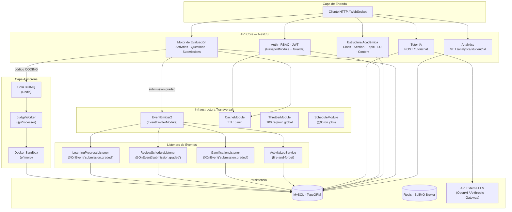

# STIRE — 01. Arquitectura y Diseño de Base de Datos
**Documento Maestro de Arquitectura, Decisiones de Diseño y Esquema Relacional**

---

## 1. Filosofía Arquitectónica

STIRE (Sistema Tutor Inteligente para la Resolución de Ejercicios) está estructurado bajo los principios de **Domain-Driven Design (DDD) adaptados a NestJS**. Cada módulo dentro de `src/` representa un **Bounded Context** autocontenido, encapsulando sus propias entidades, DTOs, controladores, servicios y repositorios.

### Principio de Desacoplamiento Total
Para asegurar la escalabilidad y mitigar el crecimiento de un monolito inmanejable:
- Los módulos **no realizan llamadas imperativas directas** entre dominios diferentes para efectos secundarios no esenciales.
- Se utiliza una **arquitectura orientada a eventos** (`EventEmitter2`). El módulo emisor notifica la ocurrencia de un evento pedagógico relevante (por ejemplo, `submission.graded`), y los módulos suscriptores (como analíticas, progreso, gamificación y repasos espaciados) reaccionan de manera asíncrona y pasiva.
- Esto garantiza que fallos en procesos secundarios no interrumpan o retrasen la respuesta inmediata al estudiante.

---

## 2. Decisiones Arquitectónicas Clave (ADRs)

### ADR 01: Domain-Driven Design (DDD) y Modularidad Estricta
*   **Decisión:** Organización del backend en dominios aislados.
*   **Justificación:** Plataformas de aprendizaje masivo y adaptativo incrementan rápidamente su complejidad. Al aislar contextos como `activities`, `submissions` y `learning-progress`, el motor de evaluación puede optimizarse y escalar independientemente de los servicios de tutoría o del CRUD institucional.
*   **Consecuencias:** Mayor número de archivos estructurados e inyección desacoplada a través del sistema de módulos de NestJS.

### ADR 02: Motor de Evaluación Desacoplado (Strategy Pattern)
*   **Decisión:** Implementar el patrón estrategia (`Strategy`) para procesar las entregas.
*   **Justificación:** Centralizar las calificaciones en un bloque condicional gigante violaría el principio de Abierto/Cerrado (Open/Closed). Mediante `IEvaluatorStrategy` y una factoría dinámica, la plataforma puede incorporar nuevos tipos de ítems evaluativos (ej. "Análisis estático de código", "MCQ de múltiples columnas") sin necesidad de alterar el core de `SubmissionsService`.

### ADR 03: Sandboxing Asíncrono para Código (Judge Engine)
*   **Decisión:** Delegar la compilación e integración del código entregado por los estudiantes de forma aislada y no síncrona.
*   **Justificación:** La ejecución directa de código de usuario en el servidor presenta riesgos de inyección de comandos maliciosos y de bloqueo del *Event Loop*. Se emplea una combinación de colas distribuidas (`BullMQ` sobre `Redis`) y contenedores efímeros Docker para aislar las ejecuciones con límites estrictos de CPU y memoria.

### ADR 04: RAG y Memoria Contextual para el Tutor Inteligente (IA)
*   **Decisión:** Alimentar al LLM del Tutor con datos agregados en el prompt de sistema, incluyendo el Mastery de la unidad y el historial reciente de diálogos.
*   **Justificación:** Un chat conversacional plano carece de valor educativo personalizado. Inyectar datos específicos de `LearningProgress` y el contexto desde el repositorio de historial pedagógico transforma al modelo de lenguaje en un tutor adaptativo capaz de reaccionar a las debilidades del estudiante.

### ADR 05: Event-Driven Architecture para Efectos Secundarios de Calificación
*   **Decisión:** El recálculo de analíticas, actualización de dominios y agendamientos del algoritmo SM-2 ocurren fuera de la transacción de calificación mediante eventos de dominio.
*   **Justificación:** Reduce los tiempos de respuesta del request HTTP principal. El estudiante recibe la notificación de calificación inmediatamente al terminar la transacción base, delegando a procesos en background el resto de las actualizaciones pesadas de base de datos.

---

## 3. Arquitectura del Sistema (Vista General)



---

## 4. Reglas Inquebrantables del Modelo de Datos

Cualquier extensión o modificación de persistencia en STIRE debe alinearse con los siguientes principios:

*   **REGLA #1 — Prohibición de `@ManyToMany()` automático de TypeORM:**
    No se permite el uso del decorador de mapeo relacional directo implícito. TypeORM genera tablas puente que no pueden auditarse ni extenderse en el futuro. Toda relación muchos a muchos debe declararse explícitamente como una entidad puente física.
*   **REGLA #2 — Entidades Puente Explícitas obligatorias:**
    Cada relación N:M debe representarse con una clase TypeScript decorada con `@Entity()`, llave primaria (PK) propia, llaves foráneas (FK) declaradas explícitamente y campos de auditoría o de negocio adicionales (ej. `joinedAt`, `score`, `isCorrect`). Ejemplos: `Enrollment`, `SubmissionAnswer`.
*   **REGLA #3 — Soft Delete en Entidades Core:**
    Las entidades clave de la estructura académica y evaluación (como `activities`, `submissions`, `learning_units`) deben utilizar `@DeleteDateColumn()` (`deletedAt`). El borrado físico de registros de usuario o académicos está prohibido, excepto para registros de logs puramente acumulativos.
*   **REGLA #4 — Relaciones con Cascada Explícita:**
    Toda anotación `@ManyToOne` debe declarar la política `onDelete` de forma explícita (e.g., `CASCADE`, `SET NULL`, `RESTRICT`) para prevenir inconsistencias o registros huérfanos.
*   **REGLA #5 — Política de Primary Keys (PK):**
    - `INT AUTO_INCREMENT` se reserva para entidades jerárquicas y catálogos estáticos no expuestos de manera sensible en la interfaz del cliente (ej. `users`, `classes`, `learning_units`).
    - `UUID` se utiliza obligatoriamente para registros altamente transaccionales o expuestos públicamente en rutas URL (ej. `submissions`, `enrollments`, `activity_logs`, `execution_results`).

---

## 5. Modelo Entidad-Relación (MER)

```mermaid
erDiagram
    %% Identidad
    USER ||--o{ USER_AFFILIATION : "tiene (1:N)"
    USER ||--o{ ENROLLMENT : "se inscribe (1:N)"
    USER ||--o{ CLASS : "dicta (1:N)"
    INSTITUTION ||--o{ PROGRAM : "ofrece (1:N)"
    PROGRAM ||--o{ USER_AFFILIATION : "afilia (1:N)"

    %% Jerarquía Académica
    CLASS ||--o{ ENROLLMENT : "contiene estudiantes (1:N)"
    CLASS ||--o{ SECTION : "se divide en (1:N)"
    SECTION ||--o{ TOPIC : "agrupa (1:N)"
    TOPIC ||--o{ LEARNING_UNIT : "contiene (1:N)"

    %% Contenido y Actividades
    LEARNING_UNIT ||--o{ CONTENT : "tiene teoría (1:N)"
    LEARNING_UNIT ||--o{ ACTIVITY : "tiene práctica (1:N)"
    ACTIVITY_TYPE ||--o{ ACTIVITY : "categoriza (1:N)"
    ACTIVITY ||--o{ ACTIVITY_QUESTION : "contiene (1:N)"

    %% Evaluación (Entidades Puente)
    USER ||--o{ SUBMISSION : "realiza intentos (1:N)"
    ACTIVITY ||--o{ SUBMISSION : "recibe intentos (1:N)"
    SUBMISSION ||--o{ SUBMISSION_ANSWER : "registra respuestas (1:N)"
    ACTIVITY_QUESTION ||--o{ SUBMISSION_ANSWER : "es respondida por (1:N)"
    SUBMISSION_ANSWER ||--o| EXECUTION_RESULT : "genera output código (1:0..1)"

    %% Inteligencia Adaptativa
    USER ||--o{ LEARNING_PROGRESS : "tiene dominio en (1:N)"
    LEARNING_UNIT ||--o{ LEARNING_PROGRESS : "es medida por (1:N)"
    USER ||--o{ REVIEW_SCHEDULE : "tiene repaso programado (1:N)"
    LEARNING_UNIT ||--o{ REVIEW_SCHEDULE : "genera repaso en (1:N)"

    %% Prerrequisitos
    LEARNING_UNIT ||--o{ PREREQUISITE : "es requerida por (targetUnitId)"
    LEARNING_UNIT ||--o{ PREREQUISITE : "requiere (requiredUnitId)"

    %% Tutor IA
    USER ||--o{ TUTOR_CONVERSATION : "conversa (1:N)"

    %% Logs y Gamificación
    USER ||--o{ ACTIVITY_LOG : "genera eventos (1:N)"
    USER ||--o{ ACHIEVEMENT : "desbloquea (1:N)"
```

---

## 6. Diccionario de Datos del Sistema

### 6.1 Identidad y Estructura Organizativa

#### Tabla `users`
Guarda el registro maestro de los usuarios registrados y sus credenciales sanitizadas.
*   `id` (`INT AUTO_INCREMENT`, PK): Identificador secuencial.
*   `email` (`VARCHAR`, UNIQUE, NOT NULL): Correo electrónico del usuario.
*   `password` (`VARCHAR`, NOT NULL, select: false): Hash bcrypt de la contraseña (excluido por defecto en consultas de base de datos).
*   `fullName` (`VARCHAR`, NOT NULL): Nombre completo del usuario.
*   `role` (`ENUM('admin', 'docente', 'estudiante')`, DEFAULT: 'estudiante'): Nivel de acceso para control RBAC.
*   `isActive` (`BOOLEAN`, DEFAULT: true): Permite deshabilitar accesos sin eliminar historial físico.
*   `createdAt` / `updatedAt` (`TIMESTAMP`): Timestamps automáticos de auditoría.

#### Tabla `user_affiliations` _(Entidad Puente: User ↔ Program)_
*   `id` (`INT AUTO_INCREMENT`, PK): Identificador único.
*   `userId` (`INT`, FK → `users` ON DELETE CASCADE): Usuario.
*   `programId` (`INT`, FK → `programs` ON DELETE RESTRICT): Programa de estudios al que pertenece.
*   `roleType` (`VARCHAR`, NOT NULL): Rol que asume institucionalmente (ej. "estudiante", "docente").
*   `currentSemester` (`INT`, NULLABLE): Semestre actual que cursa el estudiante.
*   `isActive` (`BOOLEAN`, DEFAULT: true): Vigencia de la afiliación.

#### Tabla `institutions`
*   `id` (`INT AUTO_INCREMENT`, PK): Identificador de la institución educativa.
*   `name` (`VARCHAR`, UNIQUE, NOT NULL): Nombre oficial de la universidad o colegio.

#### Tabla `programs`
*   `id` (`INT AUTO_INCREMENT`, PK): Identificador del plan académico.
*   `name` (`VARCHAR`, NOT NULL): Nombre de la carrera o programa (ej. "Ingeniería de Sistemas").
*   `maxSemesters` (`INT`, NOT NULL): Cantidad máxima de semestres curriculares.
*   `institutionId` (`INT`, FK → `institutions` ON DELETE CASCADE): Institución dueña del programa.

---

### 6.2 Estructura y Jerarquía Académica

La jerarquía es **secuencial y lineal**:
`Clase (Curso) -> Sección (Corte) -> Tema (Topic) -> Unidad de Aprendizaje (LU) -> Contenidos / Actividades`.

#### Tabla `classes`
*   `id` (`INT AUTO_INCREMENT`, PK): Identificador de la clase.
*   `name` (`VARCHAR`, NOT NULL): Nombre descriptivo (ej. "Algoritmia I").
*   `description` (`TEXT`, NULLABLE): Resumen temático.
*   `code` (`VARCHAR`, UNIQUE, NOT NULL): Código alfanumérico para autoinscripción del estudiante.
*   `teacherId` (`INT`, FK → `users`, INDEX): Docente asignado a cargo del curso.
*   `isActive` (`BOOLEAN`, DEFAULT: true): Estado operativo de la clase.
*   `startDate` / `endDate` (`DATE`, NULLABLE): Fechas de inicio y finalización de clases.
*   `maxStudents` (`INT`, NULLABLE): Límite de alumnos en el grupo.

#### Tabla `enrollments` _(Entidad Puente: User ↔ Class)_
*   `id` (`UUID`, PK): Identificador único global.
*   `classId` (`INT`, FK → `classes` ON DELETE CASCADE): Clase asociada.
*   `studentId` (`INT`, FK → `users` ON DELETE CASCADE): Estudiante matriculado.
*   `status` (`ENUM('active', 'dropped', 'completed')`, DEFAULT: 'active'): Estado de participación del alumno en el curso.
*   `joinedAt` (`TIMESTAMP`, DEFAULT: CURRENT_TIMESTAMP): Fecha de ingreso.
*   `leftAt` (`TIMESTAMP`, NULLABLE): Fecha de deserción o abandono voluntario.
*   `lastActivityAt` (`TIMESTAMP`, NULLABLE): Registro de la última interacción del estudiante en el curso.
*   *Restricción UNIQUE:* (`classId`, `studentId`) evita duplicados en un mismo curso.

#### Tabla `sections`
*   `id` (`INT`, PK): Identificador correlativo del corte académico.
*   `title` (`VARCHAR`, NOT NULL): Nombre del corte o módulo (ej. "Primer Corte - Sintaxis Básica").
*   `description` (`TEXT`, NULLABLE): Alcance pedagógico.
*   `order` (`INT`, DEFAULT: 0): Orden secuencial de visualización.
*   `isActive` (`BOOLEAN`, DEFAULT: true): Control de visualización al estudiante.
*   `classId` (`INT`, FK → `classes` ON DELETE CASCADE): Curso al que pertenece.

#### Tabla `topics`
*   `id` (`INT`, PK): Identificador.
*   `title` (`VARCHAR`, NOT NULL): Nombre del tema (ej. "Estructuras Repetitivas").
*   `description` (`TEXT`, NULLABLE): Introducción conceptual.
*   `order` (`INT`, DEFAULT: 0): Posición del tema dentro de la sección.
*   `isActive` (`BOOLEAN`, DEFAULT: true): Estado de visibilidad.
*   `sectionId` (`INT`, FK → `sections` ON DELETE CASCADE): Sección que lo agrupa.

#### Tabla `learning_units`
*   `id` (`INT`, PK): Identificador.
*   `title` (`VARCHAR`, NOT NULL): Nombre de la unidad atómica de evaluación (ej. "Ciclos While").
*   `description` (`TEXT`, NULLABLE): Objetivo pedagógico específico de la unidad.
*   `difficulty` (`ENUM('BASICO', 'INTERMEDIO', 'AVANZADO')`, DEFAULT: 'BASICO'): Dificultad base de la unidad.
*   `order` (`INT`, DEFAULT: 0): Ubicación respecto a otras unidades del mismo Topic.
*   `isActive` (`BOOLEAN`, DEFAULT: true): Publicada o deshabilitada.
*   `topicId` (`INT`, FK → `topics` ON DELETE CASCADE): Tema padre.

---

### 6.3 Contenido, Actividades y Preguntas

#### Tabla `contents`
*   `id` (`INT`, PK): Identificador único del recurso didáctico.
*   `title` (`VARCHAR`, NOT NULL): Nombre del recurso (ej. "Tutorial de Condicionales").
*   `type` (`ENUM('text', 'video', 'link', 'pdf')`, NOT NULL): Formato físico del archivo o enlace.
*   `data` (`TEXT`, NOT NULL): Texto en markdown, URL externa o ruta del recurso.
*   `order` (`INT`, DEFAULT: 0): Secuencia de lectura.
*   `learningUnitId` (`INT`, FK → `learning_units` ON DELETE CASCADE): Unidad a la que da soporte conceptual.

#### Tabla `activity_types`
*   `id` (`INT AUTO_INCREMENT`, PK): Catálogo de modalidades evaluativas.
*   `name` (`VARCHAR`, NOT NULL): Nombre (ej. "Quiz Corto", "Parcial Teórico-Práctico", "Taller Guiado").
*   `description` (`TEXT`, NULLABLE): Detalles.
*   `isEvaluative` (`BOOLEAN`, DEFAULT: true): Indica si cuenta para la nota ponderada o es formativo.
*   `baseWeight` (`FLOAT`, DEFAULT: 1.0): Factor multiplicador del peso.

#### Tabla `activities`
*   `id` (`INT`, PK): Identificador del examen o taller.
*   `learningUnitId` (`INT`, FK → `learning_units`, INDEX): Unidad a evaluar.
*   `activityTypeId` (`INT`, FK → `activity_types` ON DELETE RESTRICT): Tipo de actividad asignada.
*   `createdBy` (`INT`, FK → `users` ON DELETE RESTRICT): Docente autor.
*   `title` (`VARCHAR(200)`, NOT NULL): Título público.
*   `description` (`TEXT`, NULLABLE): Instrucciones, reglas de entrega y límites.
*   `difficulty` (`ENUM('BASICO', 'INTERMEDIO', 'AVANZADO')`, DEFAULT: 'BASICO'): Dificultad declarada de la actividad.
*   `totalPoints` (`INT`, DEFAULT: 100): Puntuación máxima posible.
*   `passingScore` (`INT`, DEFAULT: 60): Mínimo necesario para aprobar e impactar favorablemente el Mastery.
*   `attemptsAllowed` (`INT`, DEFAULT: 3): Cantidad de intentos permitidos al estudiante.
*   `timeLimit` (`INT`, NULLABLE): Duración máxima en minutos para completar la actividad (nulo = sin límite).
*   `order` (`INT`, DEFAULT: 0): Orden en la unidad.
*   `status` (`ENUM('draft', 'review', 'published', 'archived')`, DEFAULT: 'draft'): Ciclo de vida de publicación de la actividad.
*   `isRequired` (`BOOLEAN`, DEFAULT: false): Si bloquea el avance de la unidad en caso de no ser completada.
*   `adaptiveWeight` (`FLOAT`, DEFAULT: 1.0): Ponderador especial para algoritmos adaptativos.
*   `publishedAt` (`TIMESTAMP`, NULLABLE): Fecha de publicación efectiva.

#### Tabla `activity_questions`
*   `id` (`INT`, PK): Identificador de la pregunta de examen.
*   `activityId` (`INT`, FK → `activities` ON DELETE CASCADE): Actividad que la contiene.
*   `type` (`ENUM('MCQ', 'CODING', 'DRAG_DROP', 'FILL_CODE', 'MATCHING')`, NOT NULL): Tipo de ítem que define la estrategia de evaluación y la forma del campo JSON de configuración.
*   `question` (`TEXT`, NOT NULL): Enunciado o instrucción de la pregunta.
*   `points` (`INT`, DEFAULT: 10): Peso en puntos dentro del examen.
*   `order` (`INT`, DEFAULT: 0): Secuencia de ordenamiento.
*   `config` (`JSON`, NOT NULL): Parámetros, soluciones esperadas y opciones variables basadas en el tipo.

---

### 6.4 Entregas, Respuestas y Ejecuciones

#### Tabla `submissions`
*   `id` (`UUID`, PK): Identificador único seguro.
*   `activityId` (`INT`, FK → `activities` ON DELETE CASCADE): Actividad a la que responde.
*   `studentId` (`INT`, FK → `users` ON DELETE CASCADE): Estudiante ejecutor.
*   `score` (`FLOAT`, DEFAULT: 0): Calificación final obtenida sobre 100.
*   `feedback` (`TEXT`, NULLABLE): Observación global docente.
*   `attemptNumber` (`INT`, DEFAULT: 1): Correlativo del intento del estudiante en esta actividad.
*   `status` (`ENUM('IN_PROGRESS', 'SUBMITTED', 'GRADED')`, DEFAULT: 'IN_PROGRESS'): Estado del ciclo de vida del intento.
*   `startedAt` / `submittedAt` (`TIMESTAMP`, NULLABLE): Control de tiempos de resolución.
*   `timeSpentSeconds` (`INT`, DEFAULT: 0): Tiempo total invertido en segundos.
*   `lastSavedAt` (`TIMESTAMP`, NULLABLE): Control de autosave para evitar pérdidas de conexión.
*   `autosaveData` (`JSON`, NULLABLE): Estado transitorio de las respuestas no enviadas.
*   `isAbandoned` (`BOOLEAN`, DEFAULT: false): Auto-detectado si el usuario expira el tiempo límite o abandona.
*   *Indexes clave:* (`studentId`, `activityId`) y (`studentId`, `status`).

#### Tabla `submission_answers` _(Entidad Puente: Submission ↔ ActivityQuestion)_
*   `id` (`INT AUTO_INCREMENT`, PK): Identificador de la respuesta atómica.
*   `submissionId` (`UUID`, FK → `submissions` ON DELETE CASCADE): Intento padre.
*   `questionId` (`INT`, FK → `activity_questions` ON DELETE RESTRICT): Pregunta asociada.
*   `answer` (`JSON`, NOT NULL): La respuesta provista por el alumno.
*   `isCorrect` (`BOOLEAN`, NULLABLE): Estado de la calificación (nulo si está en cola de compilación asíncrona).
*   `score` (`FLOAT`, DEFAULT: 0): Calificación parcial de la pregunta.
*   `feedback` (`TEXT`, NULLABLE): Observaciones generadas automáticamente por los evaluadores de tipo.

#### Tabla `execution_results`
Registra el resultado de las compilaciones y ejecuciones de código (ejecutado de forma segura en contenedores).
*   `id` (`UUID`, PK): Identificador único de ejecución.
*   `submissionAnswerId` (`INT`, FK → `submission_answers` ON DELETE CASCADE): Respuesta de tipo programático que causó la prueba.
*   `status` (`VARCHAR(50)`, NOT NULL): Estado final (`accepted`, `wrong_answer`, `time_limit_exceeded`, `memory_limit_exceeded`, `compile_error`, `runtime_error`).
*   `stdout` (`TEXT`, NULLABLE): Salida capturada del canal estándar.
*   `stderr` (`TEXT`, NULLABLE): Detalle de errores de ejecución o compilación.
*   `executionTimeMs` (`INT`, DEFAULT: 0): Tiempo consumido por el código en milisegundos.
*   `memoryUsedKB` (`INT`, DEFAULT: 0): Consumo de memoria RAM.
*   `testCaseLabel` (`VARCHAR(255)`, NULLABLE): Etiqueta informativa del caso de prueba evaluado.

---

### 6.5 Inteligencia Adaptativa y Repaso

#### Tabla `learning_progress`
Representa el estado actual de dominio cognitivo del estudiante sobre una unidad atómica.
*   `id` (`INT`, PK): Identificador único.
*   `studentId` (`INT`, FK → `users` ON DELETE CASCADE): Estudiante.
*   `learningUnitId` (`INT`, FK → `learning_units` ON DELETE CASCADE): Unidad evaluada.
*   `mastery` (`FLOAT`, DEFAULT: 0): Porcentaje de dominio acumulado (0 a 100) resultante de ponderar sus envíos.
*   `successRate` (`FLOAT`, DEFAULT: 0): Tasa de efectividad (actividades exitosas / intentos totales).
*   `attemptsCount` (`INT`, DEFAULT: 0): Número de intentos en actividades de esta unidad.
*   `completedActivities` (`INT`, DEFAULT: 0): Conteo de actividades aprobadas (score ≥ passingScore).
*   `lastActivityId` (`INT`, FK → `activities` ON DELETE SET NULL, NULLABLE): Última actividad que modificó el progreso.
*   *Restricción UNIQUE INDEX:* (`studentId`, `learningUnitId`).

#### Tabla `review_schedules`
Almacena la planificación temporal de repasos espaciados basados en la técnica adaptativa SM-2.
*   `id` (`INT`, PK): Identificador.
*   `studentId` (`INT`, FK → `users` ON DELETE CASCADE): Estudiante.
*   `learningUnitId` (`INT`, FK → `learning_units` ON DELETE CASCADE): Unidad que requiere refuerzo.
*   `nextReviewDate` (`TIMESTAMP`, NOT NULL): Siguiente fecha programada de repaso.
*   `urgencyLevel` (`INT`, DEFAULT: 0): Nivel calculado de prioridad (0=Inactivo, 1=Bajo, 2=Medio, 3=Crítico/Vencido).
*   `intervalDays` (`INT`, DEFAULT: 1): Intervalo de días asignado para el siguiente salto temporal de repaso.
*   `repetitions` (`INT`, DEFAULT: 0): Cantidad de repasos consecutivos correctos.
*   `lastReviewedAt` (`TIMESTAMP`, NULLABLE): Fecha última del repaso realizado.
*   `easeFactor` (`FLOAT`, DEFAULT: 2.5): Factor de facilidad adaptativo de la unidad para el alumno.
*   *Restricción UNIQUE INDEX:* (`studentId`, `learningUnitId`).

#### Tabla `prerequisites`
Define el grafo de dependencia jerárquica académica.
*   `id` (`INT`, PK): Identificador único del bloqueo conceptual.
*   `targetUnitId` (`INT`, FK → `learning_units` ON DELETE CASCADE): Unidad dependiente que se quiere desbloquear.
*   `requiredUnitId` (`INT`, FK → `learning_units` ON DELETE CASCADE): Unidad previa que debe dominarse.
*   `minMasteryRequired` (`FLOAT`, DEFAULT: 60): Porcentaje de dominio mínimo en `requiredUnitId` para desbloquear el acceso a `targetUnitId`.
*   *Restricción UNIQUE INDEX:* (`targetUnitId`, `requiredUnitId`).

---

### 6.6 Tutor AI, Logs y Recompensas

#### Tabla `tutor_conversations`
*   `id` (`INT`, PK): Identificador de la burbuja o turno de chat.
*   `studentId` (`INT`, FK → `users` ON DELETE CASCADE, INDEX): Estudiante interlocutor.
*   `role` (`ENUM('user', 'assistant', 'system')`, NOT NULL): Emisor del mensaje en el historial del chat.
*   `content` (`TEXT`, NOT NULL): Mensaje conversacional.
*   `metadata` (`JSON`, NULLABLE): Información analítica extraída (ej. emociones, debilidades, temas detectados en el turno).

#### Tabla `activity_logs` _(Append-Only, sin Soft Delete)_
Registro cronológico inmutable de interacciones estudiantiles con propósitos analíticos.
*   `id` (`UUID`, PK): Llave única.
*   `studentId` (`INT`, INDEX): Identificador del estudiante (desacoplado sin FK estricta para propiciar escalabilidad).
*   `action` (`ENUM('content_read', 'activity_started', 'submission_graded', 'unit_completed')`, NOT NULL): Evento pedagógico.
*   `referenceId` (`VARCHAR(100)`, NOT NULL): Identificador de la entidad relacionada (UUID de sumisión, ID de contenido, etc.).
*   `referenceType` (`VARCHAR(50)`, NOT NULL): Nombre de la entidad referida (`submission`, `content`, `activity`).
*   `metadata` (`JSON`, NULLABLE): Datos adicionales de contexto (tiempos de lectura, puntajes parciales, etc.).
*   `createdAt` (`TIMESTAMP`, DEFAULT: CURRENT_TIMESTAMP, INDEX): Timestamp exacto.

#### Tabla `achievements` _(Gamificación)_
*   `id` (`INT`, PK): Identificador del logro.
*   `name` (`VARCHAR`, NOT NULL): Nombre del reconocimiento.
*   `description` (`TEXT`, NULLABLE): Criterio de obtención.
*   `iconUrl` (`VARCHAR`, NULLABLE): Asset gráfico asociado.
*   `points` (`INT`, DEFAULT: 0): Puntos XP.
*   `unlockedById` (`INT`, FK → `users` ON DELETE CASCADE): Estudiante que lo ha obtenido (a rediseñar en entidad puente separada para soporte de catálogo maestro).

---

## 7. Estructuras del Campo `config` en `activity_questions`

El campo `config` en la tabla `activity_questions` es una estructura semiestructurada JSON dinámica que cambia de campos obligatorios en base a la columna `type`:

### MCQ (Pregunta de Selección Múltiple)
```json
{
  "options": ["let", "var", "const", "def"],
  "correct": ["let", "const"]
}
```

### CODING (Ejercicios de Programación)
```json
{
  "language": "javascript",
  "starterCode": "function esPar(numero) {\n  // Tu código aquí\n}",
  "testCases": [
    {
      "input": "2",
      "expected": "true",
      "isPublic": true,
      "label": "Caso Par Básico"
    },
    {
      "input": "5",
      "expected": "false",
      "isPublic": false,
      "label": "Caso Impar Oculto"
    }
  ]
}
```

### FILL_CODE (Completar código con espacios en blanco)
```json
{
  "template": "for (let i = __A__; i < __B__; i++) {\n  console.log(i);\n}",
  "blanks": [
    {
      "id": "__A__",
      "answer": "0",
      "regexMode": false
    },
    {
      "id": "__B__",
      "answer": "10|n",
      "regexMode": true
    }
  ]
}
```

### DRAG_DROP (Organización y Secuenciación)
```json
{
  "items": [
    "Declarar variable de control",
    "Establecer la condición del ciclo",
    "Incrementar la variable",
    "Imprimir el acumulador"
  ],
  "correctOrder": [0, 1, 2, 3]
}
```

### MATCHING (Emparejamiento de conceptos)
```json
{
  "pairs": [
    { "source": "Bucle FOR", "target": "Iteración definida por rango" },
    { "source": "Bucle WHILE", "target": "Iteración basada en condición de entrada" },
    { "source": "Bucle DO-WHILE", "target": "Iteración de al menos una ejecución" }
  ]
}
```
