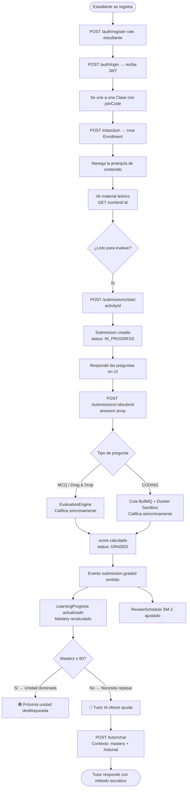
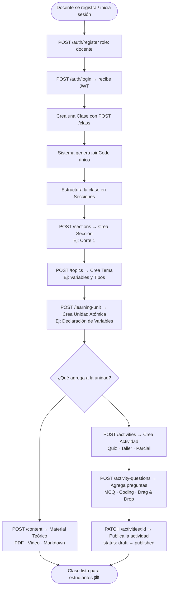

# STIRE — 02. Flujos del Sistema y Operaciones de Negocio
**Guía Técnica de Casos de Uso del Estudiante, Docente y Flujo de Pruebas Integrales (Happy Path)**

---

## 1. Flujo del Estudiante (Ciclo de Vida Cognitivo)

El estudiante interactúa con la plataforma consumiendo material de estudio, resolviendo problemas e interactuando con el Tutor IA. A nivel técnico, este flujo se compone de llamadas REST a controladores específicos y transacciones desacopladas por eventos.

### 1.1 Casos de Uso Principales



#### Paso 1: Autenticación y Autorización
*   **Endpoint:** `POST /auth/register` (Crea usuario con rol `estudiante` en la tabla `users`).
*   **Endpoint:** `POST /auth/login` (Retorna JWT firmado que contiene `userId`, `role` y `fullName`).
*   **Servicio:** `AuthService.login()` valida credenciales y firma el payload del token.

#### Paso 2: Inscripción en Clases
*   **Endpoint:** `POST /class/join`
*   **Payload:** `{ "joinCode": "PROG-101" }`
*   **Servicio:** `ClassService.joinClass(studentId, joinCode)`.
    *   *Acción:* Busca el curso en la tabla `classes` usando el `joinCode`. Si está activo y tiene cupo, crea un registro `Enrollment` con `status: active`.

#### Paso 3: Consumo de Unidades y Teoría
*   **Endpionts de Lectura:**
    *   `GET /class` (Clases inscritas por el alumno).
    *   `GET /sections?classId=X` (Cortes/secciones del curso).
    *   `GET /topics?sectionId=Y` (Temas del corte).
    *   `GET /learning-unit?topicId=Z` (Unidades de aprendizaje).
    *   `GET /content?learningUnitId=W` (Material de estudio de la unidad).
*   **Servicios implicados:** `LearningProgressService` / `PrerequisitesService`.
    *   *Regla de Negocio:* Antes de servir el contenido de una unidad, el middleware o guard verifica si tiene prerrequisitos sin cumplir en la tabla `prerequisites` (ej. se requiere dominio de la unidad anterior mayor al 60%).

#### Paso 4: Creación de Intentos (Submissions)
*   **Endpoint:** `POST /submissions/start`
*   **Payload:** `{ "activityId": 12 }`
*   **Servicio:** `SubmissionsService.startSubmission(studentId, activityId)`.
    *   *Validación:* Verifica en la tabla `activities` que `attemptsAllowed` no haya sido superado comparando con los registros previos del estudiante.
    *   *Persistencia:* Crea y guarda una entidad `Submission` con `status: 'IN_PROGRESS'`, asignando un UUID para evitar enumeraciones en rutas públicas.

#### Paso 5: Envío y Calificación de Respuestas
*   **Endpoint:** `POST /submissions/:id/submit`
*   **Payload:** Array de objetos conteniendo `questionId` y `answer` (JSON).
*   **Servicio:** `SubmissionsService.submitAnswers(submissionId, dto)`.
    *   *Transaccionalidad:* Abre una transacción a través de `QueryRunner`.
    *   *Bucle de Evaluación:* Por cada respuesta enviada:
        1. Llama a `EvaluationEngineService.evaluateAnswer(type, studentAnswer, questionConfig, points)`.
        2. Si es una pregunta cerrada (MCQ, FillCode, DragDrop), califica de forma síncrona y retorna `isCorrect` y `score`.
        3. Si la pregunta es tipo `CODING`, registra la respuesta con `isCorrect: null` y delega la tarea a `Queue('judge-queue').add('judge', jobData)` para su compilación e inspección en Sandbox asíncrono.
        4. Almacena las instancias de `SubmissionAnswer` asociadas al intento.
    *   *Cierre de Transacción:* Actualiza el `score` total acumulado y cambia el `status` de la `Submission` a `'GRADED'` (o pendiente de grading completo si hay tareas de código asíncronas).
    *   *Emisión de Eventos:* Una vez commiteada la transacción con éxito, el sistema despacha el evento de dominio a través de:
        `this.eventEmitter.emit('submission.graded', new SubmissionGradedEvent(...))`

#### Paso 6: Adaptabilidad en Background (Listeners)
El evento `submission.graded` desencadena efectos secundarios críticos de forma asíncrona:
*   **`LearningProgressListener.handleSubmissionGraded`**:
    Recupera el historial de intentos en la unidad (`learning_units`) y actualiza la tabla `learning_progress`, recalculando el `mastery` y `successRate`.
*   **`ReviewScheduleListener.handleSubmissionGraded`**:
    Invoca el algoritmo SM-2 utilizando el `score` obtenido para calcular la siguiente fecha de repaso (`nextReviewDate`) y el factor de facilidad (`easeFactor`), actualizando o creando una fila en `review_schedules`.

#### Paso 7: Tutoría Socrática Contextualizada
*   **Endpoint:** `POST /tutor/chat`
*   **Payload:** `{ "message": "...", "learningUnitId": 3 }`
*   **Servicio:** `TutorService.generateResponse(studentId, learningUnitId, message)`.
    *   *Procedimiento:*
        1. Recupera el `mastery` y las debilidades del estudiante desde `LearningProgressService` para la unidad correspondiente.
        2. Carga los últimos mensajes del historial desde `TutorConversationsRepository`.
        3. Inyecta este contexto pedagógico en el System Prompt del LLM.
        4. Invoca la API de inteligencia artificial bajo una estrategia conversacional socrática (guía mediante preguntas y pistas en vez de respuestas directas).

---

## 2. Flujo del Docente (Creación Académica y Monitoreo)

El docente es el responsable de estructurar el plan curricular, registrar contenidos teóricos, diseñar cuestionarios e interpretar los paneles de analíticas de desempeño.

### 2.1 Casos de Uso Principales



#### Paso 1: Inicialización de la Clase
*   **Endpoint:** `POST /class`
*   **Payload:** `{ "name": "Programación Estructurada", "description": "Fundamentos de C++" }`
*   **Servicio:** `ClassService.create(teacherId, classDto)`. Genera un string pseudoaleatorio único asignado a `code` (joinCode) que servirá de token de acceso para los estudiantes.

#### Paso 2: Creación Jerárquica del Plan de Estudios
El docente debe construir la estructura lineal del curso:
1.  **Sección (Corte):** `POST /sections` (recibe `classId`).
2.  **Tema (Topic):** `POST /topics` (recibe `sectionId`).
3.  **Unidad (Learning Unit):** `POST /learning-unit` (recibe `topicId`).

#### Paso 3: Carga de Material y Actividades
*   **Contenidos Teóricos:** `POST /content` (recibe `learningUnitId`, `type` y `data`).
*   **Contenedor de Actividades:** `POST /activities`
    *   *Payload:* `{ "learningUnitId": X, "title": "Cuestionario Variables", "attemptsAllowed": 3, "passingScore": 60 }`
    *   *Estado Inicial:* La actividad se crea con `status: 'draft'`, ocultándola de las consultas de estudiantes.

#### Paso 4: Construcción del Cuestionario (ActivityQuestions)
*   **Endpoint:** `POST /activity-questions`
*   *Payload:* `{ "activityId": A, "type": "CODING", "question": "Imprima 'Hola'", "points": 50, "config": { ... } }`
*   *Lógica:* El backend valida que la estructura del campo `config` cumpla estrictamente con la interfaz requerida por el `type` de pregunta seleccionado.

#### Paso 5: Publicación Académica
*   **Endpoint:** `PATCH /activities/:id`
*   **Payload:** `{ "status": "published" }`
*   *Acción:* Modifica el estado del registro a `'published'` y rellena el timestamp en `publishedAt`. A partir de este momento, se permite a los estudiantes inscritos generar submissions para la actividad.

#### Paso 6: Auditoría Pedagógica y Analytics
*   **Endpoint:** `GET /analytics/class/:classId`
    *   *Servicio:* `AnalyticsService.getClassMetrics(classId)`.
    *   *Consulta:* Agrega la métrica de Mastery por estudiante, promedia las calificaciones de todos los alumnos enrolados e identifica quiénes están rezagados o requieren alertas de intervención.

---

## 3. Verificación de Integridad del Core (Happy Path Smoke Test)

Para desarrolladores y administradores del sistema, este flujo constituye la secuencia mínima automatizada (o manual) requerida para garantizar la correcta integración del motor transaccional, el procesador asíncrono BullMQ y el Sandboxing en Docker.

### 3.1 Peticiones HTTP del Flujo E2E

#### 1. Creación del Estudiante de Prueba
*   **POST** `http://localhost:3000/auth/register`
*   **Headers:** `Content-Type: application/json`
*   **Body:**
```json
{
  "email": "estudiante.test@stire.app",
  "password": "PasswordSecure123!",
  "fullName": "Tester E2E"
}
```

#### 2. Inicio de Sesión (Obtención de Credencial JWT)
*   **POST** `http://localhost:3000/auth/login`
*   **Body:**
```json
{
  "email": "estudiante.test@stire.app",
  "password": "PasswordSecure123!"
}
```
*   *Resultado:* Copiar el token JWT retornado en `access_token` e inyectarlo en los siguientes pasos en la cabecera `Authorization: Bearer <JWT_TOKEN>`.

#### 3. Configuración de Actividad de Programación
*(En entornos reales este paso requiere permisos de Docente/Admin)*
*   **POST** `http://localhost:3000/activities`
*   **Body:**
```json
{
  "learningUnitId": 1,
  "activityTypeId": 1,
  "title": "Reto: Algoritmia Básica Python",
  "description": "Escribe un script que imprima exactamente 'Hola Mundo'",
  "difficultyLevel": 1,
  "points": 100
}
```
*   *Resultado:* Copiar el `id` numérico de la actividad creada (ej. `1`).

#### 4. Apertura del Intento de Evaluación
*   **POST** `http://localhost:3000/submissions/start`
*   **Body:**
```json
{
  "activityId": 1
}
```
*   *Resultado:* Guarda el `id` (UUIDv4) de la submission creada (ej. `a3b89c4d-fb56-4c78-90f1-e3456789abcd`).

#### 5. Envío de Código al Sandbox Asíncrono
*   **POST** `http://localhost:3000/submissions/a3b89c4d-fb56-4c78-90f1-e3456789abcd/submit`
*   **Body:**
```json
{
  "timeSpentSeconds": 120,
  "answers": [
    {
      "questionId": 1,
      "answer": {
        "code": "print('Hola Mundo')"
      }
    }
  ]
}
```

---

### 3.2 Trazabilidad de Consola durante el Test de Integración

Al enviar el paso 5, el ciclo de vida del flujo asíncrono se observa en los logs del servidor NestJS:

```
[Nest] ... LOG [SubmissionsController] POST /submissions/a3b89c4d-fb56-4c78-90f1-e3456789abcd/submit
[Nest] ... LOG [SubmissionsService] Iniciando transacción SQL para submission a3b89c4d...
[Nest] ... LOG [EvaluationEngineService] Detectada pregunta tipo CODING para questionId: 1
[Nest] ... LOG [SubmissionsService] Calificación síncrona omitida. Encolando ejecución en BullMQ...
[Nest] ... LOG [SubmissionsService] Transacción commiteada. Estado: GRADED parcial. HTTP 200 retornado.
[Nest] ... LOG [JudgeWorker] Trabajo recibido de la cola 'judge'. Ejecutando Test Case 1...
[Nest] ... LOG [DockerSandboxService] Levantando contenedor temporal python:3.9-slim
[Nest] ... LOG [DockerSandboxService] Contenedor efímero ejecutado. Salida capturada: 'Hola Mundo\n'. Tiempo: 45ms.
[Nest] ... LOG [JudgeWorker] Test Case 1 superado (accepted). Guardando ejecución en DB.
[Nest] ... LOG [SubmissionsService] Calificación de código completada para submission a3b89c4d. Score final: 100/100.
[Nest] ... LOG [EventEmitter2] Emitiendo evento 'submission.graded' para studentId: 1
[Nest] ... LOG [LearningProgressListener] Evento recibido. Recalculando mastery para LU 1...
[Nest] ... LOG [ReviewScheduleListener] Evento recibido. Programando repaso SM-2. Intervalo: 1 día.
```

### 3.3 Verificaciones Directas en la Capa de Datos

Para certificar el éxito del Smoke Test, valide los cambios en su cliente SQL:
1.  **Tabla `execution_results`:** Debe existir un registro enlazado al `submissionAnswerId` correspondiente, con el campo `status` igual a `'accepted'`, `stdout` igual a `'Hola Mundo'` y `executionTimeMs` registrado.
2.  **Tabla `learning_progress`:** Debe mostrar un registro para el `studentId` del test en la `learningUnitId` 1, con un `mastery` superior a 0 e incrementando el `attemptsCount`.
3.  **Tabla `review_schedules`:** Debe planificar el siguiente repaso del alumno, actualizando `nextReviewDate` según la fecha calculada por el algoritmo de repetición espaciada.
