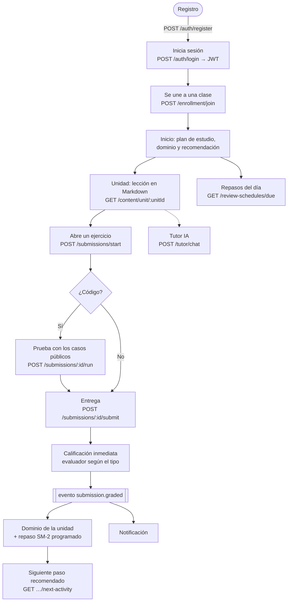
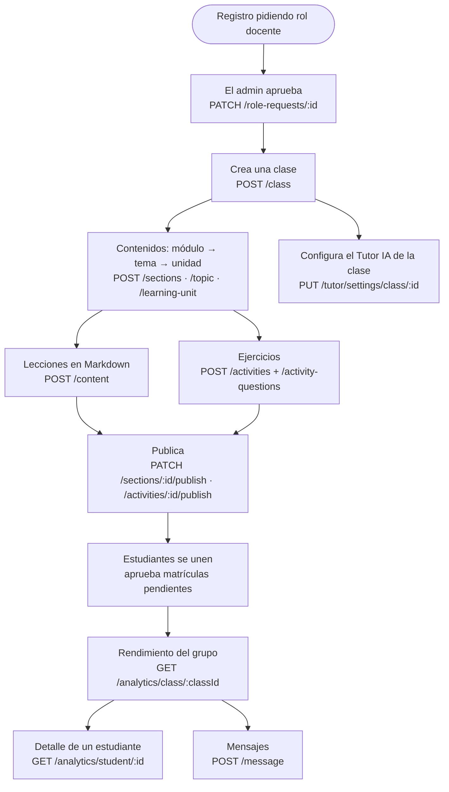

# STIRE — 02. Flujos del sistema

Cómo recorre la aplicación cada rol y qué pasa en el servidor en cada paso. Las rutas son las de los
controladores de `src/` (verificadas el 26/09/2026); el detalle de cada una está en Swagger
(`/docs` en el servidor).

> Reescrito el 26/09/2026. La versión anterior (mayo) describía una cola BullMQ y un sandbox con
> Docker que ya no existen: la calificación corre en línea (ADR 08) y el código del estudiante en un
> proceso aislado del sistema operativo (ADR 06, `SANDBOX_TYPE=hardened`).

---

## 1. Estudiante

```mermaid
flowchart TD
    A([Registro]) -->|POST /auth/register| B[Inicia sesión<br/>POST /auth/login → JWT]
    B --> C[Se une a una clase<br/>POST /enrollment/join]
    C --> D[Inicio: plan de estudio,<br/>dominio y recomendación]
    D --> E[Unidad: lección en Markdown<br/>GET /content/unit/:unitId]
    E --> F[Abre un ejercicio<br/>POST /submissions/start]
    F --> G{¿Código?}
    G -- Sí --> H[Prueba con los casos públicos<br/>POST /submissions/:id/run]
    H --> I
    G -- No --> I[Entrega<br/>POST /submissions/:id/submit]
    I --> J[Calificación inmediata<br/>evaluador según el tipo]
    J --> K[[evento submission.graded]]
    K --> L[Dominio de la unidad<br/>+ repaso SM-2 programado]
    K --> M[Notificación]
    L --> N[Siguiente paso recomendado<br/>GET …/next-activity]
    D --> O[Repasos del día<br/>GET /review-schedules/due]
    E -.-> P[Tutor IA<br/>POST /tutor/chat]
```

| Paso | Qué ve | Qué pasa en el servidor |
|---|---|---|
| Registro e inicio | Formulario; puede pedir ser docente | Se crea como estudiante. Si pidió ser docente, queda una solicitud (`/role-requests`) para el admin |
| Unirse a una clase | Código de clase | `POST /enrollment/join`: matrícula directa o pendiente de aprobación, según la clase |
| Unidad | Lección y ejercicios | El contenido llega **ya saneado** (DOMPurify en el backend) |
| Ejercicio | Enunciado, editor o panel de respuesta | `POST /submissions/start` abre el intento; `PUT …/autosave` guarda mientras escribe |
| Probar código | Resultado de los casos públicos | `POST …/run` ejecuta en el sandbox sin gastar intentos |
| Entregar | Puntaje y resultado por caso | `POST …/submit` califica con **todos** los casos, también los ocultos |
| Después de entregar | Dominio y repasos al día | Evento `submission.graded` → `learning-progress` actualiza el dominio y `review-schedules` reprograma el repaso (SM-2) |
| Tutor IA | Chat que orienta sin dar la solución | `POST /tutor/chat` con la clave de Google AI Studio del estudiante (ADR 10) y la configuración del docente |

**Tipos de ejercicio:** código (JavaScript), opción múltiple, completar código, clasificar (arrastrar y
soltar), emparejar, ordenar bloques y HTML/CSS calificado por reglas. Cada uno tiene su evaluador en
`src/evaluation-engine/` (patrón Strategy).

## 2. Docente

```mermaid
flowchart TD
    A([Registro pidiendo rol docente]) --> B[El admin aprueba<br/>PATCH /role-requests/:id]
    B --> C[Crea una clase<br/>POST /class]
    C --> D[Contenidos: módulo → tema → unidad<br/>POST /sections · /topic · /learning-unit]
    D --> E[Lecciones en Markdown<br/>POST /content]
    D --> F[Ejercicios<br/>POST /activities + /activity-questions]
    E --> G[Publica<br/>PATCH /sections/:id/publish · /activities/:id/publish]
    F --> G
    G --> H[Estudiantes se unen<br/>aprueba matrículas pendientes]
    H --> I[Rendimiento del grupo<br/>GET /analytics/class/:classId]
    I --> J[Detalle de un estudiante<br/>GET /analytics/student/:id]
    C --> K[Configura el Tutor IA de la clase<br/>PUT /tutor/settings/class/:id]
    I --> L[Mensajes<br/>POST /message]
```

- **Tipo de actividad** (catálogo sembrado por migración): autoevaluación (peso 1.0), taller (1.5) y
  parcial (3.0). El peso cuenta en el dominio del estudiante.
- **Permisos:** un docente solo ve y edita lo de sus clases, y solo ve el detalle de estudiantes con
  los que comparte clase (`AuthorizationService`).

## 3. Administrador

| Tarea | Ruta |
|---|---|
| Usuarios: listar, crear, cambiar rol, desactivar, dar contraseña nueva | `GET/POST /users`, `PATCH /users/:id/role`, `PATCH /users/:id` |
| Solicitudes de docente | `GET /role-requests`, `PATCH /role-requests/:id` |
| Estado del sistema (latencia, sandbox, base de datos, Tutor, usuarios) | `GET /admin/system/status` |
| Registros y limpieza | `GET /admin/system/logs`, `POST /maintenance/cleanup` |

El admin no puede desactivarse ni quitarse el rol a sí mismo.

## 4. Comprobar que todo funciona

- **Automático:** `npm test` (730 pruebas) y `npm run verify:clean` (de cero hasta un inicio de sesión
  real). Ver [`../CLAUDE.md`](../CLAUDE.md).
- **En el sitio desplegado:** los recorridos completos de estudiante, docente y administrador se
  simularon el 26/09/2026 en https://stire-soft.vercel.app; resultados en [`../CHANGELOG.md`](../CHANGELOG.md)
  y capturas en [`material-visual/05-primera-version-desplegada/`](material-visual/05-primera-version-desplegada/README.md).
