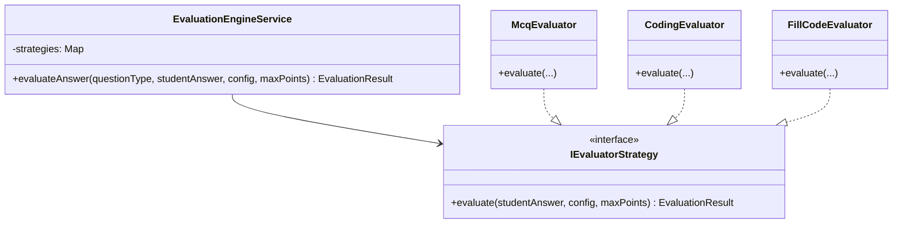
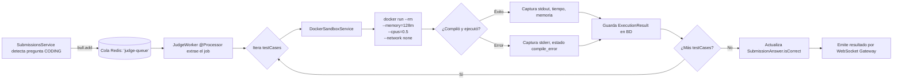
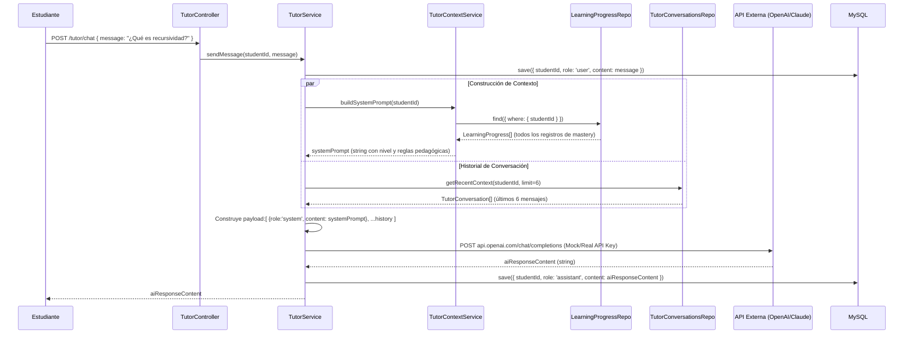
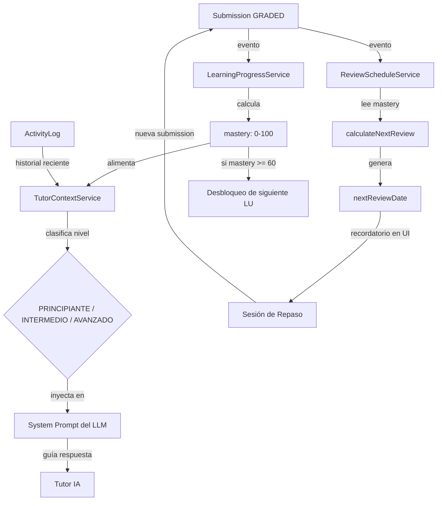

# STIRE — 03. Motores de Evaluación y Lógica Cognitiva del Tutor IA
**Especificación Técnica del Motor de Ejecución Segura, Motor de Cuestionarios Dinámicos, Cálculo de Mastery y Lógica del Tutor IA (RAG & SM-2)**

---

## 1. El Motor de Cuestionarios Dinámicos (Activity Engine)

El "Activity Engine" es el encargado de orquestar la carga de reactivos y calificar de manera extensible las entregas de los alumnos.

### 1.1 Estructura Semi-Estructurada JSON
Para evitar migraciones constantes de la base de datos MySQL ante la inserción de nuevos tipos de preguntas (por ejemplo: emparejamiento, ordenamiento, rellenar espacios), la entidad `ActivityQuestion` implementa la columna `config` como un campo de tipo `JSON` tipado de manera dinámica. Las interfaces de tipado que controlan esta configuración son:
*   `McqConfig`: `{ options: string[], correct: string[] }`
*   `CodingConfig`: `{ language: string, starterCode: string, testCases: { input: string, expected: string, isPublic: boolean, label?: string }[] }`
*   `FillCodeConfig`: `{ template: string, blanks: { id: string, answer: string, regexMode: boolean }[] }`
*   `DragDropConfig`: `{ items: string[], correctOrder: number[] }`
*   `MatchingConfig`: `{ pairs: { source: string, target: string }[] }`

### 1.2 Flujo de Auto-Grading (Pattern Strategy)
El motor de evaluación implementa el patrón **Strategy** para desacoplar la lógica de calificación de cada tipo de pregunta.

1.  **Recepción:** `SubmissionsService.submitAnswers()` recibe la carga útil de respuestas del estudiante.
2.  **Dispatching:** Se delega cada respuesta individual al método `EvaluationEngineService.evaluateAnswer()`.
3.  **Selección de Estrategia:** El servicio resuelve del mapa de estrategias inyectado la instancia correspondiente a `QuestionType` (ej. `MCQ`, `FILL_CODE`, `MATCHING`, `DRAG_DROP`, `CODING`).
4.  **Ejecución:**
    *   **MCQ/Closed questions:** Comparan valores directos y retornan inmediatamente un `EvaluationResult` conteniendo `{ isCorrect: boolean, score: number, feedback: string }`.
    *   **Coding questions:** `CodingEvaluator` intercepta la ejecución de código fuente de programación y establece en el resultado la bandera `{ needsAsyncJudge: true, score: 0 }`.
5.  **Persistencia:** Las calificaciones e instancias de `SubmissionAnswer` se persisten en la base de datos relacional dentro de una misma transacción.

---

## 2. El Motor de Ejecución de Código (Judge Engine)

El "Judge Engine" ejecuta código fuente proveído por estudiantes bajo un sandbox seguro y aislado, mitigando vulnerabilidades de ejecución remota de comandos (RCE) y ataques de denegación de servicio (DoS).

### 2.1 Desacoplamiento por Mensajería (BullMQ)
*   **NestJS (Productor):** Al identificar reactivos tipo `CODING`, el servicio de submissions añade una tarea en la cola distribuida `judge-queue` en Redis a través de BullMQ. La petición del cliente HTTP responde de manera inmediata liberando la conexión web.
*   **BullMQ Worker (Consumidor):** Una clase procesadora ejecutada fuera del hilo principal de solicitudes web extrae la tarea para ejecutarla.

### 2.2 Ciclo de Ejecución en Docker Sandbox

1.  **Iteración:** El `JudgeWorker` lee los test cases (tanto los públicos como los ocultos que el docente ha configurado).
2.  **Aislamiento en Contenedor:** Se invoca a `DockerSandboxService` que realiza una llamada al daemon de Docker para aprovisionar un contenedor efímero.
3.  **Configuración de Seguridad:**
    *   `--rm`: Elimina el contenedor al terminar la ejecución para evitar saturar el storage del host.
    *   `--memory=128m`: Limita la RAM a 128MB previniendo *Memory Leaks* inducidos y ataques de desbordamiento de memoria.
    *   `--cpus=0.5`: Límite estricto de medio núcleo CPU para mitigar bucles infinitos de CPU.
    *   `--network none`: Corta toda comunicación de red del contenedor para bloquear el robo de datos o ataques RCE de salida.
4.  **Ejecución:** Se monta el código provisto por el estudiante y se evalúa inyectando los parámetros del caso de prueba actual a través de la entrada estándar (stdin).
5.  **Análisis de Output:** Captura la salida estándar (`stdout`), el canal de errores (`stderr`) y los tiempos de CPU en milisegundos.
6.  **Destrucción y Persistencia:** El contenedor se apaga y destruye inmediatamente. Los resultados de cada caso se persisten en la tabla `execution_results`. Si existe un fallo de compilación, el worker realiza un *Early Exit* deteniendo las pruebas restantes.
7.  **Notificación de Tiempo Real:** Los resultados finales se transmiten al cliente mediante WebSockets a través de la pasarela Gateway para actualizar las vistas reactivas de la UI sin necesidad de refrescar la página.

---

## 3. Lógica del Tutor IA e Inteligencia Adaptativa

STIRE utiliza un ecosistema cerrado para procesar y adaptar la experiencia del estudiante combinando el cálculo de Mastery, el agendamiento del algoritmo SM-2 y la inyección contextual socrática al LLM.

### 3.1 El Tutor IA (Conversación y Prompt Dinámico)
El `TutorService` construye una conversación enriquecida mediante técnicas de RAG conceptual y límites estrictos de contexto.

#### Construcción del System Prompt Adaptativo
El prompt inyectado al LLM no es plano, sino que se recalcula bajo la siguiente lógica parametrizada:
1.  **Recuperación:** Carga todos los registros de `LearningProgress` del estudiante en cuestión.
2.  **Agregación:** Calcula el promedio aritmético de dominio cognitivo:
    $$\text{avgMastery} = \frac{\sum \text{mastery}}{\text{count}(learningProgress)}$$
3.  **Clasificación de Perfil:**
    *   $\text{avgMastery} > 80$: Asigna nivel `AVANZADO`.
    *   $50 < \text{avgMastery} \le 80$: Asigna nivel `INTERMEDIO`.
    *   $\text{avgMastery} \le 50$: Asigna nivel `PRINCIPIANTE`.
4.  **Generación de Prompt:** Construye las directivas de comportamiento del LLM según el nivel asignado (por ejemplo, exigir el uso de analogías cotidianas para principiantes, o incentivar análisis avanzados de Big-O para el perfil avanzado).
5.  **Método Socrático Obligatorio:** Se instruye al tutor IA a actuar guiando al estudiante a encontrar su propia respuesta, impidiéndole deliberadamente escribir el código fuente de la solución.

#### Ventana de Contexto
El historial conversacional recuperado mediante `TutorConversationsRepository.getRecentContext()` está restringido a los últimos **6 mensajes** (3 interacciones del usuario y 3 de la IA). Esto previene la saturación del límite de tokens en los LLMs comerciales y optimiza las consultas SQL indexando las tablas por `(studentId, createdAt DESC)`.

#### Estado del LLM en el Código
Actualmente, el sistema utiliza un método placeholder (`mockLlmInference()`) en `tutor.service.ts` para las pruebas de Happy Path. La conexión real con la API del LLM se encuentra preparada en la base del código, requiriendo únicamente descomentar la petición HTTP a la pasarela de la IA e incorporar la variable `OPENAI_API_KEY` en el archivo de configuración `.env`.

---

### 3.2 El Algoritmo de Cálculo de Mastery (Dominio Temático)

El Mastery es una representación numérica ponderada del grado de comprensión de un estudiante sobre una unidad de aprendizaje.

#### Algoritmo Matemático
Para todas las actividades publicadas de una Unidad de Aprendizaje:
1.  Se obtiene el puntaje máximo obtenido por el estudiante en cualquiera de sus intentos (es decir, el valor más alto en la tabla `submissions` para la actividad dada).
2.  Se calcula el peso dinámico de la actividad:
    $$\text{peso} = \text{activity.adaptiveWeight} \times \text{activityType.baseWeight}$$
3.  Se computa el Mastery ponderado:
    $$\text{Mastery} = \min\left(100, \text{round}\left( \frac{\sum_{i=1}^{n} \left(\frac{\text{mejorScore}_i}{\text{puntosMaximos}_i} \times \text{peso}_i\right)}{\sum_{i=1}^{n} \text{peso}_i} \times 100 \right)\right)$$

#### Ejemplo Práctico de Cálculo
Unidad de aprendizaje con tres actividades:
*   **Actividad 1 (Quiz):** peso = $1.0$, mejor score = $80/100$.
*   **Actividad 2 (Taller Código):** peso = $1.5$, mejor score = $60/100$.
*   **Actividad 3 (Parcial):** peso = $3.0$, mejor score = $70/100$.

$$\text{Suma Contribuciones} = \left(\frac{80}{100} \times 1.0\right) + \left(\frac{60}{100} \times 1.5\right) + \left(\frac{70}{100} \times 3.0\right) = 0.8 + 0.9 + 2.1 = 3.8$$
$$\text{Suma Pesos} = 1.0 + 1.5 + 3.0 = 5.5$$
$$\text{Mastery Final} = \text{round}\left(\frac{3.8}{5.5} \times 100\right) = 69\%$$

#### Cálculo del `successRate` (Tasa de Acierto)
A diferencia del Mastery, que evalúa el mejor desempeño histórico, la tasa de efectividad mide la solidez de aprendizaje:
$$\text{successRate} = \left( \frac{\text{intentosAprobados}}{\text{intentosTotales}} \right) \times 100$$
*   Un intento aprobado es aquel con $\text{score} \ge \text{activity.passingScore}$.
*   Esto ayuda a identificar si un estudiante domina el tema por asimilación o si simplemente resolvió una prueba por ensayo y error (ej: si obtuvo Mastery de 90% pero tiene un `successRate` de sólo 20%).

---

### 3.3 Repetición Espaciada (Adaptación del Algoritmo SM-2)

STIRE implementa una variante del algoritmo clásico SuperMemo-2 para programar automáticamente las sesiones de refuerzo de los estudiantes.

#### Reglas de Agendamiento
*   **Repetición 1 (repetitions = 0):** `intervalDays = 1` (repaso inmediato al día siguiente).
*   **Repetición 2 (repetitions = 1):** `intervalDays = 3` (repaso a los 3 días).
*   **Repeticiones superiores (repetitions >= 2):**
    El factor de facilidad (`easeFactor`) se computa dinámicamente en base al Mastery:
    $$\text{easeFactor} = \max\left(1.3, 2.5 - (100 - \text{Mastery}) \times 0.02\right)$$
    Posteriormente se determina el nuevo intervalo multiplicándolo por el factor de facilidad:
    $$\text{intervalDays} = \text{round}(\text{intervaloPrevio} \times \text{easeFactor})$$
*   El intervalo está acotado a un límite superior de 60 días para asegurar que el contenido no quede en el olvido del alumno.

#### Priorización de Repaso (Urgency Level)
El campo `urgencyLevel` se actualiza para guiar al estudiante sobre qué actividades son críticas:
*   `0` (Inactiva): La fecha de repaso se encuentra planificada a futuro.
*   `1` (Baja): La sesión vencerá en menos de 24 horas.
*   `2` (Media): La sesión venció recientemente (entre 1 y 3 días atrás).
*   `3` (Crítica): La sesión tiene más de 3 días de retraso.

---

## 4. Integración y Retroalimentación de los Componentes Adaptativos

El flujo adaptativo completo funciona de manera cíclica interactuando dinámicamente entre sí:

---

## 5. Deuda Técnica y Limitaciones Identificadas en los Motores

Para llevar el sistema a un nivel productivo de escala Enterprise, se deben solventar los siguientes puntos identificados en los motores actuales:

1.  **Activación del LLM en Tutor IA:** Reemplazar el método mockeado de inferencia por una llamada asíncrona real y control de rate limits de la API externa de IA.
2.  **Persistencia del `easeFactor`:** Actualmente, el factor SM-2 se calcula en memoria en base al Mastery. Se requiere persistir este campo en la base de datos para no perder el histórico del ritmo de aprendizaje específico del estudiante si cambia su nivel de Mastery abruptamente.
3.  **Cómputo en background de `urgencyLevel`:** El cálculo del nivel de urgencia sólo se ejecuta cuando ocurre un evento `submission.graded`. Se debe implementar un script de cron nocturno (`@Cron` de NestJS) para recorrer las tablas de repasos programados y subir la prioridad de urgencia según el paso del tiempo.
4.  **Integración del `ActivityLog` en el Tutor:** El Tutor IA debe leer las acciones pedagógicas previas del alumno (ej: "ha fallado 3 veces el reto de Python", "acaba de leer la teoría") para contextualizar mejor el prompt conversacional.
5.  **Grafo de Prerrequisitos:** Integrar el middleware de validación a nivel de servicios y endpoints para restringir físicamente la descarga de contenidos de una Unidad si sus prerrequisitos no han sido completados en un 100%.
