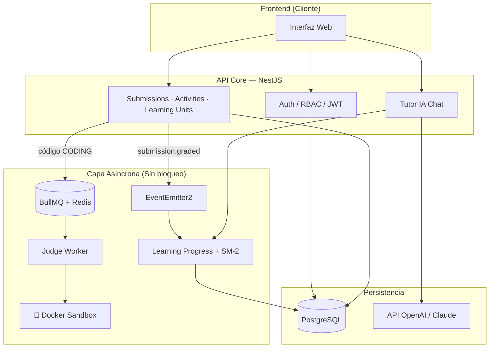

# 📚 Documentación Maestra — STIRE

> **Sistema Tutor Inteligente para la Resolución de Ejercicios**
> Stack: NestJS · PostgreSQL · TypeORM · BullMQ · Redis

---

## ¿Qué es STIRE?

STIRE es un **LMS Adaptativo** orientado a la enseñanza de programación. A diferencia de plataformas estáticas, STIRE combina cuatro sistemas inteligentes:

| Sistema | Qué hace |
|---------|----------|
| 🧠 **Tutor IA** | Asistente socrático que conoce el nivel (Mastery) del estudiante |
| ⚡ **Motor de Actividades** | Evalúa MCQ, Drag & Drop, Código automáticamente |
| 🔁 **Repaso Espaciado SM-2** | Decide cuándo el estudiante debe repasar cada tema |
| 🐳 **Judge Engine (Sandbox)** | Ejecuta código de forma segura en contenedores Docker efímeros |

---

## 🗺️ Mapa de la Arquitectura (Vista Rápida)



---

## 📂 Índice de Documentos

### 🏛️ Arquitectura y Decisiones
| Documento | Propósito |
|-----------|-----------|
| [architecture_decisions.md](./architecture_decisions.md) | **Por qué** tomamos cada decisión técnica (ADRs). Leer primero. |
| [backend_conventions.md](./backend_conventions.md) | Reglas de código que todo desarrollador DEBE seguir |
| [scalability_strategy.md](./scalability_strategy.md) | Cómo STIRE soporta carga masiva (BullMQ, Cache, Particionamiento) |
| [security_guidelines.md](./security_guidelines.md) | RBAC, Rate Limiting, Sandbox, Auditoría |

### 📖 Documentación Maestra (Base de Conocimiento del Proyecto)
| Documento | Propósito |
|-----------|-----------|
| [STIRE_MASTER_ARCHITECTURE.md](./STIRE_MASTER_ARCHITECTURE.md) | **Arquitectura completa:** DDD, módulos, flujo de submissions, Judge Engine, BullMQ, eventos de dominio, convenciones de código |
| [STIRE_DATABASE_SCHEMA.md](./STIRE_DATABASE_SCHEMA.md) | **Esquema de BD:** ERD completo + diccionario de datos exhaustivo de las 25 tablas + reglas inquebrantables de modelo |
| [STIRE_TUTOR_LOGIC.md](./STIRE_TUTOR_LOGIC.md) | **Lógica adaptativa:** Cálculo de Mastery, algoritmo SM-2, flujo del Tutor IA, matemáticas de ponderación |

### 🗄️ Diccionario Legacy (Referencia rápida de tablas)
| Documento | Propósito |
|-----------|-----------|
| [STIRE_DATA_DICTIONARY.md](./STIRE_DATA_DICTIONARY.md) | ERD y diccionario de datos en formato resumido _(reemplazado por STIRE_DATABASE_SCHEMA.md para uso técnico)_ |

### ⚙️ Flujos de los Motores Internos
| Documento | Propósito |
|-----------|-----------|
| [activity_engine_flow.md](./activity_engine_flow.md) | Cómo se auto-evalúan las respuestas (Strategy Pattern) |
| [judge_engine_flow.md](./judge_engine_flow.md) | Cómo se ejecuta código de forma segura en Docker |
| [tutor_ai_flow.md](./tutor_ai_flow.md) | Cómo el Tutor construye contexto con RAG y historial |

### 👤 Flujos de Usuario (Por Rol)
| Documento | Propósito |
|-----------|-----------|
| [teacher_flow.md](./teacher_flow.md) | Paso a paso de cómo un **docente** configura su clase completa |
| [student_flow.md](./student_flow.md) | Paso a paso de cómo un **estudiante** aprende y es evaluado |

---

## 🔑 Jerarquía de Contenido (La Columna Vertebral)

```
Class (Materia)
  └── Section (Corte / Módulo)
        └── Topic (Tema)
              └── LearningUnit (Unidad Atómica)
                    ├── Content (Teoría: PDF, Video, Markdown)
                    └── Activity (Evaluación: Quiz, Taller, Examen)
                          └── ActivityQuestion (Pregunta individual: MCQ, Coding, DragDrop)
```

---

## 🚦 Estado del Proyecto (MVP)

| Módulo | Estado | Notas |
|--------|--------|-------|
| Auth / RBAC | ✅ Estable | JWT + Permisos granulares |
| Estructura Académica | ✅ Estable | Class → Section → Topic → LU |
| Motor de Actividades (MCQ) | ✅ Estable | Evaluación sincrónica funcional |
| Submissions & Grading | ✅ Estable | Con transacciones ACID |
| Learning Progress (Mastery) | ✅ Estable | Evento `submission.graded` |
| Review Schedules (SM-2) | ✅ Estable | Algoritmo SM-2 implementado |
| Judge Engine (Docker) | ⚠️ Placeholder | Worker activo, Docker sandbox simulado |
| Tutor IA (Chat) | ⚠️ Placeholder | Contexto construido, LLM no integrado |
| Gamification (Achievements) | 🔲 Planeado | Entidad modelada, lógica pendiente |

---

> 💡 **Para nuevos integrantes:** Empieza por `architecture_decisions.md`, luego lee el `STIRE_DATA_DICTIONARY.md` para entender las tablas, y finalmente revisa el flujo que corresponde a tu rol (`teacher_flow.md` o `student_flow.md`).
