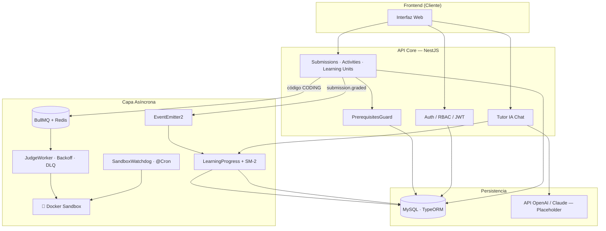

# 📚 STIRE — Documentación Oficial
> **Sistema Tutor Inteligente para la Resolución de Ejercicios**
> Stack: NestJS · MySQL · TypeORM · BullMQ · Redis · Docker

---

## ¿Qué es STIRE?

STIRE es un **LMS adaptativo** orientado a la enseñanza de **programación y algoritmia**. Combina cuatro sistemas inteligentes en un solo backend modular:

| Sistema | Motor | Estado |
|---------|-------|--------|
| 🧠 **Tutor IA** | Socrático · RAG dinámico · Mastery-aware | ⚠️ LLM en placeholder |
| ⚡ **Motor de Actividades** | Strategy Pattern · MCQ · Coding · DragDrop · FillCode · Matching | ✅ Estable |
| 🔁 **Repaso Espaciado SM-2** | Calcula cuándo repasar cada unidad | ✅ Estable |
| 🐳 **Judge Engine** | Evalúa código en Docker sandbox efímero | ⚠️ Sandbox simulado |

---

## 🗂️ Árbol de Documentación Oficial

```
docs/
├── README.md                    ← ESTE ARCHIVO — Punto de entrada y mapa
│
├── architecture/                ← CAPA: Arquitectura Técnica
│   ├── ARCHITECTURE.md          ← Documento maestro: módulos, flujos, BullMQ, eventos
│   ├── CONVENTIONS.md           ← Reglas de código obligatorias para todo el equipo
│   ├── SCALABILITY.md           ← BullMQ, caché, particionamiento, estrategia de escala
│   └── SECURITY.md              ← RBAC, Rate Limiting, Sandbox, auditoría
│
├── database/                    ← CAPA: Base de Datos
│   └── SCHEMA.md                ← Fuente única de verdad: ERD + Diccionario completo de 25 tablas
│
├── tutor-ai/                    ← CAPA: Tutor IA y Adaptividad
│   └── TUTOR_LOGIC.md           ← Mastery, SM-2, RAG, System Prompt, deudas técnicas
│
├── flows/                       ← CAPA: Flujos de Usuario y Motores
│   ├── STUDENT_FLOW.md          ← Ciclo de vida completo de un estudiante
│   ├── TEACHER_FLOW.md          ← Setup completo de un docente
│   ├── ACTIVITY_ENGINE.md       ← Evaluación sincrónica: Strategy Pattern, auto-grading
│   └── JUDGE_ENGINE.md          ← Evaluación asíncrona: BullMQ, Docker, Watchdog
│
├── testing/                     ← CAPA: Testing y Operación
│   └── HAPPY_PATH.md            ← Guía de prueba end-to-end: cURLs, puntos de control
│
├── adrs/                        ← CAPA: Decisiones Arquitectónicas (ADRs)
│   └── ADR.md                   ← Por qué se tomó cada decisión técnica clave
│
└── archive/                     ← ARCHIVO HISTÓRICO — No eliminar, no editar
    ├── STIRE_DATA_DICTIONARY.legacy.md   ← Reemplazado por database/SCHEMA.md
    ├── STIRE_MASTER_GUIDE.legacy.md      ← Consolidado en architecture/ y tutor-ai/
    └── tutor_ai_flow.legacy.md           ← Consolidado en tutor-ai/TUTOR_LOGIC.md
```

---

## 🚦 Estado del Proyecto (MVP)

| Módulo | Estado | Notas |
|--------|--------|-------|
| Auth / RBAC | ✅ Estable | JWT + Guards + Roles |
| Estructura Académica | ✅ Estable | Class → Section → Topic → LU → Content |
| Motor de Actividades | ✅ Estable | MCQ, DragDrop, FillCode, Matching, Coding |
| Submissions + Grading | ✅ Estable | Transacciones ACID + EvaluationEngine |
| Mastery (LearningProgress) | ✅ Estable | Ponderado por adaptiveWeight + baseWeight |
| Review Schedules (SM-2) | ✅ Estable | Algoritmo activo (easeFactor derivado, no persistido) |
| PrerequisitesGuard | ✅ Nuevo | Guard activo, valida mastery antes de acceder a LU |
| BullMQ + Backoff | ✅ Nuevo | 3 intentos, exponential backoff, DLQ implementado |
| Sandbox Watchdog | ✅ Nuevo | Cron EVERY_MINUTE mata contenedores > 60s |
| Judge Engine (Docker real) | ⚠️ Placeholder | Worker activo, sandbox simulado |
| Tutor IA (LLM real) | ⚠️ Placeholder | Contexto construido, LLM comentado |
| Gamification (Achievements) | 🔲 Esqueleto | Listener registrado, lógica pendiente |

---

## 🗺️ Arquitectura (Vista Rápida)



---

## 🔑 Jerarquía de Contenido (La Columna Vertebral)

```
Class (Materia)
  └── Section (Corte / Módulo)
        └── Topic (Tema)
              └── LearningUnit (Bloque Atómico)  ← PrerequisitesGuard actúa aquí
                    ├── Content (Teoría: PDF, Video, Markdown)
                    └── Activity (Evaluación: Quiz, Taller, Examen)
                          └── ActivityQuestion (MCQ, Coding, DragDrop, FillCode, Matching)
                                └── SubmissionAnswer → ExecutionResult (para CODING)
```

---

## 📖 Guía de Lectura por Rol

| Rol | Por dónde empezar |
|-----|-------------------|
| 🆕 **Nuevo integrante** | `adrs/ADR.md` → `architecture/ARCHITECTURE.md` → `database/SCHEMA.md` |
| 🎓 **Flujo Estudiante** | `flows/STUDENT_FLOW.md` |
| 👩‍🏫 **Flujo Docente** | `flows/TEACHER_FLOW.md` |
| 🧑‍💻 **Backend Developer** | `architecture/CONVENTIONS.md` → `architecture/ARCHITECTURE.md` |
| 🧠 **IA / Adaptividad** | `tutor-ai/TUTOR_LOGIC.md` |
| 🗄️ **DBA / BD** | `database/SCHEMA.md` |
| 🧪 **QA / Testing** | `testing/HAPPY_PATH.md` |

---

## 📏 Reglas de Gobernanza de Documentación

> Estas reglas son obligatorias para mantener esta carpeta como **fuente única de verdad**.

### 1. Una sola fuente por tema
| Tema | Fuente oficial | Acción si hay duplicado |
|------|----------------|------------------------|
| ERD y diccionario de tablas | `database/SCHEMA.md` | Fusionar y archivar el otro |
| Arquitectura de módulos NestJS | `architecture/ARCHITECTURE.md` | Fusionar y archivar el otro |
| Lógica de Mastery y SM-2 | `tutor-ai/TUTOR_LOGIC.md` | Fusionar y archivar el otro |
| Decisiones arquitectónicas | `adrs/ADR.md` | Agregar nueva sección, no crear nuevo archivo |
| Testing end-to-end | `testing/HAPPY_PATH.md` | Actualizar el mismo archivo |

### 2. Dónde va cada nuevo documento
```
Nueva entidad o tabla          → database/SCHEMA.md    (sección nueva)
Nuevo módulo NestJS            → architecture/ARCHITECTURE.md (tabla de módulos)
Nueva decisión técnica (ADR)   → adrs/ADR.md           (sección nueva)
Nuevo flujo de usuario         → flows/NUEVO_FLOW.md
Nueva guía de prueba           → testing/NUEVO_TEST.md
Documento de sprint/temporal   → archive/ con sufijo .temporal.md
```

### 3. Nomenclatura de archivos
- **MAYÚSCULAS** para documentos oficiales de fuente única (`SCHEMA.md`, `ARCHITECTURE.md`)
- **MAYÚSCULAS_COMPUESTAS** para flujos múltiples (`STUDENT_FLOW.md`, `HAPPY_PATH.md`)
- **kebab-case** para documentos de referencia secundarios dentro de subcarpetas
- **Sufijo `.legacy.md`** para archivos en `archive/` que están reemplazados
- **Sufijo `.temporal.md`** para borradores que aún no son fuente oficial

### 4. Cuándo archivar (no eliminar)
Mover a `archive/` cuando:
- El documento fue reemplazado por una versión más completa
- Contiene arquitectura legacy que ya no aplica pero tiene valor histórico
- Es una versión anterior de un ADR o decisión que fue revertida

### 5. Cuándo fusionar
Fusionar cuando:
- Dos documentos cubren el 70%+ del mismo tema
- Hay contradicciones entre documentos del mismo tema
- Se crea un documento "master" que consolida varios parciales

### 6. Prohibiciones
- ❌ No crear archivos `.md` directamente en la raíz de `docs/` (excepto `README.md`)
- ❌ No duplicar el ERD en más de un archivo
- ❌ No dejar documentos sin subcarpeta (usar la jerarquía establecida)
- ❌ No usar nombres como `nuevo_doc.md`, `temp.md`, `draft2.md` sin el sufijo correcto

---

> 💡 **Regla de oro:** Si no sabes dónde va un documento nuevo, actualiza el existente. Si el existente no existe, crea uno en la subcarpeta correcta y agrégalo a este índice.
