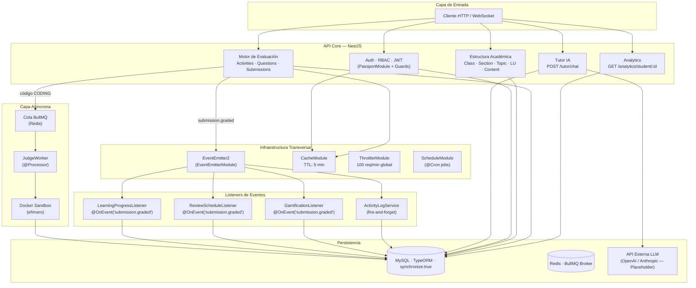
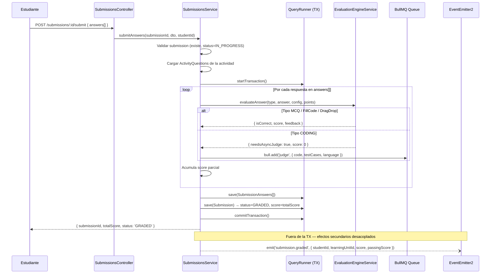
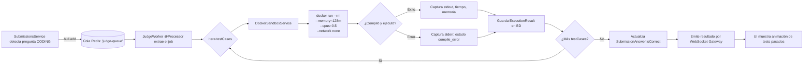

# STIRE — Arquitectura Maestra del Sistema
**Versión basada en código fuente real · Stack: NestJS · PostgreSQL/MySQL · TypeORM · BullMQ · Redis**

---

## 1. Filosofía Arquitectónica

STIRE está construido sobre **Domain-Driven Design (DDD) adaptado a NestJS**. Cada carpeta dentro de `src/` es un **Bounded Context** cerrado: tiene su propia Entidad, DTO, Controlador, Servicio y Repositorio. Los módulos no se importan directamente entre sí para ejecutar lógica — se comunican exclusivamente a través de **Eventos de Dominio** o por inyección de dependencias a través del sistema de módulos de NestJS.

### Principio Central: Desacoplamiento Total
Un módulo que necesita reaccionar al trabajo de otro NO lo llama directamente. En su lugar, el módulo emisor "grita al aire" mediante un evento. Los módulos receptores escuchan de forma pasiva. Esto garantiza que la evaluación de una sumisión nunca bloquee al estudiante esperando que se recalcule su Mastery.

---

## 2. Vista de la Arquitectura Completa



---

## 3. Módulos Registrados en `AppModule`

Los módulos se dividen en dos generaciones:

### Módulos Legacy (Estructura Académica Base)
| Módulo | Responsabilidad |
|--------|----------------|
| `UserModule` | Registro, perfil y roles de usuarios |
| `AuthModule` | Login, JWT, estrategias Passport |
| `ClassModule` | CRUD de clases (cursos) |
| `SectionModule` | Módulos/Cortes dentro de una clase |
| `TopicModule` | Temas dentro de una sección |
| `LearningUnitModule` | Bloque atómico de aprendizaje |
| `ContentModule` | Material teórico vinculado a una LU |
| `EnrollmentModule` | Inscripciones de estudiantes a clases |
| `InstitutionModule` | Catálogo de instituciones y programas |

### Módulos de Nueva Arquitectura (Core Inteligente)
| Módulo | Responsabilidad |
|--------|----------------|
| `ActivityTypesModule` | Catálogo de tipos de actividad |
| `ActivitiesModule` | Contenedores de exámenes/talleres |
| `ActivityQuestionsModule` | Preguntas con config JSON dinámica |
| `EvaluationEngineModule` | Strategy Pattern para auto-grading |
| `SubmissionsModule` | Flujo completo de intentos + transacción |
| `SubmissionAnswersModule` | Respuestas individuales calificadas |
| `JudgeEngineModule` | Worker asíncrono + Docker Sandbox |
| `TutorModule` | Contexto IA + historial + LLM |
| `LearningProgressModule` | Cálculo de Mastery por unidad |
| `ReviewSchedulesModule` | Algoritmo SM-2 de repaso espaciado |
| `AnalyticsModule` | Reportes de progreso y desempeño |
| `GamificationModule` | Logros/Achievements (en construcción) |
| `ActivityLogModule` | Registro append-only de acciones pedagógicas |
| `QuestionBanksModule` | Banco de preguntas reutilizables (sin service aún) |
| `PrerequisitesModule` | Reglas de bloqueo entre unidades (sin service aún) |

### Infraestructura Global
| Módulo | Configuración |
|--------|--------------|
| `ConfigModule` | `isGlobal: true`, lee `.env` |
| `EventEmitterModule` | Eventos de dominio en memoria |
| `BullModule` | Conecta a Redis (`REDIS_HOST`, `REDIS_PORT`) |
| `TypeOrmModule` | MySQL, `synchronize: true` (dev), auto-descubre `*.entity.ts` |
| `ThrottlerModule` | 100 req / 60 seg global |
| `CacheModule` | `isGlobal: true`, TTL 5 minutos |
| `ScheduleModule` | Habilita decoradores `@Cron` |

> ⚠️ **Regla de Producción:** `synchronize: true` debe cambiarse a `false` antes de cualquier despliegue productivo. En producción se usan Migraciones TypeORM explícitas.

---

## 4. Flujo Sincrónico Principal: El Ciclo de Vida de una Submission

Este es el flujo más crítico del sistema. Todo lo que pasa al momento de calificar una entrega.



**Garantía de Consistencia:** El `QueryRunner` asegura que si falla el guardado de cualquier `SubmissionAnswer`, se hace `rollbackTransaction()` y el estudiante no recibe una nota parcial o corrupta. El evento solo se emite **después** de un `commitTransaction()` exitoso.

---

## 5. Flujo Asíncrono: El Judge Engine (Evaluación de Código)



### Configuración de Seguridad del Sandbox
| Parámetro Docker | Valor | Propósito |
|---|---|---|
| `--rm` | (flag) | El contenedor se destruye solo al terminar |
| `--memory` | `128m` | Evita Fork Bombs y memory leaks inducidos |
| `--cpus` | `0.5` | Limita consumo de CPU por contenedor |
| `--network` | `none` | Aísla completamente el acceso a internet |
| Timeout Worker | Configurable | Mata el contenedor si hay ciclos infinitos |

---

## 6. Sistema de Eventos de Dominio

### El Evento Central: `submission.graded`

```typescript
// Payload del evento (SubmissionGradedEvent)
{
  submissionId: string,    // UUID del intento
  studentId: number,       // Quién realizó el intento
  activityId: number,      // Qué actividad resolvió
  learningUnitId: number,  // En qué unidad está la actividad
  score: number,           // Puntaje obtenido (0-100)
  passingScore: number     // Umbral mínimo para aprobar
}
```

### Listeners Registrados

| Listener | `@OnEvent` | Qué hace |
|---|---|---|
| `LearningProgressListener` | `submission.graded` | Llama a `recalculateMastery()` — actualiza Mastery y successRate |
| `ReviewScheduleListener` | `submission.graded` | Ejecuta `calculateNextReview()` — ajusta fecha SM-2 |
| `GamificationListener` | `submission.graded` | Evalúa si se desbloquea un Achievement (en construcción) |
| `ActivityLogService.log()` | (llamado directo, fire-and-forget) | Registra `SUBMISSION_GRADED` en `activity_logs` |

> **Regla de Oro:** Los Listeners son **asíncronos y no bloqueantes**. Si un Listener falla, el estudiante ya tiene su nota — el error queda en logs del servidor pero nunca interrumpe la experiencia del usuario.

---

## 7. Infraestructura de Caché y Rate Limiting

### CacheModule
- **TTL global:** 5 minutos (300.000 ms)
- **Casos de uso:** Listas de clases públicas, catálogos de `ActivityTypes`, perfiles de usuario. Nunca debe cachearse progreso de estudiante ni submissions activas.

### ThrottlerModule
- **Global:** 100 req / 60 seg
- **Endpoints críticos (aplicar override `@Throttle`):**

| Endpoint | Límite sugerido | Razón |
|---|---|---|
| `POST /auth/login` | 5 / min | Prevención de fuerza bruta |
| `POST /tutor/chat` | 20 / min | Control de gasto en tokens LLM |
| `POST /submissions/:id/submit` | 10 / min | Prevención de spam de intentos |

---

## 8. Convenciones de Desarrollo Obligatorias

### Estructura de Módulo
Todo módulo nuevo DEBE contener exactamente: `module`, `controller`, `service`, `repository` (custom), carpeta `dto/`, carpeta `entities/`. Un módulo sin controller y sin service es un **Módulo Zombie** y debe eliminarse o completarse.

### Nomenclatura
| Elemento | Convención | Ejemplo |
|---|---|---|
| Archivos | `kebab-case` | `learning-progress.service.ts` |
| Clases | `PascalCase` | `LearningProgressService` |
| Tablas SQL | `snake_case` plural | `activity_questions` |
| Variables/Métodos | `camelCase` | `calculateUnitMastery` |

### Errores y Excepciones
- **SIEMPRE** usar excepciones HTTP de NestJS: `NotFoundException`, `BadRequestException`, `ConflictException`, `ForbiddenException`.
- **NUNCA** dejar un catch vacío ni propagar errores 500 genéricos al cliente.
- `GlobalExceptionFilter` intercepta y sanitiza todo error no controlado.

### Mutaciones Críticas
Cualquier operación que escriba en más de una tabla simultáneamente (ej: `submitAnswers`, `enrollStudent`) DEBE usar `QueryRunner` con `startTransaction()` / `commitTransaction()` / `rollbackTransaction()`.

### Borrado de Entidades
El borrado físico (`DELETE`) está **prohibido** en entidades core. Usar siempre Soft Delete (`@DeleteDateColumn`). La excepción son tablas de logs append-only como `activity_logs`.

### Relaciones ManyToMany
**Prohibido** el uso de `@ManyToMany` con `@JoinTable` automático de TypeORM. Toda relación N:M debe implementarse como una **Entidad Puente Explícita** con columnas propias auditables (ej: `Enrollment`, `SubmissionAnswer`).
