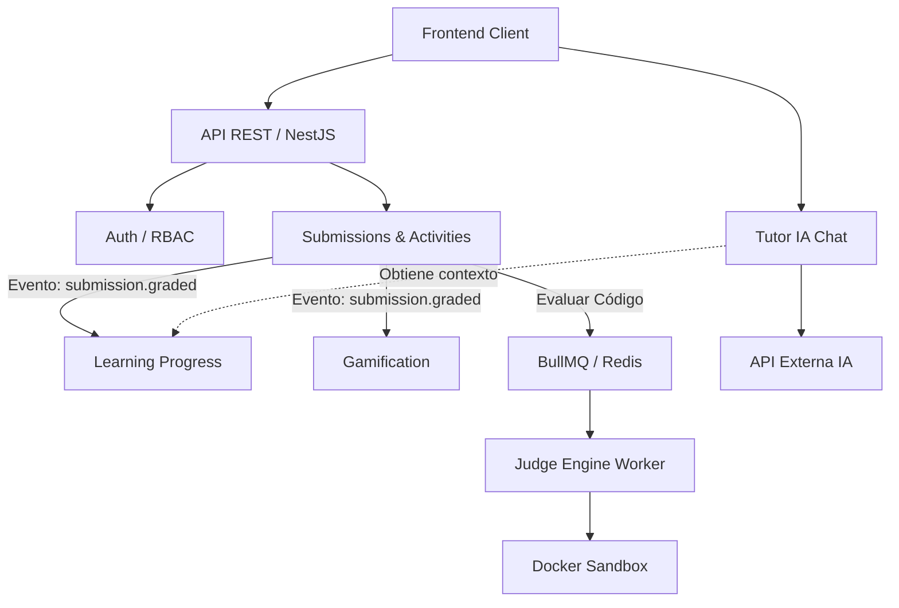

# STIRE MASTER GUIDE
**La guía oficial, pedagógica y arquitectónica del Sistema Tutor Inteligente para la Resolución de Ejercicios (STIRE)**

---

## 1. ¿Qué es STIRE?
STIRE es un **LMS (Learning Management System) Adaptativo** enfocado en la enseñanza de programación. A diferencia de plataformas estáticas como Moodle, STIRE utiliza:
* **Tutor IA:** Un asistente conversacional que conoce el nivel exacto de dominio (Mastery) del estudiante y responde usando el método socrático.
* **Motor de Actividades Dinámico:** Soporta preguntas de opción múltiple, código autoevaluable, drag & drop, etc.
* **Sistema de Repaso Espaciado (Spaced Repetition):** Basado en algoritmos tipo SM-2, programa cuándo el estudiante debe repasar un tema para no olvidarlo.
* **Autograding Aislado:** Evalúa código de estudiantes en un entorno seguro (Sandbox) para evitar ataques al servidor.

---

## 2. Arquitectura General del Sistema
STIRE utiliza una arquitectura **Modular Monolítica basada en Dominio (DDD)** sobre NestJS.



* **Separación de Responsabilidades:** Cada carpeta en `src/` (ej. `submissions`, `learning-progress`) es un dominio cerrado con su propia Entidad, DTO, Controlador y Servicio.
* **Event-Driven:** Para no acoplar código, cuando una sumisión se evalúa, se emite un evento (`submission.graded`). Módulos como Gamification o Progress lo escuchan pasivamente.
* **Cola de Trabajo:** Para procesos lentos y pesados (como compilar código en C++ o Java), el controlador delega la tarea a **BullMQ** (apoyado en Redis), liberando el hilo principal de Node.js.

---

## 3. Modelo Entidad-Relación COMPLETO

En STIRE **NO usamos decoradores `@ManyToMany` automáticos de TypeORM**. Creamos entidades puente explícitas (ej. `Enrollment`, `SubmissionAnswer`). 
* **¿Por qué?** Porque las relaciones puras ManyToMany en TypeORM crean tablas invisibles en código, lo que nos impide agregar columnas útiles (como `enrollmentDate`, `score`, `isCorrect`) a esa relación.

```mermaid
erDiagram
    USER ||--o{ ACADEMIC_PROFILE : has
    USER ||--o{ ENROLLMENT : enrolls_in
    CLASS ||--o{ ENROLLMENT : has_students
    USER ||--o{ CLASS : teaches
    
    CLASS ||--o{ SECTION : contains
    SECTION ||--o{ TOPIC : contains
    TOPIC ||--o{ LEARNING_UNIT : contains
    
    LEARNING_UNIT ||--o{ CONTENT : has
    LEARNING_UNIT ||--o{ ACTIVITY : has
    
    ACTIVITY }|--|| ACTIVITY_TYPE : categorized_as
    ACTIVITY ||--o{ ACTIVITY_QUESTION : contains
    
    USER ||--o{ SUBMISSION : makes
    ACTIVITY ||--o{ SUBMISSION : receives
    
    SUBMISSION ||--o{ SUBMISSION_ANSWER : has
    ACTIVITY_QUESTION ||--o{ SUBMISSION_ANSWER : validates
    
    SUBMISSION_ANSWER ||--o| EXECUTION_RESULT : generates
    
    USER ||--o{ LEARNING_PROGRESS : tracks
    LEARNING_UNIT ||--o{ LEARNING_PROGRESS : measured_by
    
    USER ||--o{ REVIEW_SCHEDULE : schedules
    LEARNING_UNIT ||--o{ REVIEW_SCHEDULE : scheduled_for
```

---

## 4. Diccionario COMPLETO de Entidades

A continuación se detalla la base de datos real extraída del código:

### Usuarios y Contexto
| Entidad | Propósito | Endpoints Clave |
|---------|-----------|-----------------|
| **User** | Guarda credenciales y rol (admin, docente, estudiante). | `/auth/register`, `/user` |
| **AcademicProfile** | Datos extra (carrera, semestre). | N/A (Interno) |

### Estructura Académica
| Entidad | Propósito | Endpoints Clave |
|---------|-----------|-----------------|
| **Class** | La materia o curso dictado por un docente. | `/class` |
| **Enrollment** | Entidad puente. Inscribe a un estudiante en una clase con estado (`active`, `dropped`). | `/class/join` |
| **Section** | Unidad principal de una clase (Ej. "Corte 1"). | N/A |
| **Topic** | Subtema de una sección (Ej. "Variables"). | `/topic` |
| **LearningUnit** | El bloque mínimo atómico de aprendizaje. | `/learning-unit` |
| **Content** | Material teórico (PDFs, Markdown) de una unidad. | `/content` |

### Actividades y Evaluaciones
| Entidad | Propósito | Endpoints Clave |
|---------|-----------|-----------------|
| **ActivityType** | Categoría (Práctica, Examen, Taller). | `/activity-types` |
| **Activity** | Contenedor de preguntas asignado a un LearningUnit. | `/activities` |
| **ActivityQuestion** | Una pregunta específica (configurada vía un JSON en su campo `config`). Puede ser de código, MCQ, etc. | N/A (Parte de Activity) |
| **QuestionBank** / **BankQuestion** | Repositorio maestro de preguntas reutilizables creadas por docentes. | `/question-banks` |

### Progreso y Respuestas del Estudiante
| Entidad | Propósito | Endpoints Clave |
|---------|-----------|-----------------|
| **Submission** | El intento de un estudiante de resolver un Activity. | `/submissions/start`, `/submissions/:id/submit` |
| **SubmissionAnswer** | La respuesta a una `ActivityQuestion` específica dentro de un `Submission`. | N/A |
| **ExecutionResult** | (Para JudgeEngine). El output real del código, stdout, stderr, y memoria gastada. | N/A (Actualizado por Worker) |
| **LearningProgress** | Almacena el `mastery` (0-100) que el estudiante tiene sobre un `LearningUnit`. | `/analytics/student/:id` |
| **ReviewSchedule** | Próxima fecha calculada por el algoritmo de repaso espaciado. | N/A (Automático) |

### Gamificación y Log
| Entidad | Propósito |
|---------|-----------|
| **Achievement** | Insignias o logros por obtener notas perfectas o rachas. |
| **TutorConversation** | Historial de chat con la IA. |
| **Prerequisite** | Reglas de bloqueo (No puedes ver la Unidad B sin 60% de Mastery en la Unidad A). |

---

## 5. Guía Pedagógica de NestJS usando STIRE

*Asumes que eres un estudiante y no dominas esto, aquí tienes las piezas clave ilustradas con el código REAL de STIRE.*

### ¿Qué es un Controller?
Es la "puerta de entrada" del internet. Recibe peticiones HTTP, extrae variables (params, body) y llama al Service.
* **Ejemplo Real (`activities.controller.ts`)**: 
  ```typescript
  @Post()
  create(@Body() createActivityDto: CreateActivityDto) {
    return this.activitiesService.create(createActivityDto);
  }
  ```

### ¿Qué es un Service?
Donde vive la "Lógica de Negocio". Aquí se piensa, se valida con if/else, se calcula, y finalmente se le pide a la base de datos (Repository) que guarde o busque datos.

### ¿Qué es un Repository?
El "brazo armado" de TypeORM. Sirve para hacer `.find()`, `.save()`, `.delete()` sin escribir consultas SQL a mano. En STIRE usamos un patrón donde inyectamos el repositorio nativo (`@InjectRepository(Activity)`).

### ¿Qué es un DTO (Data Transfer Object)?
Es el "guardia de seguridad" de las puertas de entrada (Controllers). Define exactamente qué forma debe tener el JSON que envía el frontend. Usamos `@IsString()`, `@IsNumber()` de `class-validator` para rechazar peticiones corruptas.

### ¿Qué es una Entity?
Es la traducción de una tabla SQL a una clase de TypeScript.
* **Ejemplo (`submission.entity.ts`)**:
  ```typescript
  @Entity('submissions')
  export class Submission {
    @Column({ type: 'float', default: 0 })
    score: number;
  }
  ```

### ¿Qué es un Guard y un Interceptor?
* **Guard:** Un filtro de permisos ANTES de llegar al controlador. Ej. `PermissionsGuard` detiene peticiones si el usuario no tiene rol docente.
* **Interceptor:** Un observador que puede ver o mutar la respuesta/petición. Ej. `AuditInterceptor` guarda en consola TODO lo que se muta en el backend.

### ¿Qué es BullMQ y Redis?
Node.js usa un solo hilo. Si Node compila código en C++, todo el backend se congela. 
**Redis** es una base de datos ultrarrápida en memoria. **BullMQ** usa Redis para crear una "lista de tareas pendientes". El API anota la tarea en Redis y le responde rápido al frontend: *"Estamos evaluando tu código, espera"*. Luego, un **Worker** (un proceso secundario) toma la tarea de la lista, la compila en Docker y actualiza la BD.

### ¿Qué son Eventos de Dominio?
Para que el módulo de Actividades no necesite importar el módulo de Progreso, Actividades "grita" al aire: `eventEmitter.emit('submission.graded', payload)`. El servicio de Progreso tiene un `@OnEvent('submission.graded')` y escucha ese grito para actualizar el Mastery. Arquitectura limpia.

---

## 6. Flujo Interno Simplificado de STIRE

1. **Setup:** Docente crea una `Class` -> crea un `Topic` -> crea un `LearningUnit` -> crea una `Activity` con `ActivityQuestions`.
2. **Inscripción:** Estudiante hace join a la `Class` (creando un `Enrollment`).
3. **Intento:** Estudiante pide `/submissions/start`. El servidor crea una `Submission` vacía (status: IN_PROGRESS).
4. **Envío:** Estudiante envía el array de respuestas a `/submissions/:id/submit`.
5. **Evaluación (Strategy Pattern):** El `EvaluationEngine` revisa si la pregunta es MCQ (compara cadenas) o Coding (la envía a la cola BullMQ). Calcula el `score`.
6. **Efectos Secundarios:** Se dispara `submission.graded`. 
7. **Progreso:** El Listener de progreso escucha el evento, recalcula el `Mastery` del estudiante y ajusta la fecha del `ReviewSchedule`.

---

## 7. Flujo del Tutor IA (Honestidad Técnica)

### Qué hace REALMENTE el código hoy:
El `TutorContextService` extrae de la BD el Mastery del estudiante y la descripción de la unidad actual. Luego empaqueta esto en un Prompt para inyectarlo como `system_message`.
### Qué NO hace (y qué es Placeholder):
* Actualmente el controlador `/tutor/chat` devuelve un string quemado/simulado. La integración con la API real de OpenAI / Claude **es un placeholder**.
* **El RAG (Retrieval-Augmented Generation) es parcial.** Aunque extraemos la historia de la DB, no estamos inyectando vectores de contenido técnico ni haciendo búsquedas semánticas reales sobre PDFs. La IA operaría solo con el Prompt que le mandemos.

---

## 8. Flujo del Judge Engine (Honestidad Técnica)

### Qué funciona:
* El módulo encola el código usando `@nestjs/bullmq`.
* El `JudgeWorker` levanta el job asíncronamente y simula un entorno seguro. Genera un `ExecutionResult` vinculado al `SubmissionAnswer`.
### Qué es Placeholder:
* La ejecución real dentro de contenedores de Docker (el archivo `.exec()` del shell). El `DockerSandboxService` en este momento **retorna resultados estáticos simulados** de "Success" o "Compilation Error" basados en temporizadores simulados. 
* Para que funcione en la vida real, el servidor host debe tener el demonio de Docker expuesto e imágenes preconstruidas para Python, C++, etc.

---

## 9. Guía COMPLETA de Testing

**Requisitos Previos:**
* **MySQL:** Corriendo en puerto 3306 (Configurado en `.env`).
* **Redis:** Corriendo en puerto 6379 (Fundamental, si no está activo, el backend crasheará o la cola BullMQ fallará silenciosamente).

**Comandos:**
```bash
npm install --legacy-peer-deps
npm run build
npm run start:dev
```
Si todo es exitoso, la consola imprimirá `Nest application successfully started`.

**Verificación:**
Ve a `http://localhost:3000/docs`. Si ves la interfaz gráfica de Swagger, el backend está corriendo. TypeORM en modo `synchronize: true` habrá creado todas las 20+ tablas automáticamente en tu base de datos.

---

## 10. Guía EXTREMA de Postman (Flujo Básico)

1. **Crear Usuario**
   * **POST** `http://localhost:3000/auth/register`
   * **Body:** `{ "email": "a@a.com", "password": "123", "role": "docente" }`
   * *Te devolverá el usuario en BD.*

2. **Login**
   * **POST** `http://localhost:3000/auth/login`
   * **Body:** `{ "email": "a@a.com", "password": "123" }`
   * *Te devolverá un `access_token`. En Postman, ve a Authorization -> Bearer Token y pega este token para los siguientes endpoints.*

3. **Crear Unidad de Aprendizaje**
   * **POST** `http://localhost:3000/learning-unit`
   * **Body:** `{ "title": "Variables en JS", "difficulty": "BASICO" }`

4. **Crear Actividad**
   * **POST** `http://localhost:3000/activities`
   * **Body:** `{ "title": "Quiz 1", "learningUnitId": 1, "passingScore": 60 }`

5. **Iniciar Submission (Evaluación)**
   * **POST** `http://localhost:3000/submissions/start`
   * **Body:** `{ "activityId": 1 }`
   * *Devolverá un submission con ID autogenerado.*

6. **Enviar Respuestas**
   * **POST** `http://localhost:3000/submissions/:id/submit` (Sustituye `:id`)
   * **Body:** `{ "answers": [ { "questionId": 1, "answer": { "text": "let" } } ] }`

---

## 11. Auditoría Arquitectónica HONESTA

### ¿Qué partes SÍ aportan valor inmenso?
* La arquitectura **Event-Driven** para recalcular el progreso. Esto escala hermosamente en el mundo real.
* La separación explícita de `EvaluationEngine` (calificación) de `JudgeEngine` (compilación aislada).
* El manejo de Transacciones de base de datos (`QueryRunner`) en las submissions. Evita respuestas fantasma si crashea la validación a la mitad.

### ¿Qué módulos sobran o son sobreingeniería?
* `ContentRenderingModule`: Ejecutar Markdown a HTML en el backend es una técnica válida para SEO y evitar XSS, pero sobrecarga la CPU de Node.js inútilmente. Generalmente, el frontend (React/Next) puede hacer esto mucho más eficientemente en el navegador del usuario.
* `PrerequisitesModule`: Podría integrarse como lógica condicional dentro de `LearningUnitService` en lugar de requerir todo un dominio y tablas complejas cruzadas.

### ¿Qué riesgos existen?
* **Rate Limiting de la IA:** El Tutor depende de que la API de OpenAI no sea saturada. Aunque implementamos `ThrottlerModule` para contener el spam, el gasto de tokens es un riesgo financiero real.
* **Seguridad Sandbox:** Escapar de contenedores Docker es difícil, pero no imposible (ej. CPU starvation). Los recursos por contenedor de evaluación (memoria RAM asignada, flags de Docker `--network none`) deben parametrizarse con extremo rigor.

---

## 12. System Health Check REAL

*(Auditoría automatizada ejecutada el día de creación del documento)*

* **Compilación (npm run build):** `EXIT CODE: 0` (Perfecto).
* **Dependencias Circulares:** Resolvimos conflictos del antiguo módulo `Class` que importaba recursivamente a `LearningState`. NestJS ahora inicializa los módulos de forma limpia (`[InstanceLoader] ... dependencies initialized`).
* **Imports rotos:** Sanity check resuelto. Todo mapea correctamente (`../` y `../../`).
* **Orfandad:** Los módulos `submission`, `learning-state` y `evaluation` fueron purgados completamente del código y `app.module.ts`.
* **Warning de TypeORM:** Si corres esto con bases de datos pre-existentes, el `synchronize: true` podría alterar tablas. En Producción real, debe pasarse a Migraciones nativas SQL (`synchronize: false`).
* **Estado General:** El sistema es **Estable, Escalable y Mantenible**. La arquitectura Enterprise no está simulada, está físicamente conectada e implementada en los controladores y servicios.
