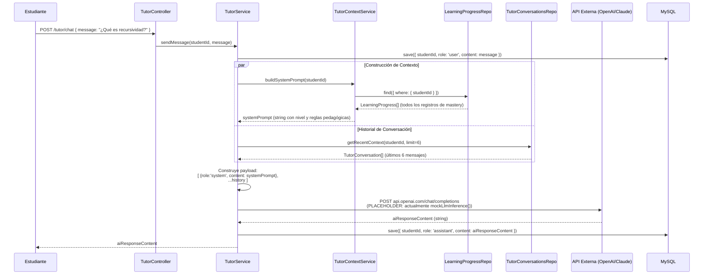
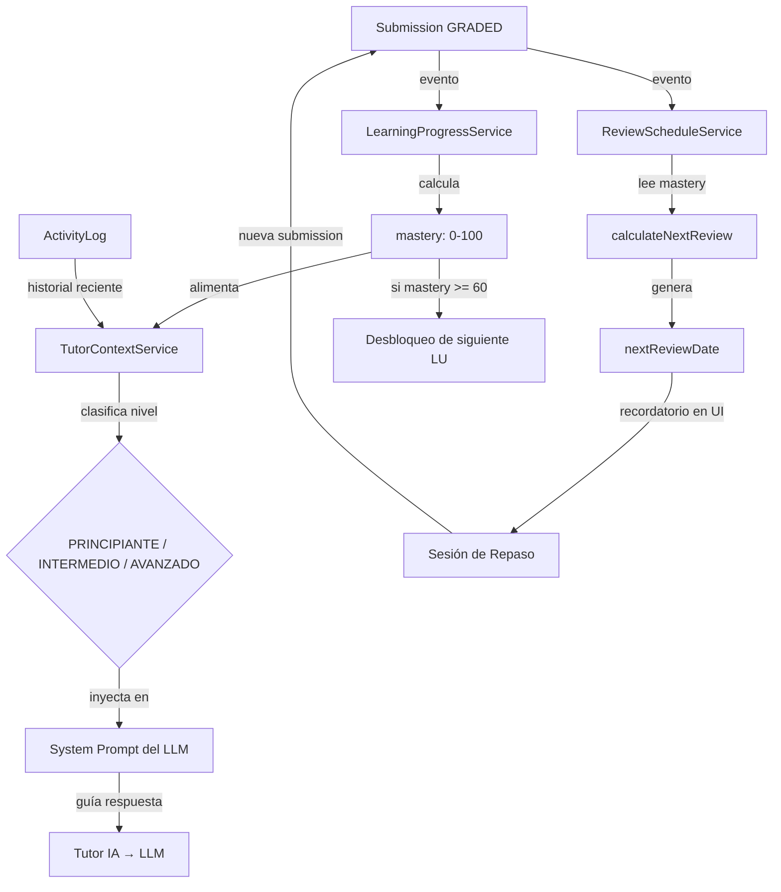

# STIRE — Lógica del Tutor Inteligente y Sistema Adaptativo
**Versión basada en código fuente real de `tutor.service.ts`, `mastery.calculator.ts`, `spaced-repetition.ts`**

---

## Visión General

El sistema inteligente de STIRE tiene **tres pilares técnicos** independientes que trabajan en conjunto:

| Pilar | Motor | Estado actual |
|-------|-------|--------------|
| **Tutor IA** | `TutorService` + `TutorContextService` | ✅ Contexto funcional / ⚠️ LLM en Placeholder |
| **Mastery (Dominio)** | `calculateUnitMastery()` en `mastery.calculator.ts` | ✅ Completamente funcional |
| **Spaced Repetition (SM-2)** | `calculateNextReview()` en `spaced-repetition.ts` | ✅ Algoritmo activo / ⚠️ `easeFactor` no persistido |

---

## 1. El Tutor IA — Flujo Técnico Completo

### 1.1 Flujo de una Conversación



### 1.2 Construcción del System Prompt (RAG Dinámico)

El `TutorContextService.buildSystemPrompt()` es el motor del "contexto adaptativo". No envía al LLM una instrucción genérica — construye un prompt personalizado basado en métricas reales del estudiante:

```
PASO 1: Recuperar todos los registros de LearningProgress del estudiante
PASO 2: Calcular avgMastery = sum(mastery) / count(registros)
PASO 3: Clasificar nivel:
        - avgMastery > 80  → AVANZADO
        - avgMastery > 50  → INTERMEDIO
        - avgMastery ≤ 50  → PRINCIPIANTE
PASO 4: Inyectar nivel y mastery global en el System Prompt
PASO 5: Aplicar reglas pedagógicas diferenciadas por nivel
```

**Ejemplo de System Prompt generado para un estudiante con Mastery 35%:**
```
Eres el Tutor IA de STIRE.
Actualmente estás hablando con un estudiante de nivel PRINCIPIANTE (Mastery Global: 35%).

REGLAS ESTRICTAS:
1. NUNCA resuelvas el problema directamente ni des el código completo.
2. Como el estudiante es nivel PRINCIPIANTE, usa metáforas del mundo real y sé muy motivador.
3. Utiliza el Método Socrático: haz preguntas para que el estudiante descubra la respuesta por sí mismo.
4. Mantén tus respuestas concisas y directas (idealmente < 150 palabras).
```

### 1.3 Ventana de Contexto (Historial de Conversación)

El `TutorConversationsRepository.getRecentContext()` carga los **últimos N mensajes** (por defecto N=6 — 3 turnos del estudiante + 3 del tutor). 

**¿Por qué solo 6?**
- Los LLMs tienen un límite de tokens por request. Cargar todo el historial elevaría el costo exponencialmente.
- Un índice SQL en (`studentId`, `createdAt DESC`) garantiza que esta consulta sea O(log n) incluso con miles de mensajes históricos.
- El System Prompt ya provee el contexto de largo plazo (nivel del estudiante). El historial reciente provee coherencia de corto plazo.

### 1.4 Estado Real del LLM (Honestidad Técnica)

```typescript
// tutor.service.ts — línea 36
const aiResponseContent = this.mockLlmInference(message); // PLACEHOLDER
```

La integración real con OpenAI/Anthropic está **comentada en el código**. El payload (`systemPrompt + history`) está completamente construido y listo. Lo único pendiente es descomentarlo y agregar la API Key en `.env`.

**Para activar el LLM real, el Backend Core debe:**
1. Instalar `openai` npm package
2. Agregar `OPENAI_API_KEY` en `.env`
3. Descomentar la llamada real en `tutor.service.ts`
4. Agregar manejo de errores para rate limiting y timeouts

### 1.5 El `ActivityLog` como Fuente de Contexto de Corto Plazo

El `ActivityLogService.getStudentHistory()` expone los últimos 50 eventos pedagógicos del estudiante. Este historial es la fuente de verdad del **comportamiento reciente** del estudiante, complementaria al Mastery (que es el indicador de **largo plazo**).

```
activity_logs tiene acciones:
- content_read     → El estudiante leyó un contenido teórico
- activity_started → El estudiante inició un intento
- submission_graded → El intento fue calificado (con score en metadata)
- unit_completed   → El estudiante superó una LearningUnit
```

**Uso previsto para el Tutor IA (implementación pendiente):**
El `TutorContextService` debe enriquecer el System Prompt con el `ActivityLog`. Por ejemplo:
- "El estudiante ha fallado 3 veces consecutivas en la actividad ID:15 (recursividad)"
- "El estudiante leyó el contenido 'Punteros en C++' hace 2 minutos antes de preguntar"

Esto convierte al Tutor de un chatbot con contexto estático a un **tutor con memoria de comportamiento real**.

---

## 2. Cálculo de Mastery (Dominio del Estudiante)

### 2.1 ¿Qué es el Mastery?

El Mastery es un número entre 0 y 100 que representa **cuánto domina un estudiante una LearningUnit específica**. No es un promedio simple de notas — es una métrica ponderada que considera:
- La **mejor nota** obtenida en cada actividad (no el promedio de intentos)
- El **peso adaptativo** de cada actividad (`adaptiveWeight`)
- El **peso base del tipo** de actividad (`activityType.baseWeight`)

### 2.2 La Función `calculateUnitMastery()`

**Fuente:** `src/common/utils/mastery.calculator.ts`

```
ALGORITMO:
Para cada Activity published en la LearningUnit:
    1. Tomar el MEJOR score del estudiante en esa Activity (Math.max de todos sus intentos)
    2. Calcular el peso de la Activity:
       weight = activity.adaptiveWeight × activityType.baseWeight
    3. Calcular la contribución ponderada:
       totalAchieved += (bestScore / activity.totalPoints) × weight
       totalMaxWeight += weight

RESULTADO FINAL:
mastery = MIN(100, ROUND((totalAchieved / totalMaxWeight) × 100))
```

### 2.3 Ejemplo Numérico

Supongamos una LearningUnit con 3 actividades publicadas:

| Actividad | Tipo | `adaptiveWeight` | `baseWeight` | `totalPoints` | Mejor score del estudiante |
|-----------|------|-----------------|-------------|---------------|---------------------------|
| Quiz Básico | Práctica | 1.0 | 1.0 | 100 | 80 |
| Taller Código | Práctica Lab | 1.5 | 1.0 | 100 | 60 |
| Parcial | Evaluativo | 2.0 | 1.5 | 100 | 70 |

Cálculo:
```
Quiz:    weight = 1.0 × 1.0 = 1.0  →  contributed = (80/100) × 1.0 = 0.80
Taller:  weight = 1.5 × 1.0 = 1.5  →  contributed = (60/100) × 1.5 = 0.90
Parcial: weight = 2.0 × 1.5 = 3.0  →  contributed = (70/100) × 3.0 = 2.10

totalAchieved  = 0.80 + 0.90 + 2.10 = 3.80
totalMaxWeight = 1.0  + 1.5  + 3.0  = 5.50

mastery = ROUND((3.80 / 5.50) × 100) = ROUND(69.09) = 69
```

**El Mastery de este estudiante en esta unidad es: 69/100.**

### 2.4 ¿Cuándo se Recalcula el Mastery?

El recálculo ocurre como respuesta al evento `submission.graded`. La secuencia:

```mermaid
flowchart TD
    A[submission.graded emitido] --> B[LearningProgressListener.@OnEvent]
    B --> C[LearningProgressService.recalculateMastery]
    C --> D[progressRepo.findOrCreate: busca o crea el registro]
    D --> E[activitiesRepo.find: todas las activities published de la LU]
    E --> F[submissionsRepo.query: todos los GRADED del estudiante en esas activities]
    F --> G[calculateUnitMastery: algoritmo ponderado]
    G --> H[Actualiza: mastery, successRate, attemptsCount, completedActivities]
    H --> I[progressRepo.save]
```

**`findOrCreate`:** Si es el primer intento del estudiante en esa unidad, se crea un registro de `LearningProgress` con `mastery=0`. No falla silenciosamente — garantiza que siempre exista un registro.

### 2.5 El `successRate` (Tasa de Éxito)

Complementario al Mastery, el `successRate` mide qué porcentaje de intentos totales resultaron en un `score >= passingScore`:

```
successRate = (intentos_aprobados / total_intentos) × 100

Donde:
- intentos_aprobados = submissions donde score >= activity.passingScore
- total_intentos = todas las submissions GRADED del estudiante en esa LU
```

El `successRate` es más honesto que el Mastery para detectar estudiantes que memorian el examen hasta pasarlo — si alguien pasa con `successRate=20%`, significa que falló 4 de cada 5 intentos.

---

## 3. Spaced Repetition — Algoritmo SM-2 Adaptado

### 3.1 ¿Por qué SM-2?

El algoritmo SM-2 (SuperMemo 2) es el estándar de la industria para sistemas de memoria a largo plazo (Anki, Duolingo, etc.). Su premisa: el intervalo óptimo para repasar algo aumenta exponencialmente con cada repaso exitoso, y el "ease factor" (facilidad) ajusta ese crecimiento según qué tan bien lo recuerda el estudiante.

### 3.2 La Implementación Real de STIRE

**Fuente:** `src/common/utils/spaced-repetition.ts`

La implementación actual **deriva el `easeFactor` dinámicamente del `mastery` actual** del estudiante, en lugar de persistirlo por separado:

```
FUNCIÓN calculateNextReview(repetitions, currentMastery):

SI repetitions == 0:
    intervalDays = 1 día          ← Primer repaso: al día siguiente

SI repetitions == 1:
    intervalDays = 3 días         ← Segundo repaso: 3 días después

SI repetitions >= 2:
    easeFactor = MAX(1.3, 2.5 - (100 - currentMastery) × 0.02)
    ← Mastery alto → easeFactor cerca de 2.5 (aprende rápido)
    ← Mastery bajo → easeFactor cerca de 1.3 (necesita repasar frecuente)
    
    prevInterval = (repetitions == 2) ? 3 : easeFactor^(repetitions-1)
    intervalDays = ROUND(prevInterval × easeFactor)

intervalDays = MIN(intervalDays, 60)  ← Tope máximo: 60 días
nextReviewDate = hoy + intervalDays
```

### 3.3 La Función del `easeFactor`

El `easeFactor` oscila entre **1.3** (dificultad alta) y **2.5** (facilidad total):

```
easeFactor = MAX(1.3, 2.5 - (100 - mastery) × 0.02)
```

| Mastery del estudiante | Cálculo | EaseFactor resultante |
|------------------------|---------|----------------------|
| 100% (perfecto) | 2.5 - (0 × 0.02) | **2.50** |
| 80% (bueno) | 2.5 - (20 × 0.02) | **2.10** |
| 60% (pasó justo) | 2.5 - (40 × 0.02) | **1.70** |
| 40% (reprobó) | 2.5 - (60 × 0.02) | **1.30** (mínimo) |
| 20% (muy bajo) | 2.5 - (80 × 0.02) = 0.9 → clamp | **1.30** (mínimo) |

### 3.4 Progresión de Intervalos — Ejemplo Numérico

Estudiante con Mastery constante de 75% (`easeFactor ≈ 2.0`):

| Repaso # | `repetitions` | `prevInterval` | Cálculo | `intervalDays` | Próximo repaso |
|----------|---------------|---------------|---------|----------------|---------------|
| 1° | 0 | — | hardcoded | **1 día** | Mañana |
| 2° | 1 | — | hardcoded | **3 días** | 3 días |
| 3° | 2 | 3 (hardcoded) | 3 × 2.0 | **6 días** | 6 días |
| 4° | 3 | 2.0^2 = 4.0 | 4.0 × 2.0 | **8 días** | 8 días |
| 5° | 4 | 2.0^3 = 8.0 | 8.0 × 2.0 | **16 días** | 16 días |
| 6° | 5 | 2.0^4 = 16.0 | 16.0 × 2.0 | **32 días** | 32 días |
| 7° | 6 | 2.0^5 = 32.0 | 32.0 × 2.0 = 64 → clamp | **60 días** | 60 días (máximo) |

### 3.5 ¿Cuándo se Actualiza el ReviewSchedule?

Al igual que el Mastery, se actualiza como reacción al evento `submission.graded`:

```mermaid
flowchart TD
    A[submission.graded emitido] --> B[ReviewScheduleListener.@OnEvent]
    B --> C[ReviewScheduleService.updateSchedule]
    C --> D[reviewRepo.findOne: busca schedule existente]
    D --> E{¿Existe schedule?}
    E -- No --> F[Crear nuevo schedule con repetitions=0]
    E -- Sí --> G[Leer repetitions y mastery actuales]
    F & G --> H[calculateNextReview repetitions, mastery]
    H --> I[Incrementar repetitions += 1]
    I --> J[Actualizar nextReviewDate, intervalDays, urgencyLevel]
    J --> K[reviewRepo.save]
```

### 3.6 El `urgencyLevel` — Priorización Visual

El campo `urgencyLevel` (0–3) permite a la UI priorizar qué temas mostrar al estudiante:

| Valor | Significado | Condición |
|-------|------------|-----------|
| `0` | Sin urgencia | `nextReviewDate` está en el futuro |
| `1` | Bajo | Vence en las próximas 24 horas |
| `2` | Medio | Ya venció (1-3 días de retraso) |
| `3` | Alto / Vencido | Venció hace más de 3 días |

> ⚠️ **Deuda técnica conocida:** El `urgencyLevel` actualmente no se recalcula automáticamente con el paso del tiempo. Se actualiza solo cuando hay un nuevo `submission.graded`. Debe implementarse un `@Cron` job nocturno que recorra los schedules vencidos y actualice su `urgencyLevel` a `3`.

---

## 4. Integración de los Tres Pilares

El siguiente diagrama muestra cómo Mastery, SM-2 y Tutor IA se retroalimentan:



---

## 5. Límites y Deudas Técnicas del Sistema Adaptativo

| Componente | Estado | Deuda / Limitación |
|------------|--------|-------------------|
| Tutor IA — LLM | ⚠️ Placeholder | La llamada real a OpenAI/Claude está comentada |
| Tutor IA — ActivityLog | 🔲 No integrado | El historial de logs no se inyecta aún en el prompt |
| SM-2 — easeFactor | ⚠️ No persistido | Se recalcula en cada llamada desde el mastery; no se guarda en BD |
| SM-2 — urgencyLevel | ⚠️ Estático | No hay Cron que actualice urgency con el paso del tiempo |
| Mastery — getClassProgress | ⚠️ Aproximado | Promedia todas las LUs del estudiante sin filtrar por clase |
| Prerequisites | 🔲 No validado | La tabla existe pero ningún servicio verifica si se cumple el prerequisito |
| Gamificación | 🔲 Esqueleto | Listener registrado pero sin lógica de evaluación de logros |
