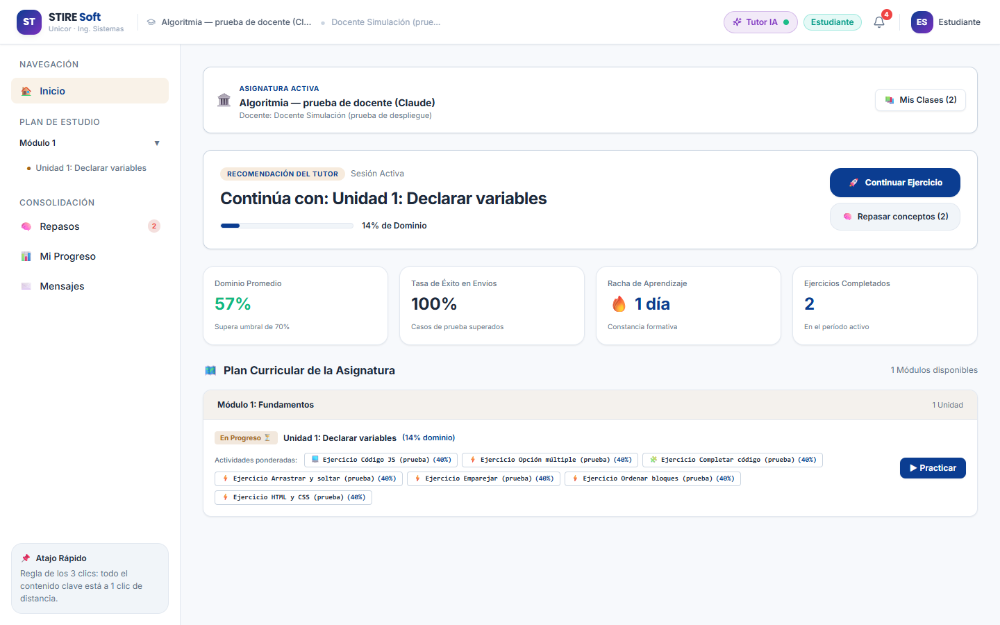
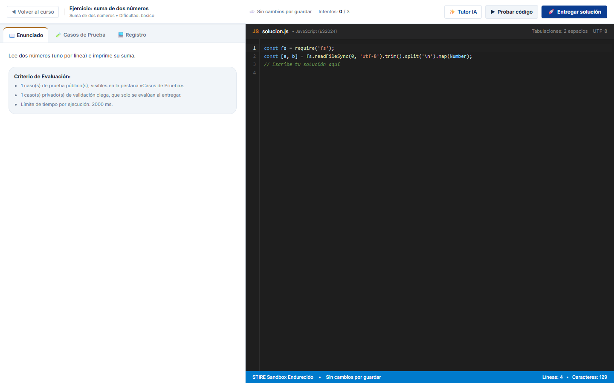
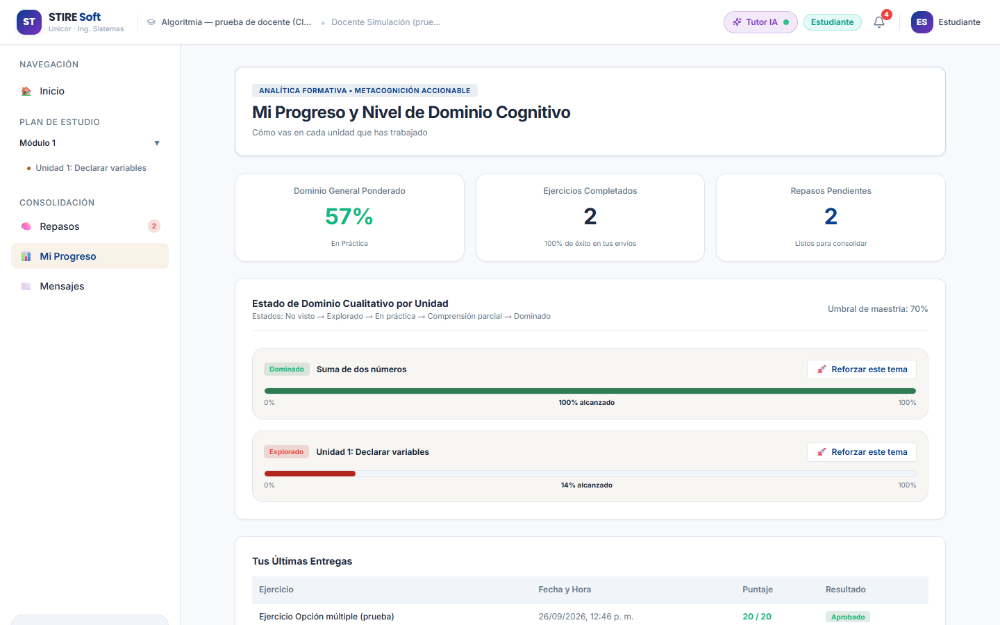
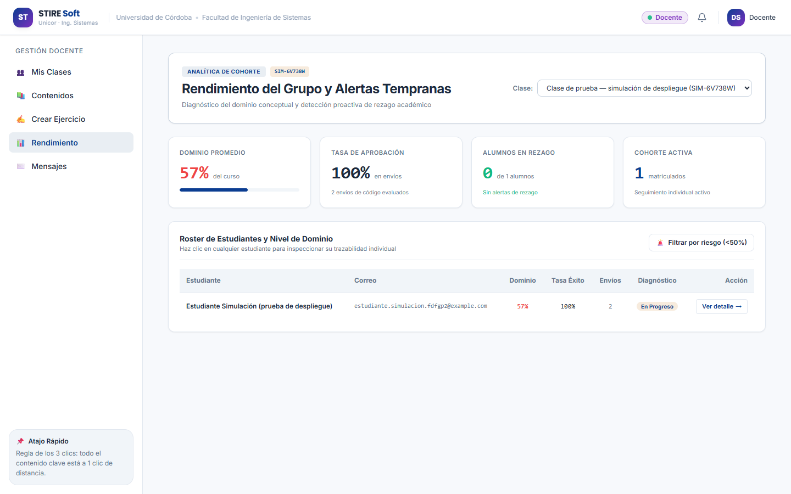
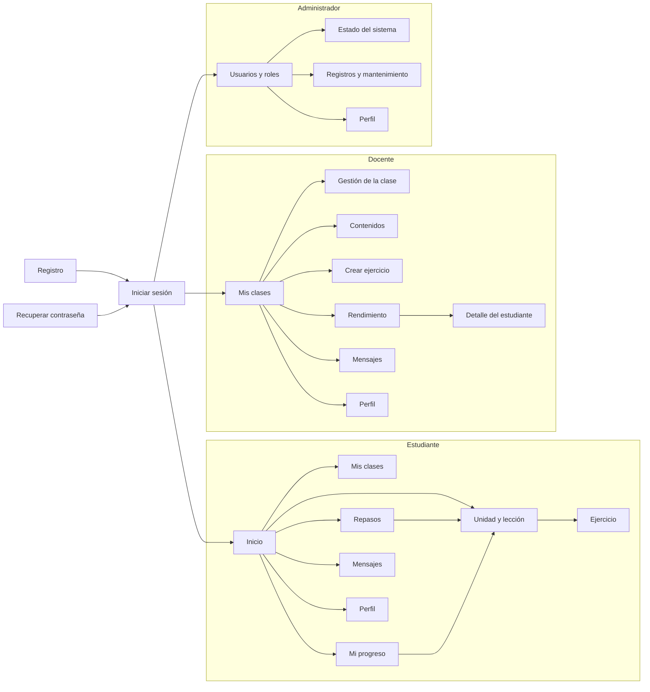

# Mockups de alta fidelidad y mapa de navegación

**Guías:** [Guía del Estudiante — Semana 03](../guias/Guia_Estudiante_Semana_03.docx) §1 y
[Diseños de la GUI](../guias/Guia_Semana_03_GUI_Mockups.docx) · **Fundamento:** Pressman & Maxim
(2020) cap. 12–13, Mandel (1997), Sommerville (2018) §5.2 y §8.4, MODESEC §3.3.1 y §3.3.3.

## 1. Los mockups

STIRE pasó por tres niveles de fidelidad, y los tres se conservan:

| Nivel | Qué es | Dónde está |
|---|---|---|
| Baja | Bocetos de la ventana estándar y de las 6 ventanas del estudiante (MODESEC §3.3) | [`modesec/assets/png/`](../../modesec/assets/png/) · fichas en [`modesec/ventanas/`](../../modesec/ventanas/3.3.1_FICHAS_VENTANAS.md) |
| Alta (diseño) | Sistema visual y prototipo en Figma: colores, tipografía, iconos, componente «Ventana estándar» y ventanas en 4 estados | [Figma — STIRE-Soft Sistema Visual](https://www.figma.com/design/1MjKiDrjU65ezO3ztO0v4m/STIRE-Soft-%E2%80%94-Sistema-Visual?m=auto&t=sehRLC79tLkTXYx3-1) |
| Implementada | Las pantallas reales, desplegadas en https://stire-soft.vercel.app | Capturas de las 32 pantallas en [`material-visual/05-primera-version-desplegada/`](../../material-visual/05-primera-version-desplegada/README.md) |

Pantallas principales, tal como se ven hoy:

| Estudiante: inicio | Estudiante: ejercicio de código |
|---|---|
|  |  |
| **Estudiante: mi progreso** | **Docente: rendimiento del grupo** |
|  |  |

## 2. Las 3 Reglas de Oro de Theo Mandel aplicadas

Pressman & Maxim (2020, cap. 12) recogen las tres reglas de Mandel (1997). Así se cumplen en las
pantallas reales:

### Regla 1 — Dar el control al usuario

| Principio | Cómo se ve en STIRE |
|---|---|
| Poder salir siempre | «Volver al curso» en todo ejercicio; migas de pan (Inicio › Plan de estudio › Unidad) en cada unidad |
| No obligar un camino | El sistema recomienda «Tu siguiente paso», pero el estudiante puede pulsar **«Elegir yo mismo»** |
| Probar sin miedo | **«Probar código»** ejecuta los casos públicos **sin gastar intentos**; solo «Entregar solución» cuenta |
| No perder el trabajo | Guardado automático del código mientras escribe, con su indicador en la barra superior |
| Cancelar | Los diálogos (crear, confirmar, restablecer) tienen «Cancelar» y se cierran con la tecla **Escape** |

### Regla 2 — Reducir la carga de memoria

| Principio | Cómo se ve en STIRE |
|---|---|
| No recordar entre pantallas | Enunciado, criterios de evaluación y editor en la **misma** pantalla; los casos de prueba en una pestaña al lado |
| Reconocer en vez de recordar | El menú lateral muestra siempre el plan de estudio con la unidad actual resaltada |
| Decir qué sigue | «Continúa con: Unidad 1» en el inicio y «Continuar donde quedaste» en la unidad |
| Estado visible | Barra de dominio por unidad, contador de repasos pendientes en el menú, intentos usados en el ejercicio |
| No saturar (7 ± 2) | El menú del estudiante tiene 5 destinos; el del docente, 5; el del admin, 3 |

### Regla 3 — Mantener la consistencia

| Principio | Cómo se ve en STIRE |
|---|---|
| Una ventana estándar | Cabecera + menú lateral + zona de contenido, igual para los tres roles (MODESEC §3.3, [`ventanas/3.3_VENTANA_ESTANDAR.md`](../../modesec/ventanas/3.3_VENTANA_ESTANDAR.md)) |
| Un solo sistema visual | Colores, tipografía y botones salen de los mismos tokens de diseño (`frontend-nuxt/tailwind.config.ts`) |
| Los 7 tipos de ejercicio se usan igual | Enunciado a la izquierda, respuesta a la derecha, y arriba siempre Tutor IA · Probar · Entregar |
| Mismas palabras | Vocabulario fijado en [`modesec/NAMING_STIRE.md`](../../modesec/NAMING_STIRE.md) |

### Lo que todavía no cumple (y se trabaja en la versión 2)

Revisando las pantallas desplegadas encontramos incumplimientos; los declaramos en vez de ocultarlos
([lista completa](../../material-visual/05-primera-version-desplegada/README.md#para-la-versión-2-ux-y-ui-qué-se-vio)):

- **Consistencia:** el menú del estudiante usa emojis y las tarjetas del docente iconos de línea.
- **Carga de memoria:** algunas etiquetas son técnicas («Metacognición accionable», «Motor SM-2»).
- **Control:** en celular el editor de código no se lee completo.

Ya se corrigieron el 26/09: datos de ejemplo en «Mi progreso», códigos internos en los menús
(«DOC-V01»…) y el nombre del estudiante en el detalle del docente.

## 3. Mapa de navegación

El mapa de diseño (MODESEC §3.3.3) está en
[`modesec/contenidos/3.3.3_MAPA_NAVEGACION.md`](../../modesec/contenidos/3.3.3_MAPA_NAVEGACION.md). Este
es el mapa de la aplicación **implementada**, con sus rutas reales (`frontend-nuxt/pages/`):

### Regla de los 3 clics (MODESEC §3.3.3)

Medido en la aplicación desplegada, desde el inicio de cada rol:

| Rol | Destino | Clics |
|---|---|---|
| Estudiante | Unidad y su lección | 1 (menú lateral) |
| Estudiante | Ejercicio recomendado | 2 (unidad → «Continuar donde quedaste») o 1 («Continuar ejercicio» en el inicio) |
| Estudiante | Repasos, progreso, mensajes | 1 |
| Docente | Contenidos, crear ejercicio, rendimiento, mensajes | 1 |
| Docente | Detalle de un estudiante | 2 (rendimiento → «Ver detalle») |
| Administrador | Estado del sistema, registros | 1 |

Todo contenido formativo queda a **2 clics o menos**.

## 4. Pruebas con usuarios (Sommerville §8.4)

- **Recorridos completos simulados** en el sitio desplegado para los tres roles (26/09/2026): el
  estudiante resolvió ejercicios y obtuvo 20/20; el docente creó una clase con los 7 tipos de
  ejercicio; el admin aprobó un docente, cambió roles y restableció contraseñas. Resultados en
  [`CHANGELOG.md`](../../../CHANGELOG.md).
- **Auditorías de QA** de Jorge Cervantes: [`calidad/`](../../calidad/README.md).
- **Pendiente:** prueba con estudiantes reales de Fundamentos de Algoritmia (Reto 5 del cronograma).
