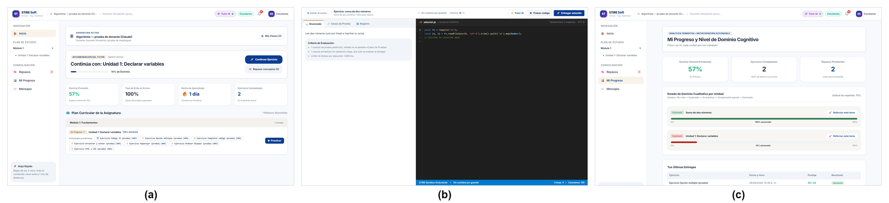

# Sección de la GUI para el artículo científico

**Guía:** [Guía del Estudiante — Semana 03](../guias/Guia_Estudiante_Semana_03.docx), §3 · **Formato:**
IMRyD, figura compuesta rotulada (a), (b), (c), como en el ejemplo del docente.

Borrador listo para pegar en la sección *Results* (o *System Design*) del artículo. Las citas
corresponden a las obras de [`15_ARTICULOS_CIENTIFICOS.md`](15_ARTICULOS_CIENTIFICOS.md).

---

**Figure 2.** STIRE-Soft student interface: (a) learning dashboard with the tutor's next-step
recommendation and mastery indicators; (b) coding workspace with the problem statement, evaluation
criteria and code editor side by side; (c) mastery dashboard by learning unit with recent graded
submissions.

Following Pressman and Maxim (2020) and the MODESEC framework (Caro et al., 2009), the user interface
was organised around a single standard window shared by the three roles, which keeps navigation,
colour and component behaviour consistent across the system (Mandel, 1997). As depicted in
Figure 2a, the student is welcomed by a dashboard that states what to do next and shows the current
mastery of the active unit, so no information has to be remembered from previous sessions. The
coding workspace (Figure 2b) places the problem statement next to the editor to avoid split attention
(Chandler & Sweller, 1992) and separates *Run code*, which executes the public test cases without
consuming an attempt, from *Submit solution*, which grades against all public and hidden cases;
this separation lowers extraneous cognitive load while keeping feedback immediate and specific
(Sweller et al., 1998; Hattie & Timperley, 2007). Finally, the mastery dashboard (Figure 2c) pairs
each unit's progress with its qualitative state and a direct action to reinforce it, turning
analytics into an actionable next step rather than a static score (Verbert et al., 2013).

---

### Traducción de trabajo (para el equipo)

**Figura 2.** Interfaz del estudiante de STIRE-Soft: (a) panel de aprendizaje con la recomendación
del siguiente paso y los indicadores de dominio; (b) espacio de programación con enunciado,
criterios de evaluación y editor lado a lado; (c) panel de dominio por unidad con las últimas
entregas calificadas.

Siguiendo a Pressman y Maxim (2020) y el modelo MODESEC (Caro et al., 2009), la interfaz se organizó
en torno a una ventana estándar compartida por los tres roles, lo que mantiene coherentes la
navegación, el color y el comportamiento de los componentes (Mandel, 1997). Como muestra la
Figura 2a, el estudiante encuentra un panel que le dice qué hacer después y el dominio actual de la
unidad, sin tener que recordar nada de sesiones anteriores. El espacio de programación (Figura 2b)
pone el enunciado junto al editor para evitar la atención dividida (Chandler y Sweller, 1992) y
separa *Probar código*, que ejecuta los casos públicos sin gastar intentos, de *Entregar solución*,
que califica con todos los casos, públicos y ocultos; esa separación reduce la carga cognitiva
innecesaria sin quitarle inmediatez ni precisión a la retroalimentación (Sweller et al., 1998;
Hattie y Timperley, 2007). Por último, el panel de dominio (Figura 2c) acompaña el progreso de cada
unidad con su estado cualitativo y una acción directa para reforzarla, de modo que la analítica se
convierte en un siguiente paso concreto y no en una nota estática (Verbert et al., 2013).

### Imágenes sueltas

Las tres capturas por separado, a 1440 × 900, están en [`figuras/`](figuras/) por si la revista pide
subfiguras independientes.
