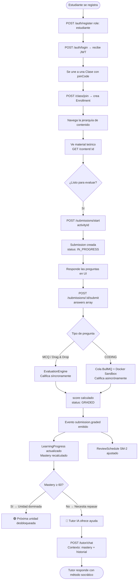
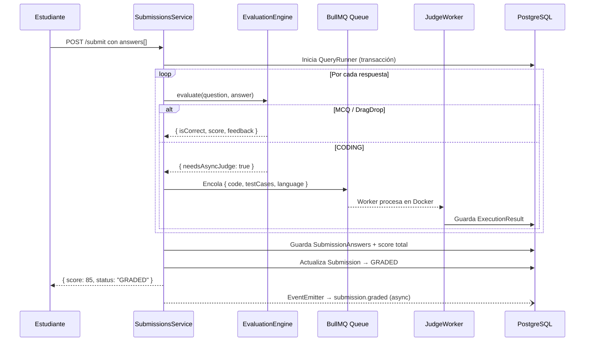
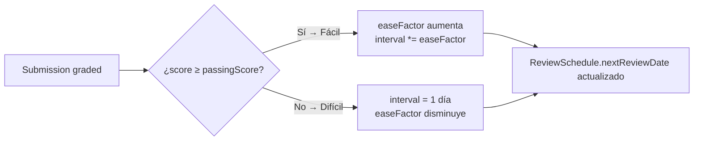
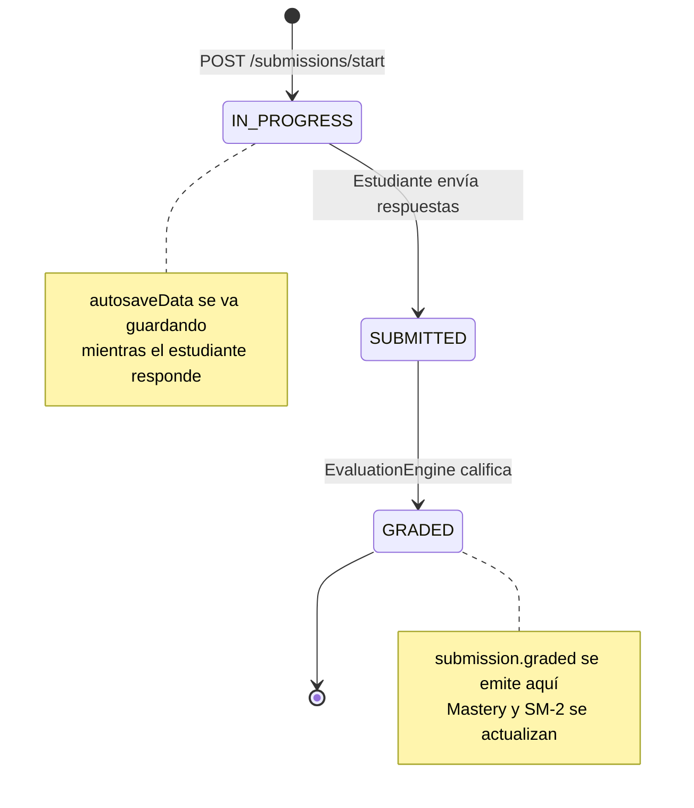

# 👨‍🎓 Flujo del Estudiante en STIRE

Este documento describe el ciclo de vida completo que sigue un **estudiante** desde que se registra hasta que el Tutor IA le da retroalimentación adaptativa basada en su desempeño real.

---

## 📋 Visión General del Flujo



---

## 🔢 Paso a Paso Detallado

### Paso 1 — Registro y Login
| Acción | Endpoint | Body |
|--------|----------|------|
| Registrarse | `POST /auth/register` | `{ email, password, fullName, role: "estudiante" }` |
| Iniciar sesión | `POST /auth/login` | `{ email, password }` → devuelve `access_token` |

---

### Paso 2 — Unirse a una Clase
El docente comparte un código (ej. `PROG-XK92`). El estudiante lo usa para inscribirse:

```
POST /class/join
Body: { "joinCode": "PROG-XK92" }
```

Esto crea un registro en la tabla `enrollments` con `status: active`. A partir de aquí, el estudiante tiene acceso a toda la jerarquía de contenido de esa clase.

---

### Paso 3 — Navegar el Contenido

```
Class  →  Sections  →  Topics  →  LearningUnits  →  Content + Activities
```

| Qué ver | Endpoint |
|---------|----------|
| Mis clases | `GET /class` |
| Secciones de una clase | `GET /sections?classId=X` |
| Temas de una sección | `GET /topics?sectionId=X` |
| Unidades de un tema | `GET /learning-unit?topicId=X` |
| Material teórico | `GET /content?learningUnitId=X` |
| Actividades disponibles | `GET /activities?learningUnitId=X` |

> 🔒 **Nota:** Si una `LearningUnit` tiene un `Prerequisite`, el sistema verificará que el estudiante tenga el Mastery mínimo requerido antes de darle acceso.

---

### Paso 4 — Iniciar un Intento (Submission)

```
POST /submissions/start
Body: { "activityId": 5 }
```

El servidor crea una `Submission` con `status: IN_PROGRESS` y devuelve su `id` (UUID). Este ID se usará para enviar las respuestas.

> El sistema valida automáticamente que no se exceda el límite de intentos (`maxAttempts` de la actividad).

---

### Paso 5 — Enviar Respuestas

```
POST /submissions/:submissionId/submit
Body:
{
  "answers": [
    { "questionId": 1, "answer": { "selected": ["let", "const"] } },
    { "questionId": 2, "answer": { "code": "function suma(a,b){ return a+b; }" } }
  ]
}
```

#### ¿Qué pasa internamente?



---

### Paso 6 — Ver Resultados y Progreso

```
GET /submissions/:id          → Ver detalle del intento (respuestas, score)
GET /analytics/student/:id    → Ver Mastery por unidad
```

---

### Paso 7 — El Sistema Adapta la Experiencia

Después de cada submission evaluada, el sistema ejecuta automáticamente (en background):

#### 7a. Recálculo de Mastery
```
learning_progress.mastery = f(score, consecutiveCorrect, historial)
```
- Si el estudiante tiene Mastery ≥ 60 → la siguiente unidad se desbloquea.
- Si cae por debajo → el Tutor IA es notificado del área débil.

#### 7b. Ajuste del Repaso Espaciado (SM-2)
El algoritmo recalcula cuándo debe volver a ver este tema:



---

### Paso 8 — Interactuar con el Tutor IA

Si el estudiante tiene dudas o su Mastery es bajo:

```
POST /tutor/chat
Body: { "message": "No entiendo los punteros en C++", "learningUnitId": 3 }
```

El Tutor construye su respuesta con:
1. **Mastery del estudiante** en esa unidad → sabe su nivel real
2. **Historial de la conversación** → no repite lo que ya explicó
3. **Método socrático** → hace preguntas en vez de dar la respuesta directa

---

## 📊 Diagrama de Estados de una Submission



---

## ✅ Checklist del Estudiante (Referencia Rápida)

- [ ] Registrarse con `role: estudiante`
- [ ] Unirse a la Clase con `joinCode` del docente
- [ ] Leer el material teórico (`Content`) de cada unidad
- [ ] Iniciar un intento con `POST /submissions/start`
- [ ] Enviar respuestas con `POST /submissions/:id/submit`
- [ ] Revisar el score y feedback
- [ ] Si score < 60% → consultar al Tutor IA
- [ ] Revisar las fechas de repaso programadas por SM-2
