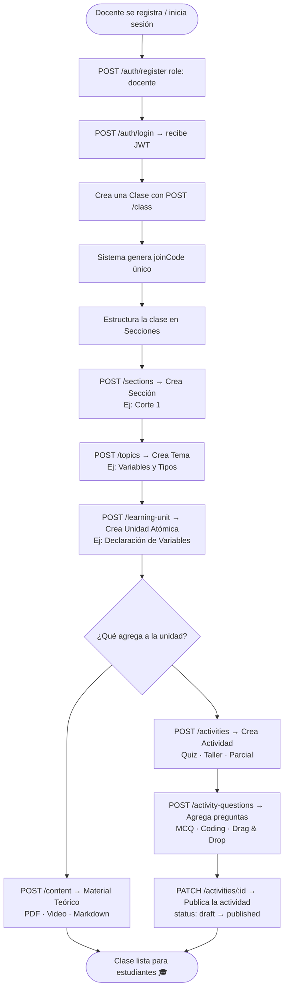
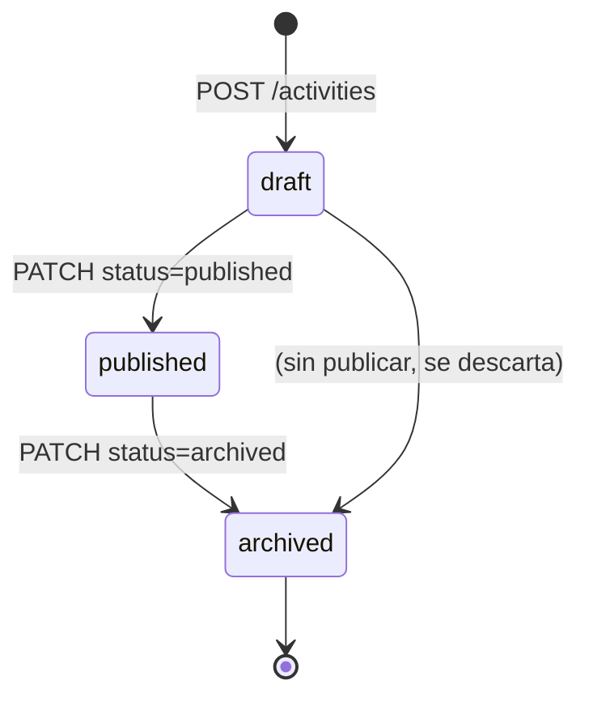

# 👩‍🏫 Flujo del Docente en STIRE

Este documento describe el ciclo de vida completo que sigue un **docente** desde que abre STIRE hasta que sus estudiantes están siendo evaluados y monitoreados adaptativamente.

---

## 📋 Visión General del Flujo



---

## 🔢 Paso a Paso Detallado

### Paso 1 — Autenticación
| Acción | Endpoint | Body clave |
|--------|----------|-----------|
| Registrarse | `POST /auth/register` | `{ email, password, fullName, role: "docente" }` |
| Iniciar sesión | `POST /auth/login` | `{ email, password }` → devuelve `access_token` |

> ⚠️ **Importante:** El `access_token` debe incluirse en todos los siguientes endpoints como `Authorization: Bearer <token>`.

---

### Paso 2 — Crear la Clase
```
POST /class
Body: { "name": "Lógica de Programación", "description": "..." }
```
El sistema genera automáticamente un `joinCode` único (ej. `PROG-XK92`). Comparte este código con tus estudiantes.

---

### Paso 3 — Construir la Jerarquía de Contenido

```
Class  ──►  Section  ──►  Topic  ──►  LearningUnit
                                            │
                                     ┌──────┴──────┐
                                  Content       Activity
                               (PDF/Video)   (Quiz/Taller)
```

| Nivel | Endpoint | Dato padre requerido |
|-------|----------|----------------------|
| Sección | `POST /sections` | `classId` |
| Tema | `POST /topics` | `sectionId` |
| Unidad | `POST /learning-unit` | `topicId` |
| Contenido | `POST /content` | `learningUnitId` |
| Actividad | `POST /activities` | `learningUnitId` |

---

### Paso 4 — Crear Preguntas para la Actividad

Cada pregunta es una `ActivityQuestion` vinculada a una `Activity`. El campo `config` (JSON) define el tipo de pregunta:

#### Pregunta de Opción Múltiple (MCQ)
```json
{
  "activityId": 1,
  "type": "MCQ",
  "question": "¿Cuál es la palabra clave para declarar una variable en JS?",
  "points": 25,
  "config": {
    "options": ["var", "let", "const", "def"],
    "correct": ["let", "const"]
  }
}
```

#### Pregunta de Código (CODING)
```json
{
  "activityId": 1,
  "type": "CODING",
  "question": "Escribe una función que sume dos números",
  "points": 50,
  "config": {
    "language": "javascript",
    "starterCode": "function suma(a, b) { }",
    "testCases": [
      { "input": "2 3", "expected": "5", "isPublic": true },
      { "input": "10 20", "expected": "30", "isPublic": false }
    ]
  }
}
```

---

### Paso 5 — Publicar la Actividad
```
PATCH /activities/:id
Body: { "status": "published" }
```
Solo las actividades en estado `published` son visibles para los estudiantes.

---

### Paso 6 — Monitorear el Progreso

Una vez que los estudiantes comiencen, el docente puede revisar:

| Qué revisar | Endpoint |
|-------------|----------|
| Progreso general por estudiante | `GET /analytics/student/:studentId` |
| Todas las submissions de una actividad | `GET /submissions?activityId=X` |
| Detalles de un intento específico | `GET /submissions/:id` |

---

## 📊 Diagrama de Estados de una Actividad



---

## ✅ Checklist del Docente (Referencia Rápida)

- [ ] Registrarse con `role: docente`
- [ ] Crear la Clase → anotar el `joinCode`
- [ ] Crear al menos 1 Sección
- [ ] Crear al menos 1 Tema por Sección
- [ ] Crear al menos 1 Unidad de Aprendizaje por Tema
- [ ] Agregar Contenido teórico (opcional pero recomendado)
- [ ] Crear Actividad con preguntas
- [ ] **Publicar** la Actividad (`status: published`)
- [ ] Compartir el `joinCode` con los estudiantes
