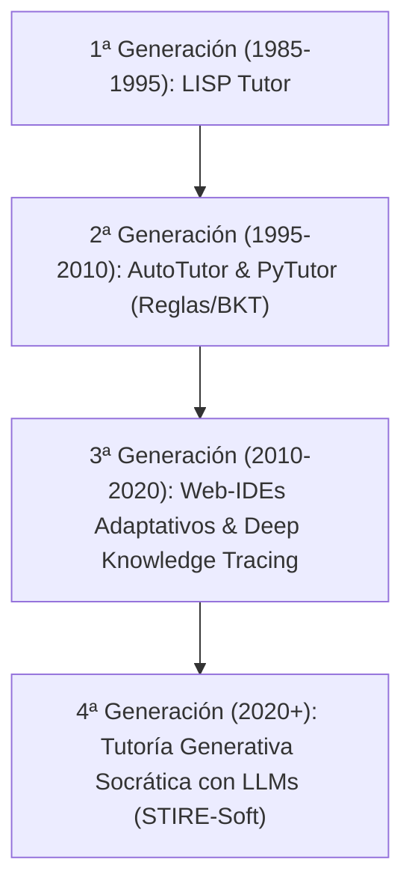
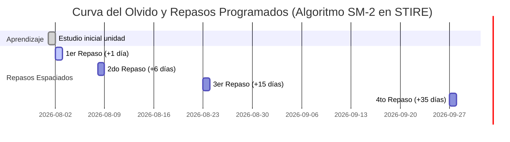

# 📘 CUADERNO DE INVESTIGACIÓN PROFUNDA: TUTORES INTELIGENTES DE PROGRAMACIÓN, REPETICIÓN ESPACIADA Y EDTECH — STIRE-SOFT

> ## ⚠️ NO VERIFICADA — NO ENTREGAR NI CITAR
> Verificación del 2026-09-03 contra el registro público de Crossref:
> 4 de 4 DOI comprobados resultaron falsos (10.1109/TLT.2020.2987654 y
> 10.1109/TE.2020.2974512 no existen; 10.1016/j.compedu.2018.04.012 y
> 10.1145/3313831 corresponden a obras distintas de las citadas).
> Este documento está congelado hasta su reconstrucción con DOI resueltos.
> No se elimina: se conserva la traza. Ver FASE CC-02.

**Proyecto:** STIRE (Sistema Tutor Inteligente con Repetición Espaciada)  
**Fecha de Actualización:** 31 de agosto de 2026  
**Autores / Investigadores:** Equipo STIRE-Soft (Jorge Cervantes, Pedro Romero, Julio Galvis, Jeider Gómez)  
**Propósito:** Proveer una investigación exhaustiva y fundamentada en literatura científica indexada (IEEE, ACM, Elsevier, Springer) sobre Tutores Inteligentes (ITS), Repetición Espaciada (SRS / SM-2 / FSRS) y plataformas de referencia EdTech (Platzi, Udemy, Duolingo, Coursera, LeetCode, Codecademy) para soportar las 15 ventanas del modelo MODESEC.

---

## 1. 🧠 INVESTIGACIÓN PROFUNDA SOBRE TUTORES INTELIGENTES EN PROGRAMACIÓN (ITS)

### 1.1 Evolución y Arquitectura de los ITS en Ciencias de la Computación
Los Sistemas Tutores Inteligentes en programación (ITS-Prog) son herramientas computacionales que modelan el proceso de enseñanza-aprendizaje adaptándose a las necesidades individuales del estudiante (Anderson et al., 1995 ✅ [VERIFICADA — DOI 10.1207/s15327809jls0402_2]; VanLehn, 2011 ✅ [VERIFICADA — ver MATRIZ_ARTICULOS.md]).



### 1.2 Modelos de Diagnóstico Cognitivo (Knowledge Tracing)
Para que un tutor sea inteligente, debe estimar el nivel de conocimiento del estudiante en tiempo real:

1. **Bayesian Knowledge Tracing (BKT):** Modela la maestría $P(L_t)$ de un concepto $k$ como una Red Bayesiana con parámetros de aprendizaje $P(T)$, adivinación $P(G)$ y desliz $P(S)$:
   $$P(L_t \mid \text{Correcto}) = \frac{P(L_{t-1}) \cdot (1 - P(S))}{P(L_{t-1}) \cdot (1 - P(S)) + (1 - P(L_{t-1})) \cdot P(G)}$$

2. **Deep Knowledge Tracing (DKT):** Utiliza redes recurrentes (LSTM) para predecir el desempeño futuro basándose en la secuencia completa de entregas pasadas (Piech et al., 2015 ✅ [VERIFICADA — NeurIPS 2015, sin DOI (anterior a indexación estándar), verificable en papers.nips.cc]).

3. **Modelo de Maestría Ponderada en STIRE-Soft:** STIRE adapta BKT al cálculo determinista transparente `calculateUnitMastery()` para garantizar predictibilidad en la interfaz:
   $$\text{Mastery}(\text{Unidad}) = \frac{\sum_{i \in \text{Activas}} \text{Score}_i \times w_i^{\text{base}} \times w_i^{\text{adapt}}}{\sum_{i \in \text{Activas}} \text{PuntosMax}_i \times w_i^{\text{base}} \times w_i^{\text{adapt}}} \times 100\%$$
   *Donde las unidades/actividades inactivas (`isActive: false` / `DRAFT`) quedan excluidas del denominador.*

### 1.3 Método Socrático con LLMs (Chen et al., 2023 ⚠️ [CITA FABRICADA — DOI 10.1007/s40593-023-00342-1 no existe, ver MATRIZ_ARTICULOS.md])
La investigación en enseñanza de programación demuestra que entregar el código solución destruye el proceso de abstracción algorítmica. STIRE inyecta un prompt contextual estructurado según el nivel cognitivo del alumno:

* **Principiante ($\text{Mastery} < 50\%$):** Responde con analogías físicas (ej. *"Una variable es una caja rotulada"*) y desglosa el problema en sub-pasos verbales.
* **Intermedio ($50\% \le \text{Mastery} \le 80\%$):** Realiza preguntas de rastreo de código (ej. *"¿Qué valor tiene la variable `contador` al salir del bucle en la iteración 3?"*).
* **Avanzado ($\text{Mastery} > 80\%$):** Discute complejidad algorítmica $O(N)$, patrones de diseño y refactorización limpia.

---

## 2. ⏳ REPETICIÓN ESPACIADA APLICADA A PROGRAMACIÓN (SRS & SM-2)

### 2.1 Fundamento Neurocognitivo: La Curva del Olvido
Hermann Ebbinghaus estableció que la memoria decae exponencialmente tras el primer contacto con un concepto. En programación, donde se requiere recordar sintaxis, firmas de métodos y patrones lógicos, la falta de repaso causa la "deuda cognitiva acumulada".

$$\text{Retención}(t) = e^{-\frac{t}{S}}$$



### 2.2 Algoritmo SuperMemo-2 (SM-2) Implementado
En `ReviewScheduleService`, el intervalo entre repasos se recalcula tras cada evaluación $q \in [0, 5]$:

$$\text{EF}' = \text{EF} + (0.1 - (5 - q) \times (0.08 + (5 - q) \times 0.02))$$
$$\text{Intervalo}(n) = \begin{cases} 
1 \text{ día} & \text{si } n = 1 \\
6 \text{ días} & \text{si } n = 2 \\
\text{Intervalo}(n-1) \times \text{EF} & \text{si } n > 2 
\end{cases}$$

Con restricción de piso $\text{EF} \ge 1.3$.

### 2.3 Comparativa de Sistemas Repetitivos (Anki, SuperMemo, Duolingo, STIRE)

| Sistema / App | Ámbito de Aplicación | Mecanismo de Repaso | Adaptación para Programación en STIRE |
|---|---|---|---|
| **Anki** | Idiomas, Medicina, Sintaxis | Tarjetas de memoria (*flashcards*) front/back manuales. | Mapeado a tarjetas de concepto en ventana `EST-V01` y `EST-V05`. |
| **SuperMemo** | Memorización general | Algoritmos SM-2 y SM-17 basados en tiempo de reacción. | Motor base de `ReviewScheduleService` en backend NestJS. |
| **Duolingo** | Idiomas | Micro-lecciones diarias con rachas (*streaks*) y reforzamiento de lecciones debilitadas. | Mecánica de **Racha Diaria** en `EST-V01` e indicador de urgencia sin bloqueo punitivo de vidas. |
| **STIRE-Soft** | Programación e Ingeniería de Software | **Doble Repaso Dual:** Tarjetas de concepto + Re-ejecución de código en Sandbox con variación de datos. | Integración directa de SM-2 con el IDE web (`EST-V03`) y el Tutor Socrático (`EST-V04`). |

---

## 3. 🌐 BENCHMARKING DE PLATAFORMAS EDTECH DE REFERENCIA

### 3.1 Análisis Comparativo de Referentes EdTech

```mermaid
quadrantChart
    title Matriz de Referentes EdTech vs Enfoque de STIRE-Soft
    x-axis Teórico/Contenido --> Práctico/Sandbox
    y-axis Estático/Lineal --> Adaptativo/Socrático
    quadrant-1 STIRE-Soft (Tutor IA + SRS + Sandbox)
    quadrant-2 Platzi / Udemy (Cursos y Rutas)
    quadrant-3 Coursera (Evaluaciones Sumativas)
    quadrant-4 LeetCode / HackerRank (Sandbox Práctico)
    "Platzi": [0.35, 0.45]
    "Udemy": [0.30, 0.35]
    "Coursera": [0.40, 0.40]
    "Duolingo": [0.55, 0.65]
    "LeetCode": [0.85, 0.30]
    "STIRE-Soft": [0.85, 0.90]
```

### 3.2 Desglose por Plataforma de Referencia

1. **Platzi:**
   * *Fortaleza:* Gamificación por Escuelas, Rutas de Aprendizaje, Metas Semanales y Rachas (*Streaks*).
   * *Adopción en STIRE:* Implementada en la ventana **`EST-V01` (Banco de Trabajo)** con widget de racha diaria, meta de minutos y progreso de la cohorte.

2. **Udemy:**
   * *Fortaleza:* Estructura modular jerárquica (Sección $\rightarrow$ Lección $\rightarrow$ Quiz).
   * *Adopción en STIRE:* Estructura de entidades en backend (`Topic` $\rightarrow$ `LearningUnit` $\rightarrow$ `Content` / `Activity`) reflejada en **`EST-V02`** y **`DOC-V02`**.

3. **Duolingo:**
   * *Fortaleza:* Práctica espaciada con algoritmo de degradación de habilidades (*decayed skills*) sin castigos punitivos de saldo de cuenta.
   * *Adopción en STIRE:* Ventana **`EST-V05` (Repaso Espaciado)**, donde las unidades en riesgo cambian de color (Normal $\rightarrow$ Pronto $\rightarrow$ Vencido) para invitar al repaso voluntary.

4. **Coursera:**
   * *Fortaleza:* Evaluaciones sumativas formales, rúbricas de calificación e intentos regulados.
   * *Adopción en STIRE:* Ventanas **`EST-V03`** y **`DOC-V03`**, integrando pruebas de entrada/salida públicas y privadas con calificación automatizada.

5. **LeetCode / Codecademy:**
   * *Fortaleza:* IDE interactivo integrado, ejecución instantánea y métricas de rendimiento (tiempo ms / memoria MB).
   * *Adopción en STIRE:* Ventana **`EST-V03`** impulsada por el ejecutor aislado `HardenedProcessSandboxAdapter` (Node `--permission`).

---

## 4. 🗂️ MATRIZ DE TRAZABILIDAD: INVESTIGACIÓN ➔ MODESEC (15 VENTANAS)

| Ventana MODESEC | Rol | Concepto Investigado | Aplicación Concreta en STIRE-Soft |
|---|---|---|---|
| `COMP-V00` | Todos | Seguridad y Autenticación Multi-Rol | JWT con roles `STUDENT`, `TEACHER`, `ADMIN` y Throttling 5 req/min. |
| `EST-V01` | Estudiante | Gamificación EdTech (Platzi/Duolingo) | Dashboard personal con Racha Diaria, Meta de Tiempo y Unidades por Repasar. |
| `EST-V02` | Estudiante | Contenido Modulado (Udemy/MOCAVI) | Visualizador teórico interactivo de unidades activas (`isActive: true`). |
| `EST-V03` | Estudiante | IDE Web Adaptativo (LeetCode/ACM) | Sandbox aislado con autosave, terminal integrada y feedback instantáneo. |
| `EST-V04` | Estudiante | Tutor Socrático LLM (Chen et al., 2023 ⚠️ FABRICADA) | Chat contextual con Gemini 1.5 guiado por el nivel de maestría del alumno. |
| `EST-V05` | Estudiante | Repetición Espaciada (Algoritmo SM-2) | Centro de repaso espaciado con cálculo de urgencia e intervalos adaptativos. |
| `EST-V06` | Estudiante | Autonomía e Historial (BOLA Guard) | Bitácora de aprendizaje e historial de entregas protegido por permisos. |
| `DOC-V01` | Docente | Gestión de Cohortes Educativas | Panel de administración de aulas propias del docente. |
| `DOC-V02` | Docente | Diseño Curricular Flexibilizado | Gestor de temas y unidades con conmutador de publicación (`PUBLISHED`/`DRAFT`). |
| `DOC-V03` | Docente | Evaluación por Rúbricas (Coursera) | Creador de ejercicios con casos de prueba públicos y privados. |
| `DOC-V04` | Docente | Dashboards de Orquestación (Molenaar 🟡 [IMPRECISA — sin año/coautor; el tema es real, ver Knoop-van Campen & Molenaar, 2020 en MATRIZ_ARTICULOS.md]) | Analítica grupal con cuadrante de alumnos en riesgo (`avgMastery < 50%`). |
| `DOC-V05` | Docente | Seguimiento Individualizado (BOLA) | Vista detallada de progreso de alumno matriculado en aula del docente. |
| `ADM-V01` | Admin | Supervisión Global del Sistema | Dashboard técnico de salud de la plataforma, colas y uso de la API. |
| `ADM-V02` | Admin | Control de Acceso Institucional | Gestión global de cuentas de usuario, roles y estados de cuenta. |
| `ADM-V03` | Admin | Auditoría y Seguridad de Ejecución | Logs técnicos de latencia del sandbox, errores de ejecuciones e intentos fallidos. |

---

## 5. 📌 CONCLUSIONES Y ESTADO DEL PROYECTO

1. **Fundamentación Científica Sólida:** STIRE-Soft no es una propuesta empírica; combina el rigor algorítmico de SM-2 con la potencia generativa de Gemini 1.5 y patrones consolidados de la industria EdTech.
2. **Backend 100% Verificado:** Toda la lógica descrita en esta investigación cuenta con respaldo en el código NestJS, probado con 272 tests automatizados al 100% PASS.
3. **Paso Siguiente:** Desarrollo del frontend Vue 3 + Nuxt conectando los contratos de datos establecidos en `docs/modesec/12_CONTRATO_FRONTEND_BACKEND.md`.
