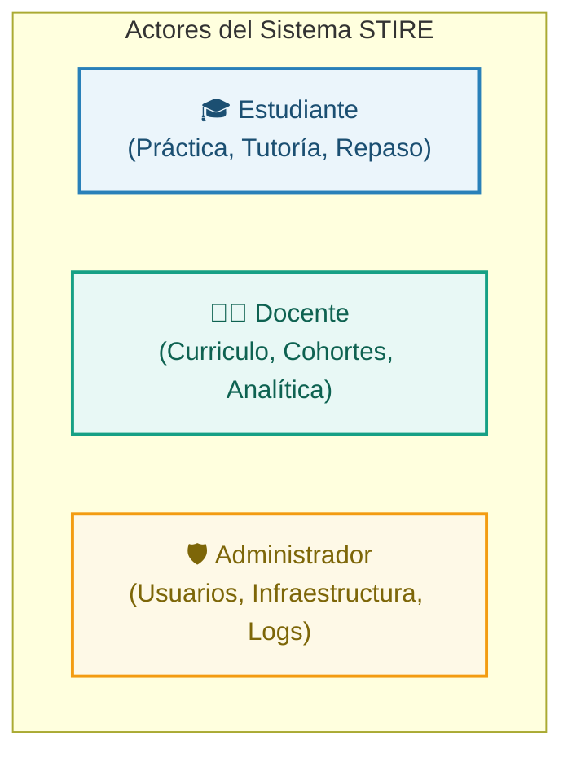
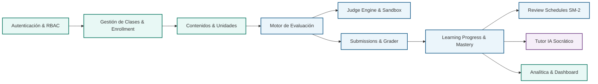

# 🗺️ Insumo 00 — Mapa Funcional del Sistema STIRE-Soft

**Proyecto:** STIRE-Soft (Sistema Tutor Inteligente con Repetición Espaciada para la Enseñanza de Algoritmia y Programación)  
**Versión de Especificación:** 2.0 (MODESEC Multi-Rol + Vue 3 / Nuxt)  
**Fecha de Elaboración:** 30 de agosto de 2026  
**Autores:** Equipo de Arquitectura y Diseño Funcional STIRE  
**Estado:** ✅ Aprobado como Marco Funcional Base  

---

## 1. Propósito y Misión de STIRE-Soft

STIRE-Soft es un entorno web educativo e interactivo diseñado para el aprendizaje adaptativo de algoritmos y estructuras de datos en educación superior. Su propósito fundamental es superar la brecha pedagógica tradicional de la enseñanza de programación mediante la convergencia sinérgica de cuatro pilares:

1. **Juez de Ejecución Endurecido (Sandbox Aislado):** Ejecución y evaluación automatizada de código en tiempo real con pruebas públicas y privadas sin comprometer la infraestructura.
2. **Tutor Inteligente Socrático (IA Adaptativa):** Orientación pedagógica contextualizada según el nivel cognitivo (*Mastery Learning*) que guía mediante preguntas y contraejemplos sin entregar jamás el código de la solución.
3. **Repetición Espaciada (Algoritmo SM-2):** Programación matemática de repasos periódicos para mitigar la curva del olvido de Ebbinghaus y consolidar conceptos algorítmicos a largo plazo.
4. **Gobierno Académico Multi-Rol (RBAC):** Flujos y vistas especializados para **Estudiantes** (práctica y autorregulación), **Docentes** (gestión curricular y analítica de cohorte) y **Administradores** (gobernanza y salud operativa).

---

## 2. Objetivos del Sistema

### 2.1 Objetivos Pedagógicos
* Guiar la adquisición de habilidades algorítmicas desde la comprensión sintáctica hasta la optimización de complejidad temporal/espacial.
* Reducir la frustración y la ansiedad ante el error de compilación/ejecución mediante retroalimentación formativa inmediata.
* Fomentar el hábito de práctica deliberada y el repaso periódico de conceptos con menor tasa de éxito.

### 2.2 Objetivos Técnicos y Funcionales
* Proveer una arquitectura desacoplada y robusta (NestJS + MySQL 8 + Redis/Inline Queue + Vue 3 / Nuxt).
* Garantizar seguridad de nivel empresarial (prevención BOLA, validación estricta DTO, sandbox con barreras `--permission`).
* Asegurar que el cómputo de progreso y maestría sea matemáticamente riguroso, discriminando unidades activas de inactivas.

---

## 3. Actores del Sistema



| Actor | Rol en el Sistema | Responsabilidad Principal |
|---|---|---|
| **Estudiante** | `estudiante` | Matricularse en clases, estudiar teoría, resolver ejercicios de código y conceptuales, interactuar con el Tutor IA socrático, completar sesiones de repaso espaciado y monitorear su bitácora de dominio (*mastery*). |
| **Docente** | `docente` | Crear y gestionar asignaturas/clases, estructurar módulos, temas y unidades de aprendizaje, diseñar bancos de ejercicios con casos de prueba, y monitorear el desempeño global e individual de sus cohortes. |
| **Administrador** | `admin` | Gestionar cuentas de usuario, controlar roles y estados de acceso, supervisar métricas de infraestructura (sandbox, colas, base de datos) y auditar eventos del sistema. |

---

## 4. Módulos Funcionales del Sistema



---

## 5. Flujo Conceptual Global de la Experiencia STIRE

El ciclo de vida del aprendizaje dentro de STIRE opera según la siguiente secuencia lógica:

```
[Usuario] 
   ↓
[Autenticación JWT & Resolución de Rol]
   ↓
[Contexto de Clase / Aula]
   ↓
[Árbol de Contenido Curricular (Módulos › Temas › Unidades Activas)]
   ↓
[Interacción con Unidad de Aprendizaje (Teoría & Ejemplos)]
   ↓
[Actividad Práctica / Evaluación (MCQ, Fill-Code, Coding Sandbox)]
   ↓
[Entrega de Solución (Submission en Transacción Atómica SQL)]
   ↓
[Calificación Automatizada & Ejecución en Sandbox Endurecido]
   ↓
[Actualización de LearningState (Mastery, SuccessRate, Estado Cognitivo)]
   ↓
[Disparo de Algoritmo SM-2 (Cálculo de Próxima Fecha de Revisión)]
   ↓
[Tutor IA Adaptativo (Alimentado con el Contexto y Nivel Actualizado)]
   ↓
[Consolidación del Progreso & Actualización de Bitácora / Dashboard]
```
