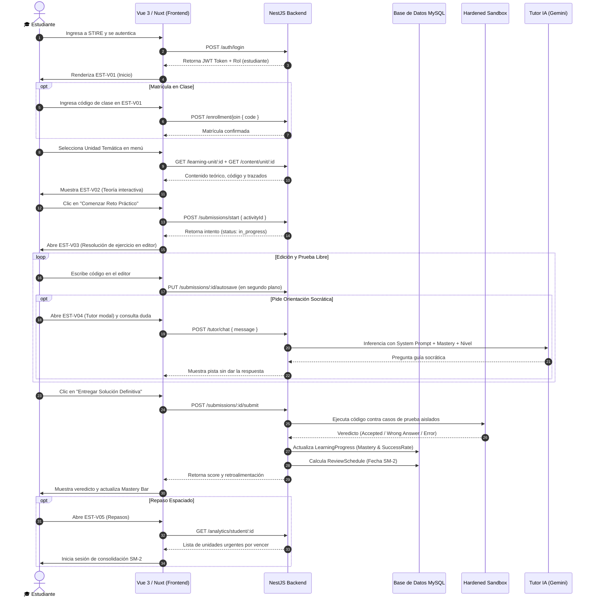
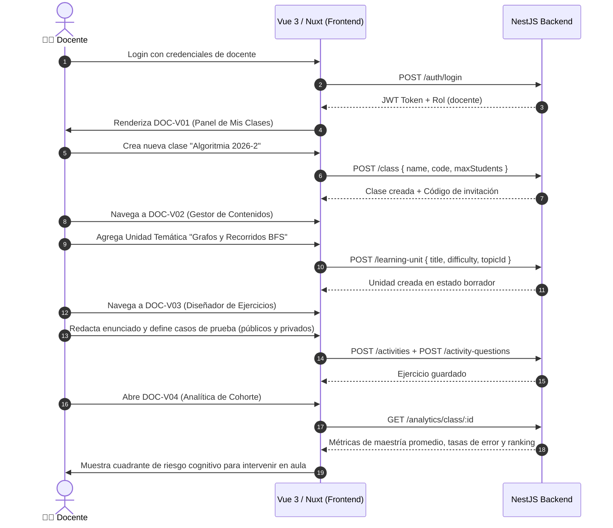
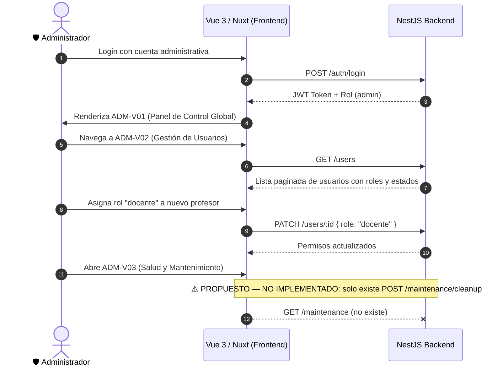

# 🚶 Insumo 05 — Flujos Principales de Usuario (User Journeys)

**Proyecto:** STIRE-Soft  
**Norma:** MODESEC §3.3.3 / Flujos Didácticos y de Gestión  
**Fecha:** 30 de agosto de 2026  

---

## 1. Journey Principal del Estudiante (Aprendizaje Adaptativo y Práctica)

---

## 2. Journey Principal del Docente (Gestión Curricular y Supervisión de Cohorte)

---

## 3. Journey Principal del Administrador (Gobernanza y Salud del Entorno)

