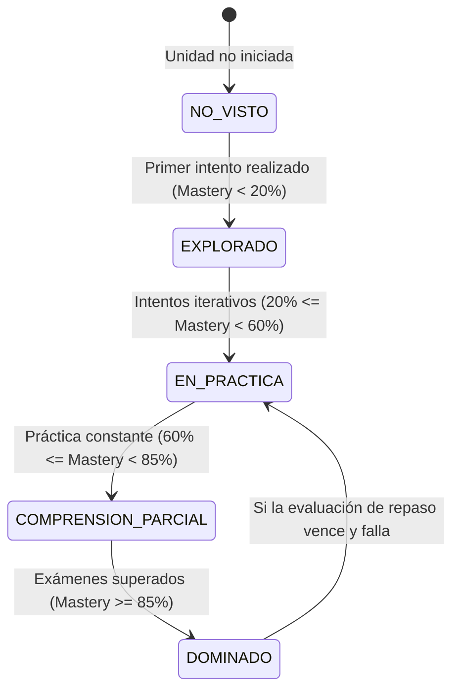

# ⏳ Insumo 07 — Mecanismo y Visualización de Repetición Espaciada (SM-2)

**Proyecto:** STIRE-Soft  
**Fundamentación Pedagógica:** Modelo de Ebbinghaus (Curva del Olvido) + Algoritmo SuperMemo-2 (SM-2)  
**Fecha:** 30 de agosto de 2026  

---

## 1. Fundamentación del Modelo de Repetición Espaciada

La enseñanza tradicional de algoritmia sufre del fenómeno de "desentrenamiento rápido": los estudiantes aprueban una evaluación sobre estructuras condicionales o ciclos y, al cabo de 3 semanas, olvidan la lógica de invariantes o actualización de acumuladores.

STIRE integra **Repetición Espaciada** en el flujo diario para convertir la práctica en memoria procedural a largo plazo.

---

## 2. Estados Cognitivos del Aprendizaje en STIRE

El sistema modela el dominio del estudiante a través de 5 estados discretos derivados del `mastery` [0, 100] calculado por `calculateUnitMastery()`:



| Estado | Rango de Maestría | Significado Pedagógico | Indicador Visual en UI |
|---|---|---|---|
| `NO_VISTO` | 0% | El estudiante no ha interactuado con la unidad. | Círculo gris tenue `○` |
| `EXPLORADO` | 1% - 19% | Ha leído la teoría o realizado un intento inicial sin aprobar. | Círculo punteado `◌` |
| `EN_PRACTICA` | 20% - 59% | Resuelve ejercicios básicos pero comete errores conceptuales. | Media luna amarilla `◐` |
| `COMPRENSION_PARCIAL` | 60% - 84% | Supera la mayoría de los casos de prueba; requiere afianzar casos límite. | Tres cuartos azul `◕` |
| `DOMINADO` | 85% - 100% | Domina sintaxis, lógica y casos de borde de forma consistente. | Círculo verde con check `✔` |

---

## 3. Algoritmo SM-2 en Backend y Programación de Revisiones

Cuando un estudiante completa una evaluación o sesión de práctica, la entidad `ReviewSchedule` actualiza:
1. **Factor de Facilidad (`easeFactor`):** Inicializado en 2.5, ajustado según la calificación obtenida.
2. **Intervalo (`intervalDays`):**
   * Repetición 1: 1 día.
   * Repetición 2: 6 días.
   * Repetición $N$: $Intervalo_{N-1} \times easeFactor$.
3. **Próxima Fecha de Revisión (`nextReviewDate`):** $FechaActual + Intervalo$.

---

## 4. Representación en la Interfaz (Ventana `EST-V05`)

En `EST-V05 (Mantenimiento de Algoritmos)`, las unidades se agrupan en tres niveles de urgencia visual:

```
[▲ CRÍTICO] - Vencido hace más de 3 días (Riesgo alto de desaprendizaje)
             Unidad 1.3: Ciclos While y Condición de Parada (Mastery actual: 55%)
             [Iniciar Repaso Rápido (3 min)]

[◐ PARA HOY] - Vence hoy
             Unidad 2.1: Arreglos Unidimensionales (Mastery: 78%)
             [Iniciar Repaso]  [Posponer 24h]

[⬤ AL DÍA]   - Programado para el 4 de septiembre
             Unidad 1.1: Asignación y Variables (Mastery: 95%)
```

**Nota de verificación en frío (09/09, FASE CC-09):** el ejemplo de arriba usa 3 niveles de urgencia
(CRÍTICO / PARA HOY / AL DÍA), pero los tokens de diseño ya shippeados
(`frontend-nuxt/tailwind.config.ts` → `urgencia-repaso`) definen 4: `al-dia`, `manana`, `vencido`,
`critico`. El backend implementado (ver §5) sigue los 4 tokens reales, no el ejemplo de 3 de esta
página — se deja señalado aquí en vez de reescribir la sección en silencio. Tampoco se tocó el
"Repetición 2: 6 días" del §3: el código real de `calculateNextReview()`
(`src/common/utils/spaced-repetition.ts`) usa 3 días para repetición 1, no 6 — discrepancia
preexistente, fuera del alcance de este bloque, dejada como hallazgo, no como corrección silenciosa.

---

## 5. `GET /review-schedules/due` — contrato real (FASE CC-09 Bloqueo 2, 2026-09-09)

Antes de este bloque, `ReviewSchedulesService` solo exponía `updateSchedule()` (llamada desde el
flujo de calificación) y el cron `checkOverdueReviews()` — no existía forma de **consultar** los
repasos de un estudiante. `EST-V05` no tenía backend real detrás.

```
GET /review-schedules/due
Roles: estudiante (el propio — sale del JWT, no acepta studentId como parámetro)
200 OK → Array<{
  id: number
  learningUnitId: number
  learningUnitTitle: string | null
  nextReviewDate: string (ISO)
  urgency: 'al-dia' | 'manana' | 'vencido' | 'critico'
  intervalDays: number
  easeFactor: number
  repetitions: number
}>
```

`urgency` se calcula en vivo a partir de `nextReviewDate` comparado con la fecha de hoy — no del
`urgencyLevel` persistido, que el cron diario (`checkOverdueReviews`) solo refresca una vez a
medianoche y por tanto puede estar desactualizado dentro del mismo día: `vencido` = hoy, `manana` =
mañana, `al-dia` = 2 o más días, `critico` = ya pasó.

`easeFactor` ahora se persiste en la entidad (`ReviewSchedule.easeFactor`, migración
`1788999128282-AddEaseFactorToReviewSchedules`). Antes, `calculateNextReview()` lo calculaba
internamente (ver §3) para derivar `intervalDays` y lo descartaba al retornar — nunca llegaba a la
base de datos.

Verificado en vivo (no solo por lectura de código): un estudiante autenticado con cero
`ReviewSchedule` sembrados recibe `200 OK []` (no un error) — el endpoint no asume que siempre haya
datos.
