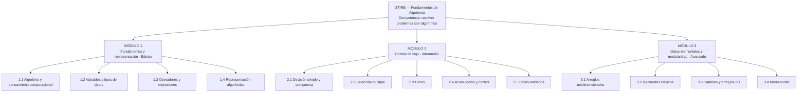
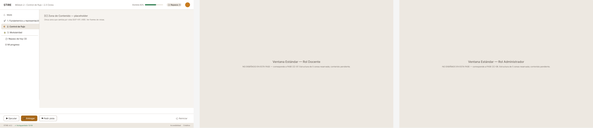

# FASE II — DISEÑO MULTIMEDIAL (MODESEC)
## STIRE-Soft · Sistema Tutor Inteligente para la Resolución de Ejercicios

---
estado:     derivado
verificado: 2026-09-03 contra commit HEAD (FASE CC-04)
fuente:     derivado de contenidos/3.1_DIAGRAMA_CONTENIDOS.md, guiones/3.2_GUION_TECNICO_MULTIMEDIAL.md, ventanas/3.3_VENTANA_ESTANDAR.md, ventanas/3.3.1_FICHAS_VENTANAS.md, contenidos/3.3.2_GUIA_METAFORAS.md, contenidos/3.3.3_MAPA_NAVEGACION.md
codigos:    EST-V01..V06 · DOC-V01..V06 · ADM-V01..V03 · COMP-V00
---

> ⚠️ **ESTE DOCUMENTO ES GENERADO. NO SE EDITA DIRECTAMENTE.**
> Es la concatenación literal de los seis documentos fuente listados arriba, regenerada en
> FASE CC-04 (2026-09-03) porque la versión anterior se había editado a mano y había divergido de
> las fuentes (usaba una numeración `V-01..V06` que no coincidía con ninguna fuente real). Para
> corregir el contenido de cualquier sección de este documento, edita el archivo fuente
> correspondiente en `contenidos/`, `guiones/` o `ventanas/` y vuelve a regenerar este archivo —
> nunca edites este archivo directamente, el próximo regenerado descartaría el cambio.

---

# § 3.1 · Diagrama de Contenidos — STIRE

**Proyecto:** STIRE-Soft · **Curso:** DDSE3 2026-2 · **Norma:** `DDS3-01.pdf` §3.1 · MODESEC §3.1
**Dueño:** Julio · **Estado:** ✅ completo · **Última actualización:** 2026-08-28

---

## 1. Representación elegida y por qué

MODESEC §3.1.1 admite tres formas de representar los contenidos: **mentefacto**, **mapa conceptual**
o **mapa mental**. Elegimos **mapa mental radial** porque el contenido de algoritmia es jerárquico y
acumulativo: cada módulo se apoya en el anterior, y el mapa mental muestra esa dependencia de un
vistazo. Un mentefacto habría exigido supraordinadas e infraordinadas que aquí no aportan, y un mapa
conceptual con proposiciones etiquetadas habría duplicado lo que ya dice la tabla de resultados de
aprendizaje.

---

## 2. Diagrama (Gráfico 1)


*Fuente editable: [`assets/3.1_diagrama_contenidos.svg`](assets/3.1_diagrama_contenidos.svg)*

<details>
<summary>Versión en Mermaid (se renderiza directamente en GitHub)</summary>


</details>

---

## 3. Correspondencia con la estructura de datos de STIRE

| Nivel MODESEC | Nivel en el sistema | Qué se le asigna |
|---|---|---|
| Módulo | Sección / Corte | agrupación curricular |
| Tema | Tema | agrupación conceptual |
| Unidad de aprendizaje | **Unidad de Aprendizaje** | `mastery`, `review_schedule`, historial de progreso |
| — | Contenido teórico y Actividad | material (PDF, video, Markdown) y preguntas |

La **unidad de aprendizaje es el gránulo mínimo evaluable**: es lo que se domina, lo que se repasa
y lo que se desbloquea. Por eso el diagrama llega hasta ese nivel y no se detiene en el tema.

---

## 4. Tabla de contenidos y resultados de aprendizaje

| Módulo | Tema | Unidades de aprendizaje | Resultado de aprendizaje (verbo observable) | Nivel |
|---|---|---|---|---|
| **1. Fundamentos y representación** | 1.1 Algoritmo y pensamiento computacional | Noción de algoritmo · Entrada-proceso-salida | **Descompone** un enunciado en entradas, proceso y salidas identificando qué dato produce el resultado | Básico |
| | 1.2 Variables y tipos de datos | Declaración y asignación · Numéricos · Cadenas · Booleanos | **Declara y asigna** variables del tipo correcto, justificando la elección | Básico |
| | 1.3 Operadores y expresiones | Aritméticos · Precedencia · Expresiones mixtas | **Evalúa** expresiones respetando la precedencia y **predice** el resultado antes de ejecutar | Básico |
| | 1.4 Representación algorítmica | Pseudocódigo · Diagrama de flujo · Prueba de escritorio | **Representa** un algoritmo en pseudocódigo y lo **verifica** con 3 casos de escritorio | Básico |
| **2. Control de flujo** | 2.1 Decisión simple y compuesta | if / if-else · Relacionales · Lógicos | **Construye** algoritmos que seleccionan entre alternativas excluyentes | Intermedio |
| | 2.2 Selección múltiple | if anidado · switch | **Reestructura** decisiones anidadas en una selección múltiple equivalente y más legible | Intermedio |
| | 2.3 Ciclos | while · for · do-while | **Diseña** ciclos con condición de corte correcta y **detecta** ciclos infinitos por trazado | Intermedio |
| | 2.4 Acumulación y control | Contadores · Acumuladores · Banderas | **Implementa** contadores y acumuladores para totales, promedios y conteos condicionados | Intermedio |
| | 2.5 Ciclos anidados | Series y tablas · Condición de corte | **Construye** ciclos anidados y **explica** la relación entre iteración externa e interna | Intermedio |
| **3. Datos elementales y modularidad** | 3.1 Arreglos unidimensionales | Declaración · Indexación · Carga y despliegue | **Manipula** arreglos accediendo por índice sin desbordar los límites | Avanzado |
| | 3.2 Recorridos clásicos | Búsqueda secuencial · Máx/mín/promedio · Ordenamiento por selección | **Aplica** el recorrido adecuado y **compara** su costo en número de comparaciones | Avanzado |
| | 3.3 Cadenas y arreglos 2D | Recorrido de cadenas · Matriz filas/columnas | **Recorre** estructuras bidimensionales resolviendo conteo y transformación | Avanzado |
| | 3.4 Modularidad | Función y procedimiento · Parámetros y retorno · Descomposición | **Descompone** un problema en funciones de responsabilidad única y **reutiliza** las ya construidas | Avanzado |

**Criterio de calidad aplicado:** ningún resultado empieza por *conocer* o *entender*. Un resultado
que no se puede medir con un ejercicio no puede alimentar el motor de dominio del sistema.

---

## 5. Reglas de progresión (enlace con el motor de dominio)

| Regla | Valor | Dónde vive en el sistema |
|---|---|---|
| Desbloqueo de la siguiente unidad | `mastery ≥ 70 %` | `minMasteryRequired` (grafo de prerrequisitos) |
| Estado **Dominado** | `mastery ≥ 85 %` | `learning_progress.mastery` |
| Tutoría socrática proactiva | `mastery < 60 %` tras 2 intentos | `TutorService` |
| Programación de repaso | SM-2, intervalo con techo de 60 días | `review_schedules.nextReviewDate` |
| Prerrequisito entre módulos | M1 → M2 → M3 secuencial; dentro del módulo orden flexible salvo 2.3 → 2.4 → 2.5 | grafo de prerrequisitos |

⚠️ Estos umbrales son **propuesta de diseño**: requieren validación con el docente titular.

---

## 6. Pendiente conocido

Según MODESEC §2.5, los contenidos deben **derivarse del formato de competencias (Formato 5)** de la
Fase I. Ese formato aún no existe (ver `../01_GAP_Y_PLAN.md`, tarea 1). Al construirlo, este
diagrama debe revisarse y corregirse en lo que no trace. Está registrado como tarea P0.

---

# § 3.2 · Guión Técnico Multimedial — STIRE

**Norma:** MODESEC §3.2 · Formatos **10** (guión didáctico) y **11** (guión técnico) · `DDS3-01.pdf` §3.2
**Estado:** ✅ guiones completos · 🟡 producción de recursos pendiente · **Última actualización:** 2026-08-28

> **Qué es esta pieza.** El guión técnico multimedial describe, con detalle de producción, *qué se ve
> y se oye en cada pantalla*: textos, imágenes, sonidos, su formato, su fuente, la acción que
> ejecutan y el evento que la dispara. Es el puente entre el diseño pedagógico (Fase I) y la
> implementación (Fase IV): sin él, cada quien inventa la pantalla a su manera.

---

## 1. Guión didáctico — Formato 10

| Campo | Contenido |
|---|---|
| **Título** | STIRE — Sistema Tutor Inteligente para la Resolución de Ejercicios · Fundamentos de Algoritmia |
| **Sinopsis de la temática** | Entorno de práctica algorítmica donde el estudiante resuelve ejercicios verificados por un juez automático, recibe tutoría socrática de un agente de IA que no entrega la solución, y consolida lo aprendido mediante repaso espaciado (SM-2). El avance se rige por dominio (*mastery learning*): no se accede a la siguiente unidad hasta demostrar la anterior. |
| **Finalidad educativa** | Desarrollar la competencia de resolución de problemas computacionales, integrando las dimensiones cognitiva (comprender estructuras de control y datos), procedimental (construir, trazar y depurar algoritmos) y actitudinal (persistir ante el error y argumentar decisiones de diseño). |
| **Objetivos didácticos** | 1. Que el estudiante represente algoritmos en pseudocódigo y los verifique con casos de prueba. 2. Que seleccione la estructura de control adecuada al problema. 3. Que descomponga problemas en funciones de responsabilidad única. 4. Que use la retroalimentación del tutor como insumo de análisis, no como respuesta. |
| **Contextos valorativos** | **Honestidad académica** (el tutor no resuelve por el estudiante; los casos privados no se exponen), **persistencia** (el error es prueba de banco, no sanción), **rigor** (un algoritmo se declara correcto solo si pasa la verificación) y **colaboración** (MOCAVI: el trabajo se comparte y se argumenta). |
| **Características de la población objetivo** | Estudiantes de Licenciatura en Informática de la Universidad de Córdoba, con acceso a sala de cómputo compartida y equipo propio de gama media; alfabetización digital media; primera experiencia formal con programación. |
| **Rango de edades** | 18 – 22 años |
| **Características psicológicas** | Pensamiento formal en consolidación; **alta ansiedad ante el error de compilación** y tendencia a atribuirlo a incapacidad personal; motivación sensible al progreso visible; baja tolerancia a la espera (>3 s) y a la ambigüedad del enunciado; capacidad de autorregulación aún en desarrollo, que requiere que el sistema haga visible el estado del aprendizaje. |
| **Nivel académico** | Universitario — 3.er semestre |
| **Unidad temática** | Fundamentos de Algoritmia: representación, control de flujo, estructuras de datos elementales y modularidad |

**Por qué se llenó así:** las características psicológicas no son un adorno del formato. De la
ansiedad ante el error salen tres decisiones de interfaz que aparecen en §3.3: *Ejecutar* separado
de *Entregar*, autoguardado visible en el footer, y un tutor que responde con preguntas en lugar de
correcciones. De la baja tolerancia a la espera sale el indicador de estado del juez en V-03.

---

## 2. Guión técnico — Formato 11

Un bloque por ventana. Filas: **Texto · Imagen · Sonido** (las tres categorías del formato).

### V-01 · Inicio

| Título de la Ventana | Descripción | Formato / fuente | Acción | Evento |
|---|---|---|---|---|
| **Texto** | Saludo (1 línea), tres tarjetas de estado, métricas de dominio. Sans serif humanista 14–16 px, color `#2B2622`, interlínea 1.5 | UTF-8 renderizado desde Markdown · fuente: producción propia + API `learning-progress` | Muestra el estado real del estudiante; cada tarjeta enlaza a su ventana | Al cargar la ventana (`onLoad`) |
| **Imagen** | Iconografía lineal 24 px (inicio, repasos, mi progreso) e ilustración de cabecera plana | SVG · producción propia (`assets/icons/`) | Icono clicable: navega a la sección correspondiente | Clic sobre el icono o su etiqueta |
| **Sonido** | No se utiliza | — | — | — |

### V-02 · Unidad de aprendizaje (contenido teórico)

| Título de la Ventana | Descripción | Formato / fuente | Acción | Evento |
|---|---|---|---|---|
| **Texto** | Cuerpo teórico en bloques ≤150 palabras; ejemplos de código en monoespaciada 14 px sobre fondo `#F6F3EF`; glosario emergente en términos marcados | Markdown renderizado (UTF-8) · autoría del equipo, revisada por el docente | Muestra teoría y ejemplo; el glosario despliega la definición | `onLoad` · `mouseover` sobre término marcado |
| **Imagen** | Diagramas de flujo y esquemas conceptuales, con texto alternativo descriptivo | SVG · producción propia | Ampliar el diagrama sin pérdida de nitidez | Clic sobre el diagrama |
| **Sonido** | No hay locución producida; se soporta la lectura por voz del navegador | — (tecnología asistiva del sistema) | Lee el texto para el usuario que lo solicite | Activación desde el lector de pantalla |
| **Video** | Cápsula de 3–6 min por unidad, subtitulada, con control de velocidad y transcripción | MP4 H.264 720p + WebVTT · **producción pendiente** | Reproduce, pausa, cambia velocidad, descarga transcripción | Clic en ▶ / controles del reproductor |
| **Animación** | Trazado de escritorio paso a paso: resalta la línea en ejecución y actualiza la tabla de variables | SVG + JS (sin dependencias de video) · producción propia | Avanza o retrocede un paso del trazado | Clic en ◀ / ▶ (nunca automático) |

### V-03 · Resolución de ejercicio

| Título de la Ventana | Descripción | Formato / fuente | Acción | Evento |
|---|---|---|---|---|
| **Texto** | Enunciado estructurado ≤200 palabras (contexto, entrada, salida, restricciones), ejemplos E/S, contador de intentos. Editor en monoespaciada 14 px con numeración de línea | UTF-8 · banco de ejercicios propio | Envía el código al juez; muestra el resultado por caso | Clic en **Ejecutar** (no consume intento) / **Entregar** (consume intento, con confirmación) |
| **Imagen** | Iconos de estado por caso de prueba: ✔ pasa, ✖ falla, ⏱ tiempo excedido | SVG · producción propia | Cambia el estado visual del caso al recibir el veredicto | Respuesta del juez (`onJudgeResult`) |
| **Sonido** | Dos señales cortas y **desactivadas por defecto**: éxito y fallo de la ejecución | WAV/OGG ≤1 s · biblioteca libre de derechos, **pendiente de selección** | Avisa del fin de la ejecución sin mirar la pantalla | Fin de la ejecución del juez |
| **Animación** | Indicador de progreso del sandbox: en cola → ejecutando → evaluando; los casos se revelan en secuencia | CSS + SVG · producción propia | Comunica que el sistema no está congelado | Envío al juez |

### V-04 · Tutor IA

| Título de la Ventana | Descripción | Formato / fuente | Acción | Evento |
|---|---|---|---|---|
| **Texto** | Turnos ≤80 palabras; el tutor responde con preguntas guía y contraejemplos. Aviso permanente: *"Respuestas generadas por IA: verifícalas ejecutando tu algoritmo"* | UTF-8 · generado por el motor de tutoría sobre el contexto del estudiante | Envía la consulta con el fragmento de código adjunto y devuelve la respuesta | Clic en **Enviar** / atajo `Ctrl+Enter` |
| **Imagen** | Avatar geométrico abstracto (no humanoide) y marcas que distinguen los turnos | SVG · producción propia | Identifica visualmente quién habla | `onLoad` |
| **Sonido** | **No se utiliza, por decisión pedagógica:** sintetizar voz sobre texto generado por IA aumenta la percepción de autoridad de una fuente falible | — | — | — |
| **Animación** | Indicador de escritura y entrega progresiva del texto | CSS · producción propia | Evita la percepción de sistema colgado | Mientras se genera la respuesta |

### V-05 · Repasos (repaso espaciado)

| Título de la Ventana | Descripción | Formato / fuente | Acción | Evento |
|---|---|---|---|---|
| **Texto** | Lista de unidades por vencer con **justificación de una línea** por cada una y explicación del intervalo SM-2 | UTF-8 · calculado por el motor de repaso | Inicia el repaso, lo pospone con motivo o muestra el historial | Clic en la tarjeta / botón **Posponer** |
| **Imagen** | Iconos de urgencia con doble codificación forma + color + etiqueta (⬤ al día, ◐ mañana, ▲ vencido, ■ crítico) | SVG · producción propia | Comunica prioridad sin depender del color | `onLoad` |
| **Sonido** | No se utiliza | — | — | — |
| **Animación** | Al completar un repaso, la tarjeta sale de la lista y aparece la nueva fecha (≤300 ms) | CSS · producción propia | Hace visible que el intervalo se extendió | Fin del repaso |

### EST-V06 · Mi Progreso

| Título de la Ventana | Descripción | Formato / fuente | Acción | Evento |
|---|---|---|---|---|
| **Texto** | Métricas (`mastery`, `successRate`, intentos, racha) **cada una con su línea de interpretación** | UTF-8 · API de progreso | Filtra por módulo o fecha; sugiere la unidad más débil | Cambio en el filtro · `onLoad` |
| **Imagen** | Barras de dominio, mapa de calor de actividad y línea de evolución, sin efectos 3D | SVG generado en cliente · producción propia | Amplía o exporta el reporte | Clic en **Exportar** |
| **Sonido** | No se utiliza | — | — | — |
| **Animación** | Las barras crecen desde cero al cargar (400 ms); se resalta lo que cambió desde la última visita | CSS · producción propia | Dirige la atención al cambio, no al adorno | `onLoad` |

---

### Vistas del Docente (Gestión y Analítica Pedagógica)

#### DOC-V01 · Panel de Mis Clases
| Título | Descripción | Formato / fuente | Acción | Evento |
|---|---|---|---|---|
| **Texto** | Listado de asignaturas/clases activas, códigos de acceso, conteo de matriculados y promedio de cohorte | UTF-8 · API `class/my-classes` | Permite crear nueva clase o abrir el seguimiento de una cohorte | `onLoad` · Clic en tarjeta de clase |
| **Imagen** | Iconos de cohorte, código QR de matrícula rápida | SVG · producción propia | Genera QR para proyectar en aula | Clic en icono QR |
| **Sonido** | No se utiliza | — | — | — |
| **Animación** | Transición al abrir el panel de detalle de cohorte (300 ms) | CSS · producción propia | Retroalimentación de navegación | Clic en clase |

#### DOC-V02 · Gestor de Contenidos y Unidades
| Título | Descripción | Formato / fuente | Acción | Evento |
|---|---|---|---|---|
| **Texto** | Árbol jerárquico de Módulos, Temas y Unidades con interruptores de publicación (Borrador / Publicado) | UTF-8 · API `topic`, `learning-unit` | Modifica visibilidad, reorganiza secuencia | Clic en interruptor o drag-and-drop |
| **Imagen** | Iconos de estado de publicación (verde/gris) | SVG · producción propia | Identifica unidades visibles a estudiantes | `onLoad` |
| **Sonido** | No se utiliza | — | — | — |
| **Animación** | Reordenamiento de lista con animación de desplazamiento | CSS · producción propia | Muestra nuevo orden | Soltar elemento |

#### DOC-V03 · Editor de Ejercicios y Casos de Prueba
| Título | Descripción | Formato / fuente | Acción | Evento |
|---|---|---|---|---|
| **Texto** | Formulario de enunciado estructurado, solución de referencia, tabla de casos públicos y privados | UTF-8 · API `activities`, `activity-questions` | Valida sintaxis de casos, guarda o publica ejercicio | Clic en **Guardar** / **Probar solución** |
| **Imagen** | Iconos de visibilidad de casos (ojo abierto = público, candado = privado) | SVG · producción propia | Conmuta visibilidad de caso | Clic en icono |
| **Sonido** | No se utiliza | — | — | — |
| **Animación** | Indicador de ejecución de la solución de referencia en el sandbox | CSS · producción propia | Valida que los casos de prueba sean consistentes con la solución | Clic en Probar |

#### DOC-V04 · Analítica de Cohorte y Alertas
| Título | Descripción | Formato / fuente | Acción | Evento |
|---|---|---|---|---|
| **Texto** | Cuadrante de dominio grupal, lista de estudiantes en rezago (alerta cognitiva), tasa de error por ejercicio | UTF-8 · API `analytics/class/:id` | Filtra por unidad o umbral de riesgo; exporta planilla de notas | `onLoad` · Clic en filtro |
| **Imagen** | Gráficos de dispersión y mapas de calor de avance por unidad | SVG generado en cliente · producción propia | Muestra detalle individual al posar cursor | Hover sobre nodo |
| **Sonido** | No se utiliza | — | — | — |
| **Animación** | Renderizado progresivo de gráficos estadísticos (500 ms) | CSS/Canvas · producción propia | Transición suave de datos | Clic en selector de métrica |

---

### Vistas del Administrador (Gobernanza y Salud del Sistema)

#### ADM-V01 · Panel de Control del Sistema
| Título | Descripción | Formato / fuente | Acción | Evento |
|---|---|---|---|---|
| **Texto** | Métricas operativas globales: usuarios activos por rol, total de ejecuciones en sandbox, estado de servicios | UTF-8 · API `analytics`, `maintenance` | Supervisa salud general del backend y base de datos | `onLoad` (auto-refresco 60 s) |
| **Imagen** | Tacómetros e indicadores de estado de servicios (verde = OK, amarillo = advertencia, rojo = crítico) | SVG · producción propia | Muestra log de eventos al hacer clic | Clic en indicador |
| **Sonido** | No se utiliza | — | — | — |
| **Animación** | Pulso sutil en el indicador de latencia del sandbox | CSS · producción propia | Señaliza monitoreo en tiempo real | Continuo |

#### ADM-V02 · Gestión de Usuarios y Roles
| Título | Descripción | Formato / fuente | Acción | Evento |
|---|---|---|---|---|
| **Texto** | Tabla paginada de usuarios con filtros por rol, estado activo/inactivo, afiliación institucional | UTF-8 · API `user` | Cambiar rol, activar/desactivar cuenta, restablecer credenciales | Clic en acción por fila |
| **Imagen** | Iconos de rol (birrete = estudiante, portafolio = docente, escudo = admin) | SVG · producción propia | Identificación visual rápida | `onLoad` |
| **Sonido** | No se utiliza | — | — | — |
| **Animación** | Modal de confirmación con animación de entrada (200 ms) | CSS · producción propia | Previene cambios accidentales de privilegios | Clic en Cambiar Rol |


---

## 3. Selección y producción de recursos multimedia — §3.2.3

MODESEC advierte que **los materiales multimedia solo se usan cuando aportan algo relevante al
aprendizaje**. Este es nuestro inventario, con su estado real:

| Recurso | Tipo | Aporte pedagógico que justifica su uso | Origen | Estado |
|---|---|---|---|---|
| Iconografía del sistema (12 metáforas) | Imagen SVG | Sostiene la metáfora rectora y permite reconocer funciones sin leer | Producción propia | ✅ producido (`assets/icons/`) |
| Diagramas de flujo de las unidades | Imagen SVG | Representación alterna del algoritmo, exigida por la unidad 1.4 | Producción propia | 🟡 en producción |
| Cápsulas de video por unidad (3–6 min) | Video MP4 + subtítulos | Apoyo para quien prefiere explicación hablada; **no sustituye el texto** | Producción propia | 🔴 no iniciado |
| Animación de trazado de escritorio | SVG + JS | **El de mayor valor pedagógico:** hace visible el estado de la memoria durante la ejecución | Producción propia | 🔴 no iniciado |
| Señales sonoras de ejecución (2) | WAV/OGG ≤1 s | Permite no mirar la pantalla durante la espera del juez | Biblioteca libre de derechos | 🔴 sin seleccionar |
| Locución / voz en off | Audio | **Descartado deliberadamente.** Impone ritmo sobre la lectura de código y, en el tutor, atribuye autoridad a una fuente falible | — | ⛔ no aplica (justificado) |

**Riesgo declarado:** si la animación de trazado no alcanza a producirse, se degrada a **trazado
estático tabulado** y se documenta en `RELEASE_NOTES.md`. No se elimina en silencio.

---

## 4. Trazabilidad

Cada ventana de este guión tiene su ficha de 7 categorías en
[`../ventanas/3.3.1_FICHAS_VENTANAS.md`](../ventanas/3.3.1_FICHAS_VENTANAS.md) y su posición en el
sistema en [`../contenidos/3.3.3_MAPA_NAVEGACION.md`](../contenidos/3.3.3_MAPA_NAVEGACION.md).

---

# § 3.3 · Ventana Estándar — STIRE

**Norma:** MODESEC §3.3.1.1 · **Formato 12** (Descripción de la ventana estándar) · `DDS3-01.pdf` §3.3
**Dueño:** José · **Estado:** ✅ completo · **Última actualización:** 2026-08-28

---

## 1. Formato 12 — Descripción de la ventana estándar

<table>
<tr><th colspan="2" align="center">DESCRIPCIÓN DE LA VENTANA ESTÁNDAR</th></tr>
<tr><td colspan="2" align="center"></td></tr>
<tr><td width="180"><b>Título de la ventana</b></td><td>Ventana estándar STIRE (modelo de todas las interfaces)</td></tr>
<tr><td><b>Descripción</b></td><td>Es la ventana modelo de la que derivan todas las interfaces del sistema. Se divide en cinco secciones funcionales —Header, Menú, Contenido, Acciones y Footer— de las cuales <b>cuatro son invariantes</b>: solo cambia la zona de contenido. El estudiante encuentra siempre los mismos controles en el mismo lugar, de modo que el esfuerzo mental se invierte en el algoritmo y no en la interfaz.</td></tr>
</table>

*Fuente editable: [`assets/3.3_ventana_estandar.svg`](assets/3.3_ventana_estandar.svg)*

---

## 2. Maqueta en texto (referencia rápida)

```
╔══════════════════════════════════════════════════════════════════════════════════╗
║ [A] HEADER — logo · ruta Módulo › Tema › Unidad · barra de dominio · repasos      ║
╠═══════════════════════╤══════════════════════════════════════════════════════════╣
║ [B] MENÚ  (260 px)    │ [C] ZONA DE CONTENIDO                                     ║
║  ▸ Inicio             │   ┌────────────────────────────────────────────────────┐  ║
║  ▾ M1 Fundamentos  ✔  │   │  Título de la unidad o del ejercicio                │ ║
║      1.1 Algoritmo ✔  │   │  teoría · enunciado + editor · tutor · repasos      │ ║
║  ▾ M2 Control      ◐  │   └────────────────────────────────────────────────────┘  ║
║      2.3 Ciclos    ◐  │   ┌────────────────────────────────────────────────────┐  ║
║      2.4 Acumular  ○  │   │  Panel auxiliar contextual (casos de prueba/tutor)  │ ║
║  ▸ M3 Datos        🔒 │   └────────────────────────────────────────────────────┘  ║
║  ⟳ Repaso de hoy  (3) │                                                           ║
║  ▤ Mi progreso        │                                                           ║
╠═══════════════════════╧══════════════════════════════════════════════════════════╣
║ [D] ACCIONES — [ ▶ Ejecutar ] [ ✔ Entregar ] [ ⚑ Pedir pista ]   [ ⟲ Reiniciar ] ║
╠══════════════════════════════════════════════════════════════════════════════════╣
║ [E] FOOTER — STIRE v0.2 · Autoguardado 12:04 · Accesibilidad · Créditos           ║
╚══════════════════════════════════════════════════════════════════════════════════╝
```

**Rejilla:** 12 columnas · canal 24 px · ancho mínimo 1024 px. En <768 px el menú [B] colapsa a
desplegable y las acciones [D] se anclan al borde inferior.

---

## 3. Descripción por secciones — lo que exige la norma

> MODESEC: *"la ventana estándar se diseña por secciones que deben ser explicadas detalladamente
> para precisar la división de la ventana"*. La columna que importa no es qué contiene cada sección,
> sino **por qué está ahí**.

| Sección | Elementos | Función pedagógica |
|---|---|---|
| **[A] Header** | Marca, ruta *Módulo › Tema › Unidad*, barra de dominio de la unidad, contador de repasos, perfil | Ancla al estudiante en el **mapa del conocimiento**: siempre sabe qué estudia, cuánto le falta para el umbral y qué deuda de repaso tiene. Hace visible el *mastery learning*, que de otro modo sería invisible y no regularía la conducta de estudio. |
| **[B] Menú** | Árbol Módulo → Tema → Unidad con estado (✔ dominado, ◐ en práctica, ○ explorado, 🔒 bloqueado) + repaso, progreso y ayuda | Materializa el **grafo de prerrequisitos**: el candado no es una restricción administrativa sino información pedagógica ("aún no tienes la base"). El estado por unidad sostiene la **autorregulación**: el estudiante decide dónde invertir esfuerzo con datos, no por intuición. |
| **[C] Contenido** | Zona principal (teoría, enunciado + editor, diálogo del tutor o tablero de repaso) + panel auxiliar | Concentra el **esfuerzo cognitivo pertinente**. Aplica el principio de contigüidad: enunciado, editor y retroalimentación conviven sin cambiar de pantalla, para no perder el estado mental del problema. |
| **[D] Acciones** | Ejecutar · Entregar · Pedir pista · Reiniciar, en posición fija | Separa **ensayar** de **entregar**. *Ejecutar* es gratis e ilimitado: habilita el ciclo ensayo-error sin castigo. *Entregar* consume intento y dispara la evaluación. Esa distinción visible convierte el error en instrumento de aprendizaje. |
| **[E] Footer** | Versión, estado de autoguardado, accesibilidad, créditos | Sostiene la **confianza en el entorno**: saber que el trabajo está guardado elimina la ansiedad por pérdida, que en población novata es causa real de abandono de la tarea. |

---

## 4. Reglas transversales

1. [A], [B], [D] y [E] son **invariantes**; solo cambia [C].
2. Nunca hay más de **una acción primaria** visible en [D] (primaria llena · secundaria contorno · terciaria texto).
3. El color **nunca** es el único portador de significado: todo estado lleva icono y etiqueta (WCAG 2.1 AA, contraste ≥ 4.5:1).
4. Toda operación destructiva (Reiniciar, entregar el último intento) exige confirmación explícita.
5. Toda ventana retorna a **Inicio** en un clic.
6. Ningún elemento decorativo compite con el contenido: si no informa, no entra.

⚠️ La conformidad WCAG 2.1 AA está **declarada en el diseño pero no auditada**. No debe reportarse
como cumplida hasta ejecutar la verificación con herramienta.

---

## 5. Adaptación de Secciones según Rol

La Ventana Estándar mantiene la misma estructura espacial de 5 zonas (A–E) para todos los roles, adaptando los contenidos y acciones pertinentes:

| Sección | Estudiante | Docente | Administrador |
|---|---|---|---|
| **[A] Header** | Marca · Ruta de unidad · Barra de Mastery · Repasos · Perfil | Marca · Selector de Clase activa · Resumen de alertas · Perfil | Marca · Indicador de Estado del Sistema · Perfil Admin |
| **[B] Menú** | Inicio, Módulos/Temas, Repasos, Mi Progreso, Tutor | Mis Clases, Catálogo/Banco de Ejercicios, Analítica, Tareas por Calificar, Mensajes | Gestión de Usuarios, Instituciones, Parámetros del Sistema, Logs de Auditoría |
| **[C] Contenido** | Teoría, Editor de código + Casos de prueba, Diálogo Tutor, Repaso SM-2 | Tablero de seguimiento de cohorte, Diseñador de ejercicios, Editor de rúbricas | Tablas maestras, Formularios de configuración, Métricas del sistema |
| **[D] Acciones** | `[Ejecutar]` (gratis), `[Entregar]`, `[Pedir Pista]`, `[Reiniciar]` | `[Crear Clase]`, `[Publicar Ejercicio]`, `[Exportar Reporte]`, `[Guardar Borrador]` | `[Crear Usuario]`, `[Guardar Configuración]`, `[Purgar Caché]`, `[Restaurar]` |
| **[E] Footer** | Versión · Estado de Autoguardado · Accesibilidad · Créditos | Versión · Estado de Sincronización · Soporte Docente | Versión · Estado de Servidores / Sandbox · Uptime |

---

## 6. Ventanas derivadas del modelo

El inventario completo de las **16 ventanas** que heredan de este modelo está especificado en:
👉 [`3.3.1_FICHAS_VENTANAS.md`](3.3.1_FICHAS_VENTANAS.md)

- **Común (1):** `COMP-V00` (Autenticación y Acceso)
- **Estudiante (6):** `EST-V01` (Inicio), `EST-V02` (Teoría), `EST-V03` (Resolución de ejercicio), `EST-V04` (Tutor IA), `EST-V05` (Repasos SM-2), `EST-V06` (Mi Progreso)
- **Docente (6):** `DOC-V01` (Mis Clases), `DOC-V02` (Contenidos y Temas), `DOC-V03` (Crear Ejercicio), `DOC-V04` (Rendimiento del Grupo), `DOC-V05` (Detalle de Estudiante), `DOC-V06` (Mensajes)
- **Administrador (3):** `ADM-V01` (Panel de control), `ADM-V02` (Gestión de usuarios y roles), `ADM-V03` (Parámetros y salud del sistema)

---

# § 3.3.1 · Fichas de Descripción de Ventanas Multi-Rol — STIRE

**Norma:** MODESEC §3.3.1.1 · **Formato 13** (Descripción de las ventanas) · `DDS3-01.pdf` §3.3  
**Autores:** José López (UI/UX), Julio Galvis (Diseño Instruccional), Jeider Gómez (Líder Técnico)  
**Estado:** ⚠️ 6 Estudiante + 1 Común + 4 Docente completas + 2 Docente pendientes + 3 Administrador · **Última actualización:** 2026-09-03 (FASE CC-04, códigos unificados según D-02)

> **Regla del formato MODESEC:** Cada ventana se describe obligatoriamente en **siete categorías**: (1) Imagen, (2) Nombre de ventana, (3) Texto, (4) Audio, (5) Video, (6) Animación y (7) Acciones. Cuando una categoría no aplica, se fundamenta su **motivo pedagógico o funcional**. Todas las ventanas derivan de la [Ventana Estándar](3.3_VENTANA_ESTANDAR.md).

---

## 🔑 PARTE 0: VISTA COMÚN DE AUTENTICACIÓN

### Ficha COMP-V00 · Autenticación y Acceso al Sistema

| # | Categoría | Descripción |
|---|---|---|
| 1 | **Imagen** | Isotipo de STIRE (SVG 48 px), fondo minimalista `#F6F3EF`. Sin ilustraciones decorativas complejas para evitar distracción en el ingreso. |
| 2 | **Nombre de ventana** | Interno: `COMP-V00_AUTH` · Visible: **"Iniciar Sesión — STIRE"** |
| 3 | **Texto** | Formulario con etiquetas claras: correo institucional, contraseña. Enlace a "Registrarse" o "Recuperar acceso". Mensajes de validación concisos en línea (< 12 palabras). |
| 4 | **Audio** | **No aplica.** Pantalla de transición transaccional rápida. |
| 5 | **Video** | **No aplica.** No aporta valor didáctico en el punto de autenticación. |
| 6 | **Animación** | Transición de entrada suave (fade-in 200 ms). Micro-animación de carga en el botón durante la verificación del token JWT. |
| 7 | **Acciones** | Iniciar sesión `[POST /auth/login]` · Registrar nuevo usuario `[POST /auth/register]` · Redirección automática según rol (`estudiante` → `EST-V01`, `docente` → `DOC-V01`, `admin` → `ADM-V01`). |

---

## 🎓 PARTE 1: VISTAS DEL ESTUDIANTE (Núcleo de Práctica)

### Ficha EST-V01 · Inicio (panel del estudiante)
*Ver maqueta: [`assets/png/3.3.1_v01_banco_trabajo.png`](assets/png/3.3.1_v01_banco_trabajo.png) · Fuente: [`assets/3.3.1_v01_banco_trabajo.svg`](assets/3.3.1_v01_banco_trabajo.svg)*

| # | Categoría | Descripción |
|---|---|---|
| 1 | **Imagen** | Iconografía lineal monocromática de 24 px (SVG) para estados de unidad y acciones. Ilustración de cabecera plana sin texto incrustado. |
| 2 | **Nombre de ventana** | Interno: `EST-V01_INICIO` · Visible: **"Inicio"** |
| 3 | **Texto** | Saludo personalizado, tres tarjetas de estado (*Continuar donde ibas*, *Repasos de hoy*, *Dominio del módulo*). Segunda persona, frases ≤ 20 palabras. |
| 4 | **Audio** | **No aplica.** Panel de consulta rápida (< 30 s) para uso en salas de cómputo compartidas. |
| 5 | **Video** | **No aplica** salvo bienvenida inicial opcional (60 s descartable). |
| 6 | **Animación** | Barra de progreso con transición de 400 ms al actualizarse; aparición escalonada de tarjetas (60 ms). |
| 7 | **Acciones** | Continuar unidad `[GET /progress/my-progress]` · Abrir repasos pendientes `[GET /progress/recommendations]` · Abrir tutor modal · Ver Mi Progreso. |

### Ficha EST-V02 · Unidad de aprendizaje (contenido teórico interactivo)
*Ver maqueta: [`assets/png/3.3.1_v02_unidad_teoria.png`](assets/png/3.3.1_v02_unidad_teoria.png) · Fuente: [`assets/3.3.1_v02_unidad_teoria.svg`](assets/3.3.1_v02_unidad_teoria.svg)*

| # | Categoría | Descripción |
|---|---|---|
| 1 | **Imagen** | Diagramas de flujo y esquemas conceptuales en SVG escalables con texto alternativo. Código siempre en texto seleccionable. |
| 2 | **Nombre de ventana** | Interno: `EST-V02_UNIDAD_TEORIA` · Visible: Título de la unidad temática (ej. **"2.3 Ciclos: while"**) |
| 3 | **Texto** | Contenido teórico en Markdown renderizado estructurado: concepto, sintaxis, ejemplos y trazado. Bloques ≤ 150 palabras. |
| 4 | **Audio** | **No aplica** como locución obligatoria. Soporte nativo para lectores de pantalla. |
| 5 | **Video** | **Aplica.** Cápsula explicativa de 3–6 min con subtítulos y transcripción descargable. |
| 6 | **Animación** | Trazado de escritorio paso a paso: resalta la línea activa y actualiza la tabla de memoria/variables de forma interactiva. |
| 7 | **Acciones** | Marcar como visto `[POST /progress/view/:unitId]` · Avanzar/retroceder trazado · Ir al ejercicio práctico · Consultar al tutor IA. |

### Ficha EST-V03 · Resolución de ejercicio (editor y juez)
*Ver maqueta: [`assets/png/3.3.1_v03_ejercicio.png`](assets/png/3.3.1_v03_ejercicio.png) · Fuente: [`assets/3.3.1_v03_ejercicio.svg`](assets/3.3.1_v03_ejercicio.svg)*

| # | Categoría | Descripción |
|---|---|---|
| 1 | **Imagen** | Iconos de estado de casos de prueba (✔ Pasa · ✖ Falla · ⏱ Tiempo excedido). |
| 2 | **Nombre de ventana** | Interno: `EST-V03_EJERCICIO` · Visible: **"Ejercicio: "** + nombre de la actividad |
| 3 | **Texto** | Enunciado formal (contexto, entrada, salida, restricciones) y ejemplos con entrada/salida visible. |
| 4 | **Audio** | **No aplica.** Solo señales sonoras opcionales de éxito/fallo al finalizar la ejecución del juez. |
| 5 | **Video** | **No aplica.** Mantener la concentración cognitiva en el editor de código. |
| 6 | **Animación** | Indicador de estado del sandbox en tiempo real (En cola → Ejecutando → Evaluando). |
| 7 | **Acciones** | Probar casos públicos `[POST /submissions]` · Enviar solución definitiva · Pedir pista al Tutor `[POST /tutor/chat]` · Autoguardado de borrador. |

### Ficha EST-V04 · Tutor IA (tutor IA adaptativo)
*Ver maqueta: [`assets/png/3.3.1_v04_tutor.png`](assets/png/3.3.1_v04_tutor.png) · Fuente: [`assets/3.3.1_v04_tutor.svg`](assets/3.3.1_v04_tutor.svg)*

| # | Categoría | Descripción |
|---|---|---|
| 1 | **Imagen** | Avatar geométrico abstracto del tutor (no antropomórfico) y marcas de turnos conversacionales. |
| 2 | **Nombre de ventana** | Interno: `EST-V04_TUTOR` · Visible: **"Tutor IA"** |
| 3 | **Texto** | Intercambio socrático: preguntas reflexivas y contraejemplos. **Nunca da el código resuelto**. Turnos ≤ 80 palabras con advertencia visible de IA. |
| 4 | **Audio** | **No aplica.** Decisión pedagógica para evitar atribuir infalibilidad a una IA. |
| 5 | **Video** | **No aplica.** Conversación contextual e irrepetible. |
| 6 | **Animación** | Indicador de escritura y renderizado progresivo del texto socrático. |
| 7 | **Acciones** | Enviar consulta `[POST /tutor/chat]` adjuntando código actual · Calificar utilidad de la pista · Cerrar modal conservando el código. |

### Ficha EST-V05 · Repasos (repaso espaciado SM-2)
*Ver maqueta: [`assets/png/3.3.1_v05_repaso.png`](assets/png/3.3.1_v05_repaso.png) · Fuente: [`assets/3.3.1_v05_repaso.svg`](assets/3.3.1_v05_repaso.svg)*

| # | Categoría | Descripción |
|---|---|---|
| 1 | **Imagen** | Iconos de urgencia con doble codificación (forma + color): ⬤ Al día, ◐ Vence mañana, ▲ Vencido, ■ Crítico. |
| 2 | **Nombre de ventana** | Interno: `EST-V05_REPASO` · Visible: **"Repasos"** |
| 3 | **Texto** | Lista de conceptos por repasar con justificación del intervalo SM-2: *"Dominado hace 10 días; un repaso corto ahora consolida la memoria."* |
| 4 | **Audio** | **No aplica.** Sesión de recuperación activa focalizada. |
| 5 | **Video** | **No aplica.** La recuperación activa requiere resolver problemas, no ver videos pasivamente. |
| 6 | **Animación** | Al completar un repaso, la tarjeta sale de la lista y se revela la nueva fecha calculada por SM-2. |
| 7 | **Acciones** | Iniciar ejercicio de repaso `[GET /progress/recommendations]` · Posponer con justificación · Consultar historial de intervalos. |

### Ficha EST-V06 · Mi Progreso (progreso y métricas)
*Ver maqueta: [`assets/png/3.3.1_v06_progreso.png`](assets/png/3.3.1_v06_progreso.png) · Fuente: [`assets/3.3.1_v06_progreso.svg`](assets/3.3.1_v06_progreso.svg)*

| # | Categoría | Descripción |
|---|---|---|
| 1 | **Imagen** | Barras de dominio por módulo, mapa de calor de constancia y gráfico de progreso sin 3D. |
| 2 | **Nombre de ventana** | Interno: `EST-V06_PROGRESO` · Visible: **"Mi Progreso"** |
| 3 | **Texto** | Métricas con interpretación: porcentaje de mastery, efectividad, intentos promedio y unidades desbloqueadas. |
| 4 | **Audio** | **No aplica.** Ventana analítica de inspección reflexiva. |
| 5 | **Video** | **No aplica.** Los datos son dinámicos y propios del alumno. |
| 6 | **Animación** | Barras de dominio con animación de llenado al cargar (400 ms). |
| 7 | **Acciones** | Filtrar por módulo · Abrir la unidad más débil recomendada · Exportar resumen de aprendizaje. |

---

## 👨‍🏫 PARTE 2: VISTAS DEL DOCENTE (Gestión y Acompañamiento)

> **Nota de unificación (FASE CC-04, D-02):** esta sección usaba una numeración `DOC-V0x`
> incompatible con la de `NAMING_STIRE.md` y el resto de `docs/`. Se recodificó cada ficha según
> su función real, no según el número que traía. Ningún contenido pedagógico se reescribió — solo
> el código y el nombre visible. Dos códigos de D-02 (`DOC-V03 · Crear Ejercicio` y
> `DOC-V04 · Rendimiento del Grupo`) no tenían ficha en este documento y no se inventan aquí — ver
> el aviso REQUERIDO-PENDIENTE al final de esta parte.

### Ficha DOC-V01 · Mis Clases

| # | Categoría | Descripción |
|---|---|---|
| 1 | **Imagen** | Tarjetas resumen con iconos SVG: total de clases activas, estudiantes matriculados y alertas de bajo rendimiento. |
| 2 | **Nombre de ventana** | Interno: `DOC-V01_MIS_CLASES` · Visible: **"Mis Clases"** |
| 3 | **Texto** | Saludo institucional, listado de cursos asignados con código de acceso y métricas agregadas de rendimiento del grupo. |
| 4 | **Audio** | **No aplica.** Panel de supervisión y gestión rápida. |
| 5 | **Video** | **No aplica.** Información administrativa y de control en tiempo real. |
| 6 | **Animación** | Transición de carga suave en tarjetas de resumen y contadores numéricos al entrar. |
| 7 | **Acciones** | Acceder a gestión de clases `[GET /class/my-classes]` · Crear nueva clase `[POST /class]` · Ver alertas pedagógicas. |

**Sub-vista: detalle de clase y roster** (se abre al seleccionar una clase desde DOC-V01, no es
una ventana con código propio en D-02): listado tabular de estudiantes matriculados con correo y
fecha de ingreso, código `joinCode` de la clase. El enrolamiento real se hace vía
`POST /enrollment/join` (el estudiante se une con el código) — no existe endpoint para que el
docente añada o retire estudiantes manualmente uno por uno; el docente consulta el roster con
`GET /enrollment/class/:classId`. La ficha original describía `POST/DELETE /class/:id/students/:id`,
que **no existe** en `src/` — corregido en el Paso 5 de esta fase.

### Ficha DOC-V02 · Contenidos y Temas

| # | Categoría | Descripción |
|---|---|---|
| 1 | **Imagen** | Estructura de árbol con iconos de módulo, tema, unidad teórica y banco de ejercicios. |
| 2 | **Nombre de ventana** | Interno: `DOC-V02_CONTENIDOS` · Visible: **"Contenidos y Temas"** |
| 3 | **Texto** | Formularios de edición para título, descripción, nivel de dificultad, orden y prerrequisitos de cada unidad. |
| 4 | **Audio** | **No aplica.** Edición de contenidos formativos. |
| 5 | **Video** | **No aplica.** |
| 6 | **Animación** | Reordenamiento interactivo tipo arrastrar y soltar (drag & drop) para estructurar el orden de temas. |
| 7 | **Acciones** | Crear unidad `[POST /learning-unit]` · Modificar unidad `[PATCH /learning-unit/:id]` · Consultar catálogo global `[GET /learning-unit/all]`. |

### Ficha DOC-V05 · Detalle de Estudiante

| # | Categoría | Descripción |
|---|---|---|
| 1 | **Imagen** | Gráficas comparativas de mastery individual frente al promedio del grupo y distribución de errores frecuentes. |
| 2 | **Nombre de ventana** | Interno: `DOC-V05_DETALLE_ESTUDIANTE` · Visible: **"Detalle de Estudiante"** |
| 3 | **Texto** | Ficha detallada del estudiante seleccionado: historial de intentos, tasa de éxito por unidad y estado en el algoritmo SM-2. |
| 4 | **Audio** | **No aplica.** Análisis de métricas académicas. |
| 5 | **Video** | **No aplica.** |
| 6 | **Animación** | Despliegue interactivo del desglose de intentos y tiempo de resolución por ejercicio. |
| 7 | **Acciones** | Consultar progreso detallado `[GET /learning-progress/student/:studentId]` · Consultar detalle por unidad `[GET /learning-progress/student/:studentId/unit/:unitId]`. |

### Ficha DOC-V06 · Mensajes

| # | Categoría | Descripción |
|---|---|---|
| 1 | **Imagen** | Lista de conversaciones con avatares e indicador de mensajes no leídos (badge numérico). |
| 2 | **Nombre de ventana** | Interno: `DOC-V06_MENSAJES` · Visible: **"Mensajes"** |
| 3 | **Texto** | Hilo de comunicación bidireccional entre docente y estudiante para resolver dudas metodológicas o administrativas. Bandeja de entrada, enviados y contador de no leídos separados por conversación. |
| 4 | **Audio** | **No aplica.** Comunicación asíncrona escrita. |
| 5 | **Video** | **No aplica.** |
| 6 | **Animación** | Desplazamiento automático al final de la conversación al enviar o recibir mensajes; badge de no leídos se actualiza sin recargar la página. |
| 7 | **Acciones** | Enviar mensaje `[POST /message]` · Ver bandeja de entrada `[GET /message/inbox]` · Ver enviados `[GET /message/sent]` · Ver contador de no leídos `[GET /message/unread-count]` · Ver conversación con un usuario `[GET /message/conversation/:userId]` · Marcar como leído `[PATCH /message/:id/read]`. |

> **NOTA:** `DOC-V03 · Crear Ejercicio` y `DOC-V04 · Rendimiento del Grupo` (analítica de cohorte,
> no individual) no tienen ficha en el formato de siete categorías de este documento — pero **sí
> están completamente especificadas**, con endpoints reales, en
> [`usuarios/docente/README.md`](../usuarios/docente/README.md) (secciones `DOC-V03` y `DOC-V04`)
> y en [`06_ARQUITECTURA_VENTANAS.md`](../06_ARQUITECTURA_VENTANAS.md). No se duplica aquí ese
> contenido para no generar dos fuentes que puedan divergir — este documento remite a la fuente
> existente en vez de redactar una ficha paralela.

---

## ⚙️ PARTE 3: VISTAS DEL ADMINISTRADOR (Supervisión y Gobernanza)

### Ficha ADM-V01 · Panel de Control de la Plataforma

| # | Categoría | Descripción |
|---|---|---|
| 1 | **Imagen** | Tarjetas de estado global: usuarios totales, volumen de código ejecutado, estado del sandbox y tasa de disponibilidad. |
| 2 | **Nombre de ventana** | Interno: `ADM-V01_DASHBOARD` · Visible: **"Panel de Control Administrativo"** |
| 3 | **Texto** | Métricas de uso del sistema, consumo de recursos del sandbox y resumen de eventos recientes de seguridad. |
| 4 | **Audio** | **No aplica.** Supervisión operativa. |
| 5 | **Video** | **No aplica.** |
| 6 | **Animación** | Actualización de contadores de carga de servidor en tiempo real. |
| 7 | **Acciones** | Monitorear estado del sistema · Acceder a administración de usuarios · Auditar logs de seguridad. |

### Ficha ADM-V02 · Gestión Global de Usuarios y Roles

| # | Categoría | Descripción |
|---|---|---|
| 1 | **Imagen** | Tabla con filtros avanzados por rol (`estudiante`, `docente`, `admin`), estado activo/inactivo y botón de alta. |
| 2 | **Nombre de ventana** | Interno: `ADM-V02_USUARIOS` · Visible: **"Directorio y Control de Usuarios"** |
| 3 | **Texto** | Información de cuenta: nombre completo, correo institucional, rol asignado, afiliación y estado de activación. |
| 4 | **Audio** | **No aplica.** Gestión administrativa. |
| 5 | **Video** | **No aplica.** |
| 6 | **Animación** | Modal de confirmación con animación de advertencia al suspender cuentas o modificar roles privilegiados. |
| 7 | **Acciones** | Listar usuarios `[GET /users]` · Crear cuenta `[POST /users]` · Modificar rol `[PATCH /users/:id/role]` · Desactivar usuario `[DELETE /users/:id]`. |

### Ficha ADM-V03 · Supervisión y Parámetros del Sistema

| # | Categoría | Descripción |
|---|---|---|
| 1 | **Imagen** | Esquema visual de parámetros del sistema: límites del sandbox (timeout, memoria), umbrales de mastery y configuración de IA. |
| 2 | **Nombre de ventana** | Interno: `ADM-V03_PARAMETROS` · Visible: **"Configuración y Parámetros Globales"** |
| 3 | **Texto** | Descripción de constantes del sistema: umbral de dominio (70%), reintentos del tutor y límites de llamadas a API. |
| 4 | **Audio** | **No aplica.** Configuración de plataforma. |
| 5 | **Video** | **No aplica.** |
| 6 | **Animación** | Indicador de guardado persistente al actualizar variables del entorno. |
| 7 | **Acciones** | Visualizar configuración de umbrales · Auditar integridad de unidades de aprendizaje `[GET /learning-unit/all]`. |

---

# § 3.3.2 · Guía de Metáforas — STIRE

**Norma:** MODESEC §3.3.2 · **Formato 14** (Diseño de guía de metáforas) · `DDS3-01.pdf` §3.3.2
**Dueño:** Julio · **Estado:** ✅ 12 metáforas, reencuadradas (D-01, FASE CC-04) · **Última actualización:** 2026-09-03

---

## 0. Reencuadre (D-01, decisión de Jeider, 2026-09-03)

> **La metáfora del taller gobierna la ICONOGRAFÍA, la paleta y el marco conceptual — nunca las
> etiquetas visibles de la interfaz.** Las etiquetas que el estudiante lee en pantalla son las de
> [`NAMING_STIRE.md`](../NAMING_STIRE.md) (Inicio, Lección, Ejercicio, Tutor IA, Repasos, Mi
> Progreso), sin excepción.

`NAMING_STIRE.md` §2 documentó por qué "Mi Banco de Trabajo", "Maestro de Taller",
"Mantenimiento del Taller" y "Bitácora" fallan como texto visible: exigen interpretación, suenan a
soporte técnico o son arcaicas para un estudiante universitario de Algoritmos I. Esta guía no
contradice esa decisión — la metáfora del taller sigue siendo válida y valiosa, pero en la capa
donde sí funciona: como marco conceptual que explica **por qué** la interfaz se comporta como se
comporta (por qué probar no cuesta nada, por qué el repaso no es castigo, por qué el tutor pregunta
en vez de responder), y como criterio de coherencia para iconos, paleta y tono visual. La sección 2
de esta guía separa explícitamente qué se conserva de la metáfora (el concepto) y qué usa la
etiqueta del naming (lo que el estudiante lee).

---

## 1. Metáfora rectora

> ## 🔨 El taller del algoritmista

MODESEC pide que la metáfora vaya **asociada al contexto de la población y al ambiente de
aprendizaje**. No pide un catálogo de iconos: pide una analogía que dé sentido al conjunto.

**Justificación pedagógica (anclada en MOCAVI).** MOCAVI sitúa el aprendizaje en la actividad
mediada y el trabajo colaborativo sobre problemas reales. El taller es el espacio donde se aprende
un oficio **produciendo piezas**, con un maestro que corrige el procedimiento y no el resultado, y
donde el error es parte esperada del proceso, no una sanción. Para estudiantes de tercer semestre
que llegan con miedo al error de compilación, esta metáfora reencuadra el fallo como **prueba de
banco**: algo que se hace a propósito, muchas veces, antes de dar por buena una pieza. Sostiene
además el repaso espaciado, que en un taller real no es castigo sino **mantenimiento del
herramental**.

---

## 2. Equivalencias de la metáfora

> **Lectura de la tabla (D-01):** la columna *"Concepto en la metáfora"* es marco conceptual e
> iconografía — se conserva. La columna *"Etiqueta visible (naming)"* es lo único que el
> estudiante lee en pantalla, y es la que manda en cualquier conflicto. Ver
> [`NAMING_STIRE.md` §8](../NAMING_STIRE.md#8-trazabilidad-completa-código-→-documental-→-visible).

| Elemento de la interfaz | Concepto en la metáfora (se conserva) | Etiqueta visible (naming, manda) | Qué comunica el concepto |
|---|---|---|---|
| Panel principal (EST-V01) | Banco de trabajo | **Inicio** | "Este es tu puesto: aquí está lo que dejaste a medias y lo que toca hoy." |
| Ejercicio (EST-V03) | Pieza en el banco | **Ejercicio** | "Es un encargo concreto, con medidas y tolerancias: entrada, salida y restricciones." |
| Ejecutar sin entregar | Prueba de banco | **Probar código** | "Ensaya cuantas veces quieras; probar no cuesta nada y no consume intento." |
| Intento fallido | Pieza que no pasa la medida | *(sin etiqueta propia; feedback inline)* | "No pasó la verificación. Se ajusta y se vuelve a probar: eso es el oficio." |
| Tutor IA (EST-V04) | Maestro de taller | **Tutor IA** | "Te muestra dónde mirar y te pregunta por qué; no hace la pieza por ti." |
| Casos de prueba | Calibradores | **Casos públicos / Casos ocultos** | "Criterios objetivos y públicos: no dependen de la opinión de nadie." |
| Nivel de dominio (`mastery`) | Temple de la herramienta | **Dominio** | "Se gana con uso repetido y se pierde con el desuso; por eso hay repasos." |
| Repaso espaciado (EST-V05) | Mantenimiento del herramental | **Repasos** | "Se afila antes de que se desafile, no cuando ya falló." |
| Unidad bloqueada | Encargo fuera de tu nivel | *(sin etiqueta propia; estado visual bloqueado)* | "Aún no tienes la base; termina el encargo anterior y se abre." |
| Progreso del módulo (EST-V06) | Bitácora del taller | **Mi Progreso** | "Registro de lo que has producido y de lo que domina tu mano." |

---

## 3. Formato 14 — Guía de metáforas (iconografía)

> Nombres de archivo renombrados a FUNCIÓN (D-01, FASE CC-04) — el nombre del archivo ya no
> lleva vocabulario de taller, solo la ilustración conserva el concepto.

<table>
<tr><th align="center">DISEÑO DE GUÍA DE METÁFORAS</th><th></th><th></th></tr>
<tr><th align="left">Nombre visible (naming)</th><th align="center">Imagen</th><th align="left">Descripción (concepto en la metáfora)</th></tr>
<tr><td width="220"><b>Inicio</b></td><td align="center" width="90"></td><td>Panel del estudiante (EST-V01): lo que dejó a medias y lo que toca hoy. Concepto: mi banco de trabajo.</td></tr>
<tr><td width="220"><b>Ejercicio</b></td><td align="center" width="90"></td><td>Ejercicio con medidas y tolerancias: entrada, salida y restricciones. Concepto: encargo / pieza.</td></tr>
<tr><td width="220"><b>Probar código</b></td><td align="center" width="90"></td><td>Ejecutar sin entregar: ensayo ilimitado que no consume intento. Concepto: prueba de banco.</td></tr>
<tr><td width="220"><b>Casos de prueba</b></td><td align="center" width="90"></td><td>Casos de prueba: criterio objetivo y público, no opinión. Concepto: calibrador.</td></tr>
<tr><td width="220"><b>Tutor IA</b></td><td align="center" width="90"></td><td>Tutor IA (EST-V04): pregunta y señala; nunca hace la pieza por ti. Concepto: maestro de taller.</td></tr>
<tr><td width="220"><b>Dominio</b></td><td align="center" width="90"></td><td>Nivel de dominio (mastery): se gana con uso y se pierde con desuso. Concepto: temple.</td></tr>
<tr><td width="220"><b>Repasos</b></td><td align="center" width="90"></td><td>Repaso espaciado SM-2: se afila antes de que se desafile. Concepto: mantenimiento del herramental.</td></tr>
<tr><td width="220"><b>Unidad bloqueada</b></td><td align="center" width="90"></td><td>Unidad bloqueada por el grafo de prerrequisitos. Concepto: encargo fuera de nivel.</td></tr>
<tr><td width="220"><b>Mi Progreso</b></td><td align="center" width="90"></td><td>Progreso y dominio (EST-V06): registro de lo producido. Concepto: bitácora.</td></tr>
<tr><td width="220"><b>Entregar solución</b></td><td align="center" width="90"></td><td>Consume intento y dispara la evaluación del juez.</td></tr>
<tr><td width="220"><b>Pedir pista al Tutor</b></td><td align="center" width="90"></td><td>Abre el Tutor IA con el contexto del código actual. Concepto: maestro de taller.</td></tr>
<tr><td width="220"><b>Cerrar sesión</b></td><td align="center" width="90"></td><td>Sale de la sesión guardando el estado del panel.</td></tr>
</table>

**Hoja completa de iconografía:**


*Iconos individuales en [`assets/icons/`](assets/icons/) (SVG, 48×48, trazo 2.2 px). Nombres de
archivo renombrados a función en FASE CC-04 — la imagen del PNG consolidado arriba es anterior al
renombrado y se regenerará en CC-06/CC-08 desde Figma (ver Paso 10, estado `derivado`).*

---

## 4. Consistencia visual derivada de la metáfora

> **Criterio de calidad:** si la metáfora es un taller y los iconos son de videojuego, la metáfora
> no está aplicada — está declarada.

| Dimensión | Decisión |
|---|---|
| **Paleta** | Base neutra de taller (grises cálidos, madera clara). Acento único **ámbar `#C87B1E`** para la acción primaria. Semánticos: verde `#2F7D4F` = pasa, rojo `#B3261E` = falla, azul `#2B5D8A` = información del maestro. Ningún color decorativo compite con el acento. |
| **Iconografía** | Trazo lineal uniforme, esquinas rectas, sin relleno. Vocabulario de herramienta e instrumento de medición. **Prohibidos** trofeos, medallas, cofres y demás repertorio de videojuego: contradicen el encuadre de oficio y desplazan la motivación intrínseca. |
| **Tipografía** | Sans serif humanista para interfaz; **monoespaciada para todo el código, sin excepción**. |
| **Lenguaje** | Verbos de oficio: *ensayar, ajustar, verificar, entregar*. Se evita *ganar*, *perder*, *puntos* y *vidas*. |
| **Gamificación** | Fuera del alcance de esta fase. Si se incorpora, será como registro de oficio (bitácora, sellos de calidad), nunca como economía de puntos. |

---

## 5. Accesibilidad de la iconografía

1. Ningún icono comunica solo por color: todos llevan **forma distintiva + etiqueta textual**.
2. Todo icono tiene `alt` descriptivo y área clicable mínima de 44 × 44 px.
3. Los iconos de estado (dominio, urgencia de repaso) usan **doble codificación**: forma + color + texto.

---

# § 3.3.3 · Mapa de Navegación Multi-Rol — STIRE

**Norma:** MODESEC §3.3.3 · **Gráfico 2** (Esquema de navegación) · `DDS3-01.pdf` §3.3.3  
**Autores:** Julio Galvis (Diseño Instruccional), José López (UI/UX), Jeider Gómez (Líder Técnico)  
**Estado:** ⚠️ Códigos de Docente unificados según D-02 (FASE CC-04); DOC-V03 y DOC-V04 pendientes de ventana · **Última actualización:** 2026-09-03

> **Propósito MODESEC:** El mapa de navegación define formalmente las rutas de transición entre pantallas, los disparadores de interacción y la reversibilidad de cada cambio de estado, garantizando que no existan ventanas huérfanas ni caminos ciegos en la plataforma.

---

## 1. Esquema de Navegación Global y por Roles

```mermaid
stateDiagram-v2
    [*] --> COMP_V00 : Arranque de la plataforma
    COMP_V00: COMP-V00 Autenticación y Registro

    state "Rol: Estudiante" as R_EST {
        EST_V01: EST-V01 Inicio (Hub)
        EST_V02: EST-V02 Unidad de Aprendizaje
        EST_V03: EST-V03 Resolución de Ejercicio
        EST_V04: EST-V04 Tutor IA
        EST_V05: EST-V05 Repasos (SM-2)
        EST_V06: EST-V06 Mi Progreso

        EST_V01 --> EST_V02 : Abrir unidad desbloqueada
        EST_V01 --> EST_V03 : Continuar ejercicio en curso
        EST_V01 --> EST_V05 : Atender repasos del día
        EST_V01 --> EST_V06 : Consultar métricas de dominio
        EST_V02 --> EST_V03 : Ir a resolver el problema
        EST_V03 --> EST_V04 : Pedir pista socrática (modal)
        EST_V04 --> EST_V03 : Retornar (borrador intacto)
        EST_V03 --> EST_V05 : Domina unidad → SM-2 programa repaso
        EST_V05 --> EST_V03 : Resolver ejercicio de repaso
        EST_V02 --> EST_V01 : Volver al hub
        EST_V03 --> EST_V01 : Volver al hub (guarda borrador)
        EST_V05 --> EST_V01 : Volver al hub
        EST_V06 --> EST_V01 : Volver al hub
    }

    state "Rol: Docente" as R_DOC {
        DOC_V01: DOC-V01 Mis Clases (Hub)
        DOC_ROSTER: Detalle de Clase (dentro de Mis Clases, sin código propio)
        DOC_V02: DOC-V02 Contenidos y Temas
        DOC_V05: DOC-V05 Detalle de Estudiante
        DOC_V06: DOC-V06 Mensajes

        DOC_V01 --> DOC_ROSTER : Administrar clases y alumnos
        DOC_V01 --> DOC_V02 : Gestionar unidades y teoría
        DOC_V01 --> DOC_V05 : Ver progreso pedagógico
        DOC_V01 --> DOC_V06 : Abrir canal de mensajes
        DOC_ROSTER --> DOC_V05 : Ver ficha de alumno de la clase
        DOC_ROSTER --> DOC_V01 : Retornar al panel
        DOC_V02 --> DOC_V01 : Retornar al panel
        DOC_V05 --> DOC_V01 : Retornar al panel
        DOC_V06 --> DOC_V01 : Retornar al panel
    }

    state "Rol: Administrador" as R_ADM {
        ADM_V01: ADM-V01 Panel de Control (Hub)
        ADM_V02: ADM-V02 Gestión de Usuarios y Roles
        ADM_V03: ADM-V03 Supervisión Global

        ADM_V01 --> ADM_V02 : Gestionar cuentas y roles
        ADM_V01 --> ADM_V03 : Auditar unidades y plataforma
        ADM_V02 --> ADM_V01 : Retornar al panel
        ADM_V03 --> ADM_V01 : Retornar al panel
    }

    COMP_V00 --> EST_V01 : Credenciales de Estudiante
    COMP_V00 --> DOC_V01 : Credenciales de Docente
    COMP_V00 --> ADM_V01 : Credenciales de Administrador

    EST_V01 --> COMP_V00 : Cerrar Sesión
    DOC_V01 --> COMP_V00 : Cerrar Sesión
    ADM_V01 --> COMP_V00 : Cerrar Sesión
```



> **REQUERIDO-PENDIENTE (FASE CC-04, D-02):** `DOC-V03 · Crear Ejercicio` y
> `DOC-V04 · Rendimiento del Grupo` (analítica de cohorte) no tienen ventana ni ficha todavía, por
> lo que no aparecen en este mapa. No se inventan aquí — ver la misma nota en
> [`ventanas/3.3.1_FICHAS_VENTANAS.md`](../ventanas/3.3.1_FICHAS_VENTANAS.md).

---

## 2. Tabla de Transiciones Multi-Rol

| # | Origen | Destino | Disparador / Condición | ¿Reversible? | Efecto en el Sistema |
|---|---|---|---|---|---|
| 1 | — | `COMP-V00` | Arranque de la aplicación en el navegador | — | Carga inicial del estado de autenticación |
| 2 | `COMP-V00` | `EST-V01` | Login exitoso con rol `estudiante` | No (requiere logout) | Emisión y guardado de JWT en cliente |
| 3 | `COMP-V00` | `DOC-V01` | Login exitoso con rol `docente` | No (requiere logout) | Emisión de JWT con privilegios docentes |
| 4 | `COMP-V00` | `ADM-V01` | Login exitoso con rol `admin` | No (requiere logout) | Emisión de JWT con acceso administrativo |
| 5 | `EST-V01` | `EST-V02` | Clic en unidad desbloqueada (`mastery` previo ≥ 70%) | Sí | Estado de la unidad → *Explorado* |
| 6 | `EST-V01` | `EST-V03` | Clic en "Continuar ejercicio" o actividad | Sí | Recupera borrador autoguardado |
| 7 | `EST-V01` | `EST-V05` | Clic en "Repasos de hoy" | Sí | Consulta unidades vencidas en SM-2 |
| 8 | `EST-V01` | `EST-V06` | Clic en "Mi Progreso" | Sí | Carga analítica y métricas de dominio |
| 9 | `EST-V02` | `EST-V03` | Clic en "Ir a resolver el problema" | Sí | Abre entorno de programación |
| 10 | `EST-V03` | `EST-V04` | Clic en "Pedir pista al Tutor" | Sí (modal) | Inyecta código actual como contexto socrático |
| 11 | `EST-V04` | `EST-V03` | Clic en "Volver al ejercicio" | Sí | Conserva el código y borrador intacto |
| 12 | `EST-V03` | `EST-V05` | Entrega evaluada con éxito (`score` ≥ 70) | — | Algoritmo SM-2 programa `nextReviewDate` |
| 13 | `EST-V05` | `EST-V03` | Clic en "Iniciar repaso de unidad" | Sí | Carga ejercicio de refuerzo |
| 14 | `DOC-V01` | Detalle de Clase | Clic en "Gestionar Clases" | Sí | Carga listado de cursos asignados (sub-vista sin código propio, ver ficha DOC-V01) |
| 15 | `DOC-V01` | `DOC-V02` | Clic en "Contenidos y Temas" | Sí | Abre gestor curricular |
| 16 | `DOC-V01` | `DOC-V05` | Clic en "Seguimiento de Estudiantes" | Sí | Lista alumnos matriculados con métricas |
| 17 | `DOC-V01` | `DOC-V06` | Clic en "Mensajes" | Sí | Carga hilos de conversación |
| 18 | Detalle de Clase | `DOC-V05` | Clic en un alumno de la clase | Sí | Muestra detalle individual de mastery |
| 19 | `ADM-V01` | `ADM-V02` | Clic en "Gestión de Usuarios" | Sí | Carga directorio global de cuentas |
| 20 | `ADM-V01` | `ADM-V03` | Clic en "Supervisión Global" | Sí | Abre panel de parámetros del sistema |
| 21 | Cualquier ventana | Hub correspondiente (`V01`) | Clic en el logotipo o botón de inicio | Sí | Guarda estado y vuelve al panel |
| 22 | Hub (`V01`) | `COMP-V00` | Clic en "Cerrar Sesión" | — | Invalida el token JWT local |

---

## 3. Reglas de Calidad y Ergonomía Cognitiva

1. **Aislamiento por Rol:** Cada rol cuenta con un punto de entrada unificado (`COMP-V00`) y un panel principal dedicado (`EST-V01`, `DOC-V01`, `ADM-V01`), evitando la saturación cognitiva del usuario con funciones ajenas a su objetivo.
2. **Cero Pantallas Huérfanas:** Todas las vistas secundarias cuentan con un botón de retorno directo a su panel principal en el header.
3. **El Tutor no Rompe el Flujo:** El tutor IA (`EST-V04`) opera como una capa modal sobre el ejercicio, garantizando que el estudiante nunca pierda de vista su código ni deba recargar la pantalla.
4. **Persistencia Transparente:** Las transiciones desde el editor de código guardan automáticamente el borrador en el almacenamiento local o base de datos antes de navegar.

## Fuentes

Este documento se regenera a partir de, en este orden:
1. [`contenidos/3.1_DIAGRAMA_CONTENIDOS.md`](contenidos/3.1_DIAGRAMA_CONTENIDOS.md) — congelado, pendiente de rederivación desde COMP-203413 en FASE CC-05 (ver nota en ese archivo).
2. [`guiones/3.2_GUION_TECNICO_MULTIMEDIAL.md`](guiones/3.2_GUION_TECNICO_MULTIMEDIAL.md)
3. [`ventanas/3.3_VENTANA_ESTANDAR.md`](ventanas/3.3_VENTANA_ESTANDAR.md)
4. [`ventanas/3.3.1_FICHAS_VENTANAS.md`](ventanas/3.3.1_FICHAS_VENTANAS.md)
5. [`contenidos/3.3.2_GUIA_METAFORAS.md`](contenidos/3.3.2_GUIA_METAFORAS.md)
6. [`contenidos/3.3.3_MAPA_NAVEGACION.md`](contenidos/3.3.3_MAPA_NAVEGACION.md)
