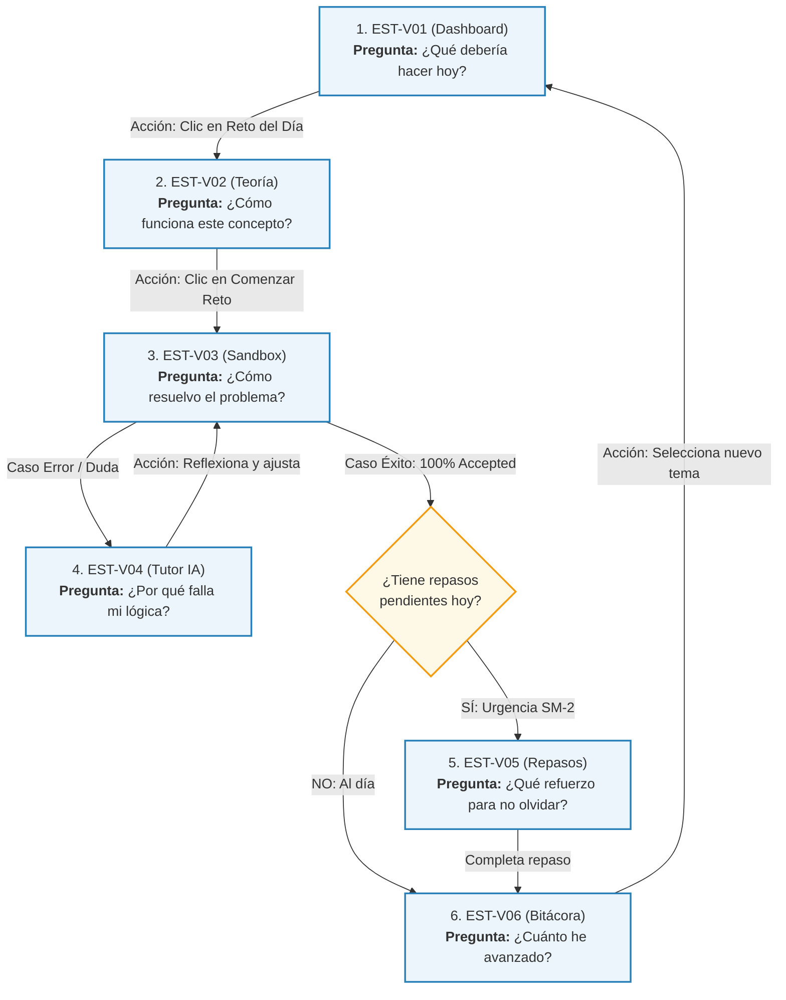

# 🧭 Marco UX + Pedagógico Oficial — STIRE-Soft (v1.0)

> **Documento Maestro de Trazabilidad:** Evidencia Científica $\to$ Principios STIRE $\to$ Decisiones UX $\to$ Decisiones Visuales para Figma.  
> **Fecha de Consolidación:** 2 de septiembre de 2026 | **Versión:** 1.0 Oficial

---

## 1. Cadena de Trazabilidad del Proyecto

Para garantizar rigor académico y claridad en el desarrollo, toda decisión de interfaz en STIRE sigue esta cadena de fundamentación:

```
[ 📚 EVIDENCIA CIENTÍFICA ]  ──►  Lo que indican las investigaciones empíricas.
              ↓
[ 🧩 PRINCIPIO STIRE ]       ──►  La postura pedagógica adoptada por el proyecto.
              ↓
[ 📐 DECISIÓN UX ]           ──►  Cómo se estructura el flujo, la prioridad y la interacción.
              ↓
[ 🎨 DECISIÓN VISUAL ]       ──►  Cómo se representa en Figma y se programa en Vue 3 / Nuxt.
```

---

## 2. Los 10 Principios UX + Pedagógicos de STIRE-Soft

---

### P01 — Orientación y Jerarquía de Acción Inmediata
* **Evidencia Científica:** La Ley de Hick-Hyman y la Teoría de Carga Cognitiva (*Sweller & Robins, 2019*) demuestran que presentar múltiples opciones con igual peso visual incrementa el tiempo de decisión y la fatiga mental inicial.
* **Principio STIRE:** El estudiante debe poder identificar en su panel principal cuál es la acción de aprendizaje más prioritaria en ese momento sin sobrecarga de opciones.
* **Decisión UX:** `EST-V01` presenta una tarjeta Hero destacada con una sola acción recomendada (avanzar en la unidad activa o consolidar conceptos con deuda en SM-2).
* **Decisión Visual (Figma):** Botón primario de gran contraste y tamaño en la tarjeta superior; el resto de acciones (unirse a clase, ver catálogo) se representan con menor jerarquía visual.
* **Estado:** 🟢 **EVIDENCIA + 🟡 PROPUESTA STIRE.**

---

### P02 — Pedagogía del Error Transparente y Formativo
* **Evidencia Científica:** La teoría de retroalimentación formativa (*Hattie & Timperley, 2007; Becker et al., 2021*) demuestra que informar únicamente si una respuesta es correcta/incorrecta genera frustración; el feedback efectivo debe responder a *¿Hacia dónde voy?*, *¿Cómo voy?* y *¿Qué hago ahora?*.
* **Principio STIRE:** Todo error en el Sandbox debe ser una oportunidad diagnóstica que enseñe a depurar sin revelar la solución completa.
* **Decisión UX:** La consola de `EST-V03` desglosa los casos de prueba públicos mostrando entrada, salida esperada, salida obtenida y la diferencia visual (*diff*). Los casos privados permanecen ocultos para evitar la memorización superficial.
* **Decisión Visual (Figma):** Pestañas de consola con doble codificación: icono ✔/✖ + texto descriptivo + resaltado de discrepancias en rojo suave.
* **Estado:** 🟢 **EVIDENCIA.**

---

### P03 — Modelo de Andamiaje Progresivo del Tutor IA
* **Evidencia Científica:** El *Assistance Dilemma* en Sistemas Tutores Inteligentes (*Koedinger & Aleven, 2007; VanLehn, 2011; Chen et al., 2023*) demuestra que dar respuestas directas destruye el aprendizaje profundo, mientras que la falta total de ayuda induce abandono (*wheel-spinning*).
* **Principio STIRE:** La ayuda de la IA se entrega en niveles crecientes de concreción según el bloqueo del estudiante, manteniendo la autoría del alumno sobre el código.
* **Decisión UX:** Operacionalización propuesta por STIRE en 3 niveles:
  * *Nivel 1 (Pista Conceptual):* Recordatorio de la regla teórica o definición.
  * *Nivel 2 (Pregunta Guía):* Pregunta orientadora sobre el comportamiento de variables en casos límite.
  * *Nivel 3 (Localización de la Falla):* Señalamiento del bloque o línea problemática sin escribir el código corregido.
* **Decisión Visual (Figma):** Drawer lateral (no modal bloqueante) con botones de intención rápida (*"Pista conceptual"*, *"Revisar caso borde"*) + campo de consulta libre.
* **Estado:** 🟢 **EVIDENCIA (Andamiaje) + 🟡 PROPUESTA STIRE (Estructura de 3 niveles).**

---

### P04 — Consolidación No Punitiva de la Memoria (SM-2 Humano)
* **Evidencia Científica:** La práctica de recuperación espaciada (*Wozniak & Gorzelanczyk, 2018; Roediger & Karpicke, 2006*) incrementa la retención a largo plazo. Sin embargo, presentar los repasos como "deudas acumuladas" induce ansiedad y evasión (*Deci & Ryan, 2000*).
* **Principio STIRE:** La repetición espaciada debe comunicarse como un refuerzo positivo y preventivo de la memoria, ocultando la complejidad matemática del motor SM-2 al estudiante.
* **Decisión UX:** `EST-V05` oculta variables internas (`easeFactor`, matrices numéricas) y paquetiza los repasos urgentes como una propuesta de *"Sesión de Mantenimiento Corta"* explicada en lenguaje natural (*"Refuerza este concepto en 5 min para asegurar tu retención"*).
* **Decisión Visual (Figma):** Badges de urgencia con doble codificación accesible (Forma + Color + Texto: ⬤ Al día, ▲ Repasar hoy, ■ Crítico) + Botón `[Iniciar Refuerzo]`.
* **Estado:** 🟢 **EVIDENCIA + 🟡 PROPUESTA STIRE (Micro-sesión como hipótesis de prueba).**

---

### P05 — Metacognición Accionable (De la Métrica a la Práctica)
* **Evidencia Científica:** La autorregulación del aprendizaje (*Zimmerman, 2002; Molenaar & Knoop, 2021*) solo se activa si la visualización del propio desempeño va acompañada de mecanismos directos para corregir debilidades.
* **Principio STIRE:** Toda métrica o gráfico de progreso presentado debe permitir al estudiante actuar de inmediato para mejorar su dominio.
* **Decisión UX:** En `EST-V06`, cada barra de tema con bajo dominio (< 50%) incorpora un acceso directo para practicar ejercicios de nivelación de esa unidad temática.
* **Decisión Visual (Figma):** Barras de dominio cualitativas con etiquetas de estado (`no_visto` $\to$ `dominado`) y botón contextual `[🚀 Reforzar este tema]`.
* **Estado:** 🟢 **EVIDENCIA + 🟡 PROPUESTA STIRE.**

---

### P06 — Doble Codificación y Accesibilidad Universal
* **Evidencia Científica:** Las directrices WCAG 2.1 (*Harper & Yesilada, 2020*) exigen que la información visual no dependa exclusivamente del color para transmitir significado, garantizando la inclusión de usuarios con daltonismo o baja visión.
* **Principio STIRE:** Todo estado pedagógico, veredicto o nivel de urgencia debe ser comprensible mediante múltiples canales perceptivos simultáneos.
* **Decisión UX:** Se prohíbe el uso de puntos o círculos de color aislados sin etiqueta textual o icono complementario.
* **Decisión Visual (Figma):** Uso sistemático de la tríada: **Icono + Forma geométrica + Color semántico + Texto explícito**.
* **Estado:** 🟢 **EVIDENCIA.**

---

### P07 — Codificación Dual en la Presentación Conceptual
* **Evidencia Científica:** La Teoría de Codificación Dual (*Paivio, 1986; Sorva & Sirkiä, 2020*) comprueba que coordinar texto explicativo con diagramas espaciales y trazados de memoria dinámicos reduce las concepciones erróneas en programación introductoria.
* **Principio STIRE:** La teoría no debe ser un documento estático; debe combinar texto conciso, esquemas vectoriales y simulación del estado de memoria.
* **Decisión UX:** `EST-V02` estructura la lectura en micro-bloques acompañados de diagramas SVG y una tabla interactiva de trazado de variables paso a paso.
* **Decisión Visual (Figma):** Layout de lectura limpio (~750px ancho) con bloques diferenciados para teoría, código con syntax highlighting y trazador paso a paso.
* **Estado:** 🟢 **EVIDENCIA.**

---

### P08 — Experimentación Segura sin Penalización (Sandbox Amigable)
* **Evidencia Científica:** El miedo a la evaluación punitiva temprana paraliza la exploración en programación novata (*Sweller & Robins, 2019*).
* **Principio STIRE:** El estudiante debe poder experimentar y depurar libremente antes de someter su código a una calificación formal.
* **Decisión UX:** `EST-V03` separa físicamente la acción `[▶ Probar Código]` (ejecución libre contra casos públicos sin consumir intentos) de `[🚀 Entregar Solución]` (evaluación formal que registra el envío).
* **Decisión Visual (Figma):** Botón secundario outline para prueba rápida y botón primario sólido para entrega definitiva.
* **Estado:** 🟢 **EVIDENCIA + 🟡 PROPUESTA STIRE.**

---

### P09 — Asistencia Contextual No Obstructiva
* **Evidencia Científica:** El manejo de múltiples ventanas desarticuladas en entornos de desarrollo (*Split-Attention Effect; Becker et al., 2021*) fragmenta la atención del alumno.
* **Principio STIRE:** El estudiante debe poder recibir ayuda del tutor sin perder la visibilidad de su código ni del enunciado.
* **Decisión UX:** `EST-V04` opera como un Drawer lateral que se despliega sobre el lateral derecho, manteniendo el editor Monaco visible y leyendo automáticamente el código activo sin requerir copy-paste.
* **Decisión Visual (Figma):** Panel lateral de 400px superpuesto con backdrop tenue y botón de colapso rápido `[✕]`.
* **Estado:** 🔵 **INFERENCIA + 🟡 PROPUESTA STIRE.**

---

### P10 — Transición Cualitativa del Dominio Cognitivo
* **Evidencia Científica:** Los marcos de *Mastery Learning* (*Bloom, 1968; Anderson et al., 2020*) demuestran que categorizar el aprendizaje en etapas cualitativas orienta mejor al estudiante que las calificaciones numéricas continuas.
* **Principio STIRE:** El avance se representa mediante estados pedagógicos comprensibles: `no_visto` $\to$ `explorado` $\to$ `en_practica` $\to$ `comprension_parcial` $\to$ `dominado`.
* **Decisión UX:** El progreso en `EST-V01` y `EST-V06` muestra badges de nivel cualitativo con descripciones de lo que falta para alcanzar el siguiente hito.
* **Decisión Visual (Figma):** Indicadores de progreso por etapas con colores graduales y micro-textos explicativos.
* **Estado:** 🟢 **EVIDENCIA.**

---

## 3. Matriz de Decisiones y Grado de Confianza

| ID | Decisión de Diseño | Tipo de Fundamentación | Nivel de Confianza | Acción en el Proyecto |
| :---: | :--- | :---: | :---: | :--- |
| **D01** | Registro simple + Auto-matrícula en Dashboard (`COMP-V00` / `EST-V01`). | 🟡 PROPUESTA STIRE | **Alta** | **Aprobada para Figma:** Reduce fricción inicial. |
| **D02** | Priorización visual dinámica en Dashboard según SM-2 (sin bloqueo forzado). | 🔵 INFERENCIA + 🟡 PROPUESTA | **Media-Alta** | **Aprobada para Figma:** Sugiere enfáticamente el repaso pero respeta la autonomía del alumno. |
| **D03** | Trazado de memoria interactivo recomendado pero no obligatorio (`EST-V02`). | 🟢 EVIDENCIA + 🟡 PROPUESTA | **Alta** | **Aprobada para Figma:** Evita frustración en alumnos con experiencia previa. |
| **D04** | Layout adaptativo con Enunciado colapsable y Consola reactiva (`EST-V03`). | 🟡 PROPUESTA STIRE | **Media** | **Hipótesis para validar en Figma:** Diseñar y probar con resoluciones de 1366x768 y 1920x1080. |
| **D05** | Andamiaje socrático del Tutor en 3 niveles de pistas (`EST-V04`). | 🟢 EVIDENCIA + 🟡 PROPUESTA | **Alta** | **Aprobada como modelo STIRE:** Respaldada en literatura ITS; estructura de 3 niveles sujeta a refinamiento. |
| **D06** | Repasos SM-2 agrupados en propuesta de "Sesión Corta" (`EST-V05`). | 🟡 PROPUESTA STIRE | **Media** | **Hipótesis para pruebas de usuario:** Probar aceptación de sesiones de 3 vs. 5 ejercicios. |
| **D07** | Analítica con botones de refuerzo directo (`EST-V06`). | 🟢 EVIDENCIA + 🟡 PROPUESTA | **Alta** | **Aprobada para Figma:** Vincula diagnóstico metacognitivo con acción inmediata. |

---

## 4. Prueba de Coherencia del Flujo Completo del Estudiante

Sometemos el flujo a la pregunta crítica: **¿El estudiante siempre sabe qué hacer después?**



### ✅ Veredicto de Coherencia:
* **En ningún punto el flujo termina en un "callejón sin salida" (*dead end*).**
* Todo resultado (éxito o error) tiene una acción siguiente clara:
  * Si falla $\to$ Consola orienta el diff $\to$ Tutor ofrece andamiaje $\to$ Vuelve a probar.
  * Si aprueba $\to$ Sistema felicita $\to$ Actualiza maestría $\to$ Invita a repasar o avanzar al siguiente tema.
* **El estudiante siempre tiene visibilidad y control sobre su siguiente paso formativo.**

---

## 5. Orden Oficial de Diseño de Mockups en Figma

Con el marco consolidado y el flujo validado, el orden de construcción en Figma es:

```
Ruta de Maquetación en Figma
├── 1️⃣ EST-V01 (Dashboard)      ──► Establece la navegación, el Hero de acción y el lenguaje visual.
├── 2️⃣ EST-V02 (Unidad Teórica)  ──► Establece el layout de lectura, tipografía y trazado de memoria.
├── 3️⃣ EST-V03 + EST-V04 (Core)  ──► El corazón de STIRE: Editor Monaco, Consola de diffs y Tutor Drawer.
├── 4️⃣ EST-V05 (Repasos SM-2)    ──► Tarjetas de urgencia accesible y sesión de mantenimiento.
├── 5️⃣ EST-V06 (Bitácora)        ──► Gráficos de maestría cualitativa y botones de refuerzo.
└── 6️⃣ COMP-V00 (Autenticación) ──► Tarjeta de acceso y registro (pantalla estándar de soporte).
```
