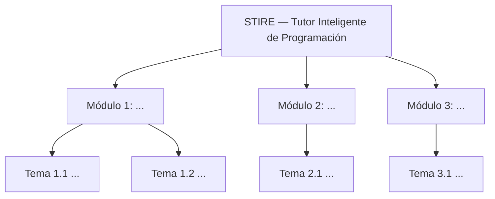
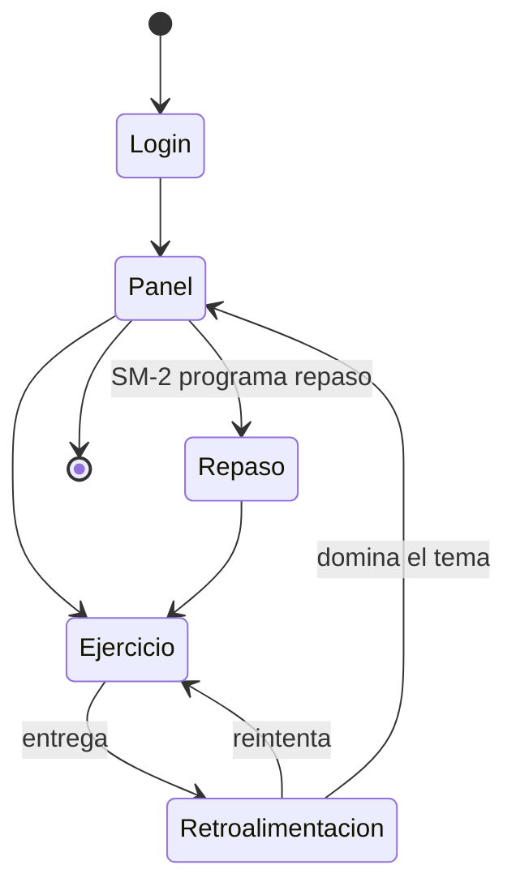

# 📐 PLANTILLAS — MODESEC Fase II (Diseño Multimedial)
**Proyecto:** STIRE-Soft · **Curso:** DDSE3 2026-2 · **Norma:** presentación `DDS3-01.pdf` §3
**Para qué sirve este archivo:** nadie empieza en hoja en blanco. Se copia la plantilla que le toca a
su archivo propio y se rellena. **No se edita este archivo** — es la plantilla maestra.

| § | Pieza | Autor | Archivo destino |
|---|---|---|---|
| 3.1 | Diagrama de Contenidos | Julio | `docs/modesec/contenidos/3.1_DIAGRAMA_CONTENIDOS.md` |
| 3.3 | Ventana Estándar | José | `docs/modesec/ventanas/3.3_VENTANA_ESTANDAR.md` |
| 3.3.1 | Fichas de Descripción de Ventana | José | `docs/modesec/ventanas/3.3.1_FICHAS_VENTANAS.md` |
| 3.3.2 | Guía de Metáforas | Julio | `docs/modesec/contenidos/3.3.2_GUIA_METAFORAS.md` |
| 3.3.3 | Mapa de Navegación | Julio | `docs/modesec/contenidos/3.3.3_MAPA_NAVEGACION.md` |

---

## § 3.1 · Diagrama de Contenidos

> Jerarquía de módulos y temas. **Tres módulos.** Cada tema declara su resultado de aprendizaje.



| Módulo | Tema | Resultado de aprendizaje (verbo observable) | Nivel de dominio esperado |
|---|---|---|---|
| 1. … | 1.1 … | El estudiante *identifica / construye / depura* … | Básico / Intermedio / Avanzado |
| 1. … | 1.2 … | | |
| 2. … | 2.1 … | | |
| 3. … | 3.1 … | | |

**Criterio de calidad:** un resultado de aprendizaje que empiece por "conocer" o "entender" no es
observable y por tanto no es evaluable. Usar verbos que se puedan medir con un ejercicio.

---

## § 3.3 · Ventana Estándar

> Interfaz modelo **explicada sección por sección**. La maqueta sola no cumple: cada sección necesita
> su función pedagógica.

```
┌──────────────────────────────────────────────────────────────┐
│ [A] HEADER — logo, nombre de la unidad, progreso, perfil      │
├───────────────┬──────────────────────────────────────────────┤
│               │                                              │
│ [B] MENÚ      │  [C] ZONA DE CONTENIDO                       │
│  · Módulos    │      enunciado del ejercicio, editor,        │
│  · Progreso   │      retroalimentación del tutor             │
│  · Repaso     │                                              │
│               │                                              │
├───────────────┴──────────────────────────────────────────────┤
│ [D] ZONA DE ACCIONES — ejecutar, entregar, pedir pista        │
├──────────────────────────────────────────────────────────────┤
│ [E] FOOTER — ayuda, créditos, estado de la sesión             │
└──────────────────────────────────────────────────────────────┘
```

| Sección | Elementos que contiene | **Función pedagógica** (por qué está ahí, no cómo se ve) |
|---|---|---|
| [A] Header | | |
| [B] Menú | | |
| [C] Contenido | | |
| [D] Acciones | | |
| [E] Footer | | |

**Criterio de calidad:** si la columna de función pedagógica dice "para que el usuario navegue", está
mal. Debe conectar con el modelo de aprendizaje: dominio, repetición espaciada, retroalimentación,
carga cognitiva.

---

## § 3.3.1 · Ficha de Descripción de Ventana (las 7 categorías)

> **Una ficha por ventana. Mínimo 3 ventanas.** Ninguna de las 7 categorías puede quedar en blanco:
> si no aplica, se escribe "No aplica" **con su justificación**. QA bloquea las fichas incompletas.

### Ficha V-0X · [Nombre de la ventana]

| # | Categoría MODESEC | Descripción |
|---|---|---|
| 1 | **Imagen** | Recursos gráficos: iconografía, ilustraciones, capturas. Formato y propósito |
| 2 | **Nombre de ventana** | Identificador interno y título visible para el estudiante |
| 3 | **Texto** | Contenido textual, tono, extensión y nivel de lectura |
| 4 | **Audio** | Locución, efectos, retroalimentación sonora. Si no aplica: justificar |
| 5 | **Video** | Clips, demostraciones, duración. Si no aplica: justificar |
| 6 | **Animación** | Transiciones, animación de estados, refuerzo visual del progreso |
| 7 | **Acciones del estudiante** | Qué puede hacer aquí y qué ocurre en el sistema con cada acción |

**Ventanas sugeridas inicialmente (SUPERADO — el inventario definitivo son 6 ventanas, V-01 a V-06; ver `3.3.1_FICHAS_VENTANAS.md`):** V-01 Inicio / Panel del estudiante · V-02 Resolución de
ejercicio · V-03 Retroalimentación del tutor · V-04 Repaso espaciado (SM-2) · V-05 Progreso y dominio.

**Enlace con la ingeniería (verifica Jeider):** cada acción de la categoría 7 debe corresponder a una
capacidad real o planificada de la API. Anotar el endpoint entre corchetes, p. ej.
`Entregar solución [POST /submissions/:id/submit]`.

---

## § 3.3.2 · Guía de Metáforas

> Una **metáfora rectora**, no cinco sueltas.

**Metáfora rectora elegida:** [p. ej. "Laboratorio de práctica" / "Expedición" / "Taller del artesano"]
**Justificación pedagógica (anclada en MOCAVI):** [2–4 líneas: por qué esta metáfora favorece el
co-aprendizaje y el trabajo por proyectos con la población objetivo]

| Elemento de la interfaz | Equivalente en la metáfora | Qué comunica al estudiante |
|---|---|---|
| Ejercicio | | |
| Intento fallido | | |
| Retroalimentación del tutor IA | | |
| Nivel de dominio | | |
| Repaso espaciado | | |
| Progreso del módulo | | |

**Consistencia visual derivada:** paleta, iconografía y lenguaje deben salir de la metáfora. Si la
metáfora es un laboratorio y los iconos son de videojuego, la metáfora no está aplicada — está declarada.

---

## § 3.3.3 · Mapa de Navegación



| Origen | Destino | Disparador / condición | ¿Reversible? |
|---|---|---|---|
| | | | |

**Criterio de calidad (QA verifica):**
1. Ninguna ventana sin ruta de entrada.
2. Ninguna ventana sin ruta de salida (nodo huérfano = bloqueo automático).
3. Toda ventana tiene retorno al panel principal.
4. Las condiciones de transición son explícitas, no implícitas.

---

*Plantilla mantenida por el Líder Técnico. Si el docente precisa el formato en clase, se actualiza
aquí primero y se avisa en el grupo.*
