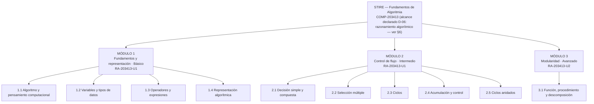

# § 3.1 · Diagrama de Contenidos — STIRE

**Proyecto:** STIRE-Soft · **Curso:** DDSE3 2026-2 · **Norma:** `DDS3-01.pdf` §3.1 · MODESEC §3.1
**Dueño:** Julio · **Estado:** ✅ rederivado de `COMP-203413`, alcance MVP declarado (D-06) ·
**Última actualización:** 2026-09-04

> **Rederivación (FASE CC-05, Paso 2, D-04):** este diagrama se reescribe a partir de
> [`fase1/2.4_SISTEMA_COMPETENCIAS.md`](../fase1/2.4_SISTEMA_COMPETENCIAS.md) — la transcripción
> literal del Plan de Curso `FDOC-088` (Fundamentos de Algoritmia, `203413`). La versión anterior de
> este diagrama cubría pseudocódigo, diagramas de flujo, arreglos y modularidad, sin trazar
> explícitamente con ningún resultado de aprendizaje del Plan de Curso — se reconcilia aquí.
>
> **Actualización D-06 (FASE CC-05B):** la competencia oficial (`COMP-203413`) cubre HTML5, CSS,
> JavaScript y construcción de OVA/REDA en tres unidades; STIRE-Soft, por decisión explícita del
> dueño del proyecto, es una **herramienta de apoyo** que cubre el segmento de razonamiento
> algorítmico y estructuras de control (`U1` + parte algorítmica de `U2`) — no la competencia
> completa. El resto se dicta por otros medios del curso. Ver el detalle en la sección 6.

---

## 1. Representación elegida y por qué

MODESEC §3.1.1 admite tres formas de representar los contenidos: **mentefacto**, **mapa conceptual**
o **mapa mental**. Elegimos **mapa mental radial** porque el contenido de algoritmia es jerárquico y
acumulativo: cada módulo se apoya en el anterior, y el mapa mental muestra esa dependencia de un
vistazo. Un mentefacto habría exigido supraordinadas e infraordinadas que aquí no aportan, y un mapa
conceptual con proposiciones etiquetadas habría duplicado lo que ya dice la tabla de resultados de
aprendizaje.

---

## 2. Diagrama (Gráfico 1)

⚠️ **El SVG/PNG de este gráfico NO se regenera en esta fase (FASE CC-05) — queda pendiente para
FASE CC-06.** La imagen de abajo referencia el archivo anterior a esta rederivación y **ya no
coincide** con la tabla de la sección 4; se mantiene el enlace por continuidad de la carpeta de
`assets/`, no como fuente de verdad. La fuente de verdad hasta CC-06 es el Mermaid y la tabla de
la sección 4.

*Fuente editable (desactualizada): [`assets/3.1_diagrama_contenidos.svg`](../assets/3.1_diagrama_contenidos.svg)*

Versión en Mermaid (se renderiza directamente en GitHub) — vigente

---

## 3. Correspondencia con la estructura de datos de STIRE

| Nivel MODESEC | Nivel en el sistema | Qué se le asigna |
|---|---|---|
| Módulo | Sección / Corte | agrupación curricular |
| Tema | Tema | agrupación conceptual |
| Unidad de aprendizaje | **Unidad de Aprendizaje** | `mastery`, `review_schedule`, historial de progreso |
| — | Contenido teórico y Actividad | material (PDF, video, Markdown) y preguntas |

La **unidad de aprendizaje es el gránulo mínimo evaluable**: es lo que se domina, lo que se repasa
y lo que se desbloquea. Por eso el diagrama llega hasta ese nivel y no se detiene en el tema.

---

## 4. Tabla de contenidos y resultados de aprendizaje

**Cada unidad de aprendizaje cita el RA del que deriva** (columna "RA de origen"), con la página del
Plan de Curso donde ese contenido está listado. Ver
[`fase1/2.4_SISTEMA_COMPETENCIAS.md`](../fase1/2.4_SISTEMA_COMPETENCIAS.md) §4 para el texto
completo de cada RA.

| Módulo | Tema | Unidades de aprendizaje | Resultado de aprendizaje (verbo observable) | Nivel | RA de origen |
|---|---|---|---|---|---|
| **1. Fundamentos y representación** | 1.1 Algoritmo y pensamiento computacional | Noción de algoritmo · Entrada-proceso-salida | **Descompone** un enunciado en entradas, proceso y salidas identificando qué dato produce el resultado | Básico | `RA-203413-U1` — "conceptos básicos: definición de algoritmo, características, tipos" (p. 6) |
| | 1.2 Variables y tipos de datos | Declaración y asignación · Numéricos · Cadenas · Booleanos | **Declara y asigna** variables del tipo correcto, justificando la elección | Básico | `RA-203413-U1` — "variables, constantes, operadores, expresiones" (p. 6) |
| | 1.3 Operadores y expresiones | Aritméticos · Precedencia · Expresiones mixtas | **Evalúa** expresiones respetando la precedencia y **predice** el resultado antes de ejecutar | Básico | `RA-203413-U1` — mismo contenido que 1.2 (p. 6) |
| | 1.4 Representación algorítmica | Pseudocódigo · Diagrama de flujo · Prueba de escritorio | **Representa** un algoritmo en pseudocódigo y lo **verifica** con 3 casos de escritorio | Básico | `RA-203413-U1` — "representación de algoritmos: diagramas de flujo, pseudocódigo" (p. 6) |
| **2. Control de flujo** | 2.1 Decisión simple y compuesta | if / if-else · Relacionales · Lógicos | **Construye** algoritmos que seleccionan entre alternativas excluyentes | Intermedio | `RA-203413-U1` — "estructuras de control: secuencial, condicional, iterativa" (p. 6). ⚠️ **PROPUESTA STIRE:** el Plan de Curso lista esto como un único bullet de contenido para toda la Unidad 1; la separación en 5 sub-temas (2.1-2.5) es una elaboración pedagógica de STIRE, no un desglose que el Plan de Curso haga explícito. |
| | 2.2 Selección múltiple | if anidado · switch | **Reestructura** decisiones anidadas en una selección múltiple equivalente y más legible | Intermedio | ídem — PROPUESTA STIRE (ver 2.1) |
| | 2.3 Ciclos | while · for · do-while | **Diseña** ciclos con condición de corte correcta y **detecta** ciclos infinitos por trazado | Intermedio | ídem — PROPUESTA STIRE (ver 2.1) |
| | 2.4 Acumulación y control | Contadores · Acumuladores · Banderas | **Implementa** contadores y acumuladores para totales, promedios y conteos condicionados | Intermedio | ídem — PROPUESTA STIRE (ver 2.1) |
| | 2.5 Ciclos anidados | Series y tablas · Condición de corte | **Construye** ciclos anidados y **explica** la relación entre iteración externa e interna | Intermedio | ídem — PROPUESTA STIRE (ver 2.1) |
| **3. Modularidad** | 3.1 Función, procedimiento y descomposición | Función y procedimiento · Parámetros y retorno · Descomposición | **Descompone** un problema en funciones de responsabilidad única y **reutiliza** las ya construidas | Avanzado | `RA-203413-U2` — "diseño modular: funciones, procedimientos" (p. 11), dentro de "Diseño de algoritmos" |

**Criterio de calidad aplicado:** ningún resultado empieza por *conocer* o *entender*. Un resultado
que no se puede medir con un ejercicio no puede alimentar el motor de dominio del sistema.

---

## 5. Reglas de progresión (enlace con el motor de dominio)

| Regla | Valor | Dónde vive en el sistema |
|---|---|---|
| Desbloqueo de la siguiente unidad | `mastery ≥ 70 %` | `minMasteryRequired` (grafo de prerrequisitos) |
| Estado **Dominado** | `mastery ≥ 85 %` | `learning_progress.mastery` |
| Tutoría socrática proactiva | `mastery < 60 %` tras 2 intentos | `TutorService` |
| Programación de repaso | SM-2, intervalo con techo de 60 días | `review_schedules.nextReviewDate` |
| Prerrequisito entre módulos | M1 → M2 → M3 secuencial; dentro del módulo orden flexible salvo 2.3 → 2.4 → 2.5 | grafo de prerrequisitos |

⚠️ Estos umbrales son **propuesta de diseño**: requieren validación con el docente titular. No
provienen del Plan de Curso — el Plan de Curso no define umbrales de dominio automatizado, usa la
rúbrica de 5 niveles (Prestructural a Abstracto Ampliado) descrita en
`fase1/2.4_SISTEMA_COMPETENCIAS.md` §4, que no es lo mismo que un porcentaje de `mastery`.

---

## 6. Alcance funcional de STIRE (D-06)

> **Decisión de producto D-06 (dueño del proyecto, FASE CC-05B):** STIRE-Soft es una **herramienta
> de apoyo al docente**, no la plataforma donde se dicta el curso completo. No cubre ni pretende
> cubrir `COMP-203413` entera. Cubre el segmento donde su mecánica — verificación automática de
> código, tutoría socrática, repetición espaciada — aporta valor real: **razonamiento algorítmico y
> estructuras de control**. Esto no es un hueco: es alcance declarado, con su razón, desde antes de
> la sustentación.

### 6.1 Qué cubre STIRE, y por qué la herramienta aporta ahí

- **Razonamiento algorítmico y estructuras de control** (`RA-203413-U1` completo, más la parte
  algorítmica de `U2`: diseño de algoritmos, estructuras de control, diseño modular): definición y
  tipos de algoritmo, estructuras secuencial/condicional/iterativa, representación en pseudocódigo
  y diagrama de flujo, variables/operadores/expresiones, y diseño modular (funciones,
  procedimientos, descomposición). Es exactamente el contenido de la tabla de la sección 4.
  **Por qué STIRE aporta aquí:** un juez automático que ejecuta código y compara la salida contra
  un caso de prueba es una herramienta precisa para verificar lógica — hay una respuesta correcta
  objetivamente comprobable. La tutoría socrática y la repetición espaciada (SM-2) tienen sentido
  sobre este tipo de contenido: se practica, se falla, se repite con espaciamiento creciente, y el
  tutor puede guiar sin entregar la solución porque la solución es verificable automáticamente.

- **Arreglos unidimensionales, recorridos clásicos (búsqueda, máx/mín/promedio, ordenamiento por
  selección), cadenas y arreglos 2D** — el `Judge Engine` los soporta técnicamente (JavaScript
  sobre stdin/stdout admite arreglos y cadenas sin cambios de arquitectura), pero **no aparecen en
  el contenido de ninguna unidad** del Plan de Curso (`U1`, `U2` ni `U3` — ver
  `fase1/2.4_SISTEMA_COMPETENCIAS.md` §4). Quedan fuera de la tabla de la sección 4 por la misma
  razón que el resto de este documento: nada entra sin respaldo del Plan de Curso. Se conserva la
  capacidad técnica para reintroducirlos si en el futuro se justifican como valor de producto —
  nunca como transcripción de una competencia que no los exige.

### 6.2 Qué queda fuera, y por qué se dicta por otros medios

- **HTML5 y CSS (construcción y estilo de páginas web), Unidad 1 y 2** (p. 6-7, 11-12): el Plan de
  Curso evalúa estas unidades mediante la construcción de plantillas y presentaciones HTML5/CSS
  (`RA-203413-U1-E1/E2/E3`, `RA-203413-U2-E1/E2`). Fuera del alcance de STIRE: un juez que ejecuta
  código y compara salida es una herramienta pobre para evaluar marcado o una hoja de estilos — no
  hay una "salida esperada" que comparar, hay criterio visual y semántico. Se dicta por los medios
  habituales del curso (clase magistral, talleres, revisión docente directa).
- **JavaScript orientado al DOM** (manipulación del DOM, eventos de interacción, validación de
  formularios — Unidad 2, p. 12): STIRE ejecuta JavaScript algorítmico (lógica, sin navegador ni
  DOM) en un sandbox aislado sin acceso a `window`/`document`. Fuera del alcance de STIRE por la
  misma razón que el punto anterior: STIRE no es un entorno de navegador, es un evaluador de
  lógica.
- **Unidad 3 completa — Creación de OVA y REDA** (p. 19-21): sus resultados de aprendizaje se
  evalúan por diseño pedagógico, pruebas de usabilidad e informe — un entregable de portafolio, no
  un ejercicio con veredicto automático. El modelo de datos de STIRE (`Activity`,
  `ActivityQuestion`, `Submission`) está diseñado para preguntas evaluables automáticamente, no
  para ese tipo de entrega. Se dicta y se evalúa por el docente, fuera de STIRE.

**Conclusión del alcance:** STIRE-Soft cubre la Unidad 1 completa (la parte algorítmica) y la parte
de diseño modular de la Unidad 2. El resto de la Unidad 2 (HTML5/CSS/DOM) y toda la Unidad 3
(OVA/REDA) se dictan por otros medios del curso — el docente conserva esa parte, que es justamente
lo que el marco MOCAVI plantea sobre mediación docente (ver `MARCO_UX_PEDAGOGICO_STIRE.md`). Esta
tabla, junto con la de trazabilidad (`fase1/TRAZABILIDAD.md`), es la evidencia escrita de ese
alcance — declarado antes de la sustentación, no descubierto en ella.
