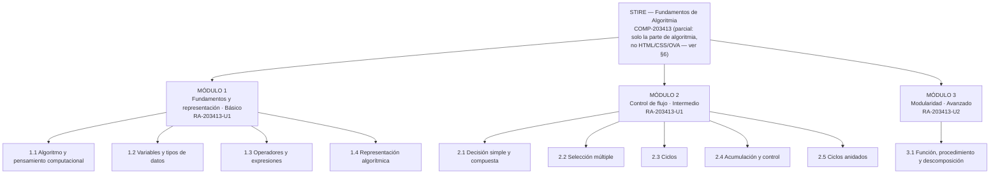

# § 3.1 · Diagrama de Contenidos — STIRE

**Proyecto:** STIRE-Soft · **Curso:** DDSE3 2026-2 · **Norma:** `DDS3-01.pdf` §3.1 · MODESEC §3.1
**Dueño:** Julio · **Estado:** ✅ rederivado de `COMP-203413` (FASE CC-05, Paso 2) · **Última
actualización:** 2026-09-04

> **Rederivación (FASE CC-05, Paso 2, D-04):** este diagrama se reescribe a partir de
> [`fase1/2.4_SISTEMA_COMPETENCIAS.md`](../fase1/2.4_SISTEMA_COMPETENCIAS.md) — la transcripción
> literal del Plan de Curso `FDOC-088` (Fundamentos de Algoritmia, `203413`). La versión anterior de
> este diagrama cubría pseudocódigo, diagramas de flujo, arreglos y modularidad, sin trazar
> explícitamente con ningún resultado de aprendizaje del Plan de Curso — se reconcilia aquí. La
> competencia oficial (`COMP-203413`) cubre HTML5, CSS, JavaScript y construcción de OVA/REDA en
> tres unidades; STIRE-Soft, tal como está construido (`Judge Engine`, sandbox de ejecución de
> código JavaScript vía stdin/stdout), no evalúa páginas HTML/CSS ni construcción de OVA/REDA — solo
> ejercicios de lógica algorítmica. Esa brecha es el hallazgo central de esta rederivación y se
> declara explícitamente en la sección 6, no se disimula.

---

## 1. Representación elegida y por qué

MODESEC §3.1.1 admite tres formas de representar los contenidos: **mentefacto**, **mapa conceptual**
o **mapa mental**. Elegimos **mapa mental radial** porque el contenido de algoritmia es jerárquico y
acumulativo: cada módulo se apoya en el anterior, y el mapa mental muestra esa dependencia de un
vistazo. Un mentefacto habría exigido supraordinadas e infraordinadas que aquí no aportan, y un mapa
conceptual con proposiciones etiquetadas habría duplicado lo que ya dice la tabla de resultados de
aprendizaje.

---

## 2. Diagrama (Gráfico 1)

⚠️ **El SVG/PNG de este gráfico NO se regenera en esta fase (FASE CC-05) — queda pendiente para
FASE CC-06.** La imagen de abajo referencia el archivo anterior a esta rederivación y **ya no
coincide** con la tabla de la sección 4; se mantiene el enlace por continuidad de la carpeta de
`assets/`, no como fuente de verdad. La fuente de verdad hasta CC-06 es el Mermaid y la tabla de
la sección 4.

*Fuente editable (desactualizada): [`assets/3.1_diagrama_contenidos.svg`](../assets/3.1_diagrama_contenidos.svg)*

Versión en Mermaid (se renderiza directamente en GitHub) — vigente

---

## 3. Correspondencia con la estructura de datos de STIRE

| Nivel MODESEC | Nivel en el sistema | Qué se le asigna |
|---|---|---|
| Módulo | Sección / Corte | agrupación curricular |
| Tema | Tema | agrupación conceptual |
| Unidad de aprendizaje | **Unidad de Aprendizaje** | `mastery`, `review_schedule`, historial de progreso |
| — | Contenido teórico y Actividad | material (PDF, video, Markdown) y preguntas |

La **unidad de aprendizaje es el gránulo mínimo evaluable**: es lo que se domina, lo que se repasa
y lo que se desbloquea. Por eso el diagrama llega hasta ese nivel y no se detiene en el tema.

---

## 4. Tabla de contenidos y resultados de aprendizaje

**Cada unidad de aprendizaje cita el RA del que deriva** (columna "RA de origen"), con la página del
Plan de Curso donde ese contenido está listado. Ver
[`fase1/2.4_SISTEMA_COMPETENCIAS.md`](../fase1/2.4_SISTEMA_COMPETENCIAS.md) §4 para el texto
completo de cada RA.

| Módulo | Tema | Unidades de aprendizaje | Resultado de aprendizaje (verbo observable) | Nivel | RA de origen |
|---|---|---|---|---|---|
| **1. Fundamentos y representación** | 1.1 Algoritmo y pensamiento computacional | Noción de algoritmo · Entrada-proceso-salida | **Descompone** un enunciado en entradas, proceso y salidas identificando qué dato produce el resultado | Básico | `RA-203413-U1` — "conceptos básicos: definición de algoritmo, características, tipos" (p. 6) |
| | 1.2 Variables y tipos de datos | Declaración y asignación · Numéricos · Cadenas · Booleanos | **Declara y asigna** variables del tipo correcto, justificando la elección | Básico | `RA-203413-U1` — "variables, constantes, operadores, expresiones" (p. 6) |
| | 1.3 Operadores y expresiones | Aritméticos · Precedencia · Expresiones mixtas | **Evalúa** expresiones respetando la precedencia y **predice** el resultado antes de ejecutar | Básico | `RA-203413-U1` — mismo contenido que 1.2 (p. 6) |
| | 1.4 Representación algorítmica | Pseudocódigo · Diagrama de flujo · Prueba de escritorio | **Representa** un algoritmo en pseudocódigo y lo **verifica** con 3 casos de escritorio | Básico | `RA-203413-U1` — "representación de algoritmos: diagramas de flujo, pseudocódigo" (p. 6) |
| **2. Control de flujo** | 2.1 Decisión simple y compuesta | if / if-else · Relacionales · Lógicos | **Construye** algoritmos que seleccionan entre alternativas excluyentes | Intermedio | `RA-203413-U1` — "estructuras de control: secuencial, condicional, iterativa" (p. 6). ⚠️ **PROPUESTA STIRE:** el Plan de Curso lista esto como un único bullet de contenido para toda la Unidad 1; la separación en 5 sub-temas (2.1-2.5) es una elaboración pedagógica de STIRE, no un desglose que el Plan de Curso haga explícito. |
| | 2.2 Selección múltiple | if anidado · switch | **Reestructura** decisiones anidadas en una selección múltiple equivalente y más legible | Intermedio | ídem — PROPUESTA STIRE (ver 2.1) |
| | 2.3 Ciclos | while · for · do-while | **Diseña** ciclos con condición de corte correcta y **detecta** ciclos infinitos por trazado | Intermedio | ídem — PROPUESTA STIRE (ver 2.1) |
| | 2.4 Acumulación y control | Contadores · Acumuladores · Banderas | **Implementa** contadores y acumuladores para totales, promedios y conteos condicionados | Intermedio | ídem — PROPUESTA STIRE (ver 2.1) |
| | 2.5 Ciclos anidados | Series y tablas · Condición de corte | **Construye** ciclos anidados y **explica** la relación entre iteración externa e interna | Intermedio | ídem — PROPUESTA STIRE (ver 2.1) |
| **3. Modularidad** | 3.1 Función, procedimiento y descomposición | Función y procedimiento · Parámetros y retorno · Descomposición | **Descompone** un problema en funciones de responsabilidad única y **reutiliza** las ya construidas | Avanzado | `RA-203413-U2` — "diseño modular: funciones, procedimientos" (p. 11), dentro de "Diseño de algoritmos" |

**Criterio de calidad aplicado:** ningún resultado empieza por *conocer* o *entender*. Un resultado
que no se puede medir con un ejercicio no puede alimentar el motor de dominio del sistema.

---

## 5. Reglas de progresión (enlace con el motor de dominio)

| Regla | Valor | Dónde vive en el sistema |
|---|---|---|
| Desbloqueo de la siguiente unidad | `mastery ≥ 70 %` | `minMasteryRequired` (grafo de prerrequisitos) |
| Estado **Dominado** | `mastery ≥ 85 %` | `learning_progress.mastery` |
| Tutoría socrática proactiva | `mastery < 60 %` tras 2 intentos | `TutorService` |
| Programación de repaso | SM-2, intervalo con techo de 60 días | `review_schedules.nextReviewDate` |
| Prerrequisito entre módulos | M1 → M2 → M3 secuencial; dentro del módulo orden flexible salvo 2.3 → 2.4 → 2.5 | grafo de prerrequisitos |

⚠️ Estos umbrales son **propuesta de diseño**: requieren validación con el docente titular. No
provienen del Plan de Curso — el Plan de Curso no define umbrales de dominio automatizado, usa la
rúbrica de 5 niveles (Prestructural a Abstracto Ampliado) descrita en
`fase1/2.4_SISTEMA_COMPETENCIAS.md` §4, que no es lo mismo que un porcentaje de `mastery`.

---

## 6. Contenido declarado fuera de alcance en esta versión (con razón)

Esta sección existe porque el Paso 2 de FASE CC-05 exige declarar, no ocultar, lo que no traza.

### 6.1 Contenido que STIRE tenía en versiones previas y el Plan de Curso NO respalda

- **Arreglos unidimensionales, recorridos clásicos (búsqueda, máx/mín/promedio, ordenamiento por
  selección), cadenas y arreglos 2D** — existían como Módulo 3 completo en la versión anterior de
  este diagrama. **No aparecen en el contenido de ninguna unidad** del Plan de Curso (`U1`, `U2` ni
  `U3` — ver `fase1/2.4_SISTEMA_COMPETENCIAS.md` §4). Razón de por qué existían: son contenido de
  programación algorítmica general que el `Judge Engine` de STIRE ya soporta técnicamente
  (JavaScript sobre stdin/stdout admite arreglos y cadenas sin cambios de arquitectura), pero su
  inclusión fue una decisión de diseño de STIRE sin respaldo curricular directo — no una
  transcripción de la competencia oficial. Se retiran de la tabla de la sección 4 (que ahora solo
  contiene contenido trazado); no se borra el conocimiento de que existieron: seguían siendo
  ejercicios técnicamente válidos y podrían reintroducirse en el futuro, pero entonces la
  justificación tendría que ser "es útil para el proyecto" y no "el Plan de Curso lo exige", que es
  la distinción que esta fase exige mantener explícita.

### 6.2 Contenido que el Plan de Curso exige y STIRE NO cubre

- **HTML5 y CSS (construcción y estilo de páginas web), Unidad 1 y 2** (p. 6-7, 11-12): el Plan de
  Curso evalúa la Unidad 1 y gran parte de la Unidad 2 mediante la construcción de plantillas y
  presentaciones HTML5/CSS (`RA-203413-U1-E1/E2/E3`, `RA-203413-U2-E1/E2`). STIRE no tiene ningún
  mecanismo de evaluación de estructura HTML ni de estilos CSS — el `Judge Engine` compara
  `stdout` de un programa contra un valor esperado, no verifica marcado ni presentación visual.
- **JavaScript orientado al DOM** (manipulación del DOM, eventos de interacción, validación de
  formularios — Unidad 2, p. 12): STIRE ejecuta JavaScript algorítmico (lógica, sin navegador ni
  DOM) en un sandbox aislado sin acceso a `window`/`document`. El lenguaje coincide (JavaScript);
  la habilidad evaluada no — DOM/eventos de navegador no son ejecutables en el sandbox actual.
  Esto es una brecha real, no solo documental.
- **Unidad 3 completa — Creación de OVA y REDA** (p. 19-21): ningún resultado de aprendizaje de
  esta unidad tiene equivalente en STIRE. El modelo de datos actual (`Activity`,
  `ActivityQuestion`, `Submission`) está diseñado para preguntas evaluables automáticamente por el
  Judge Engine, no para la entrega de un objeto de aprendizaje completo con diseño pedagógico
  propio, pruebas de usabilidad e informe — sería un tipo de actividad estructuralmente distinto,
  más cercano a un entregable de portafolio que a un ejercicio con veredicto automático. No se
  propone una solución aquí: el hallazgo se registra para que se decida en una fase posterior si
  se construye, se excluye del alcance del proyecto STIRE, o se cubre por otro medio (evaluación
  manual del docente, por ejemplo).

**Conclusión de la reconciliación:** de las tres unidades del Plan de Curso, STIRE-Soft cubre una
fracción real de la Unidad 1 (la parte de "algoritmia" propiamente dicha: definición, estructuras
de control, representación, variables, operadores) y una fracción pequeña de la Unidad 2 (diseño
modular). No cubre la parte de desarrollo web de ninguna de las dos unidades, ni la Unidad 3. Esta
tabla, junto con la de trazabilidad (`fase1/TRAZABILIDAD.md`), es la evidencia de ese alcance real
— no una afirmación de que STIRE cumple la competencia completa.
