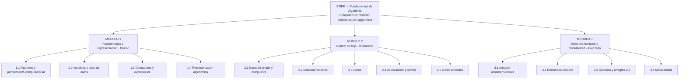

# § 3.1 · Diagrama de Contenidos — STIRE

**Proyecto:** STIRE-Soft · **Curso:** DDSE3 2026-2 · **Norma:** `DDS3-01.pdf` §3.1 · MODESEC §3.1
**Dueño:** Julio · **Estado:** ✅ completo · **Última actualización:** 2026-08-28

> ⚠️ **NOTA DE ALCANCE (D-04, FASE CC-04):** este diagrama queda **pendiente de rederivarse desde
> `COMP-203413` en FASE CC-05**. La rederivación de §3.1 fue explícitamente sacada de alcance de
> FASE CC-04 (documento normativo D-04) — **no se reescribe su contenido en esta fase**, solo se le
> agrega la cabecera de estado de Paso 10. El contenido debajo de esta nota es el que existía antes
> de CC-04 y se mantiene sin cambios hasta que CC-05 lo rederive.

---

## 1. Representación elegida y por qué

MODESEC §3.1.1 admite tres formas de representar los contenidos: **mentefacto**, **mapa conceptual**
o **mapa mental**. Elegimos **mapa mental radial** porque el contenido de algoritmia es jerárquico y
acumulativo: cada módulo se apoya en el anterior, y el mapa mental muestra esa dependencia de un
vistazo. Un mentefacto habría exigido supraordinadas e infraordinadas que aquí no aportan, y un mapa
conceptual con proposiciones etiquetadas habría duplicado lo que ya dice la tabla de resultados de
aprendizaje.

---

## 2. Diagrama (Gráfico 1)

*Fuente editable: [`assets/3.1_diagrama_contenidos.svg`](../assets/3.1_diagrama_contenidos.svg)*

Versión en Mermaid (se renderiza directamente en GitHub)

---

## 3. Correspondencia con la estructura de datos de STIRE

| Nivel MODESEC | Nivel en el sistema | Qué se le asigna |
|---|---|---|
| Módulo | Sección / Corte | agrupación curricular |
| Tema | Tema | agrupación conceptual |
| Unidad de aprendizaje | **Unidad de Aprendizaje** | `mastery`, `review_schedule`, historial de progreso |
| — | Contenido teórico y Actividad | material (PDF, video, Markdown) y preguntas |

La **unidad de aprendizaje es el gránulo mínimo evaluable**: es lo que se domina, lo que se repasa
y lo que se desbloquea. Por eso el diagrama llega hasta ese nivel y no se detiene en el tema.

---

## 4. Tabla de contenidos y resultados de aprendizaje

| Módulo | Tema | Unidades de aprendizaje | Resultado de aprendizaje (verbo observable) | Nivel |
|---|---|---|---|---|
| **1. Fundamentos y representación** | 1.1 Algoritmo y pensamiento computacional | Noción de algoritmo · Entrada-proceso-salida | **Descompone** un enunciado en entradas, proceso y salidas identificando qué dato produce el resultado | Básico |
| | 1.2 Variables y tipos de datos | Declaración y asignación · Numéricos · Cadenas · Booleanos | **Declara y asigna** variables del tipo correcto, justificando la elección | Básico |
| | 1.3 Operadores y expresiones | Aritméticos · Precedencia · Expresiones mixtas | **Evalúa** expresiones respetando la precedencia y **predice** el resultado antes de ejecutar | Básico |
| | 1.4 Representación algorítmica | Pseudocódigo · Diagrama de flujo · Prueba de escritorio | **Representa** un algoritmo en pseudocódigo y lo **verifica** con 3 casos de escritorio | Básico |
| **2. Control de flujo** | 2.1 Decisión simple y compuesta | if / if-else · Relacionales · Lógicos | **Construye** algoritmos que seleccionan entre alternativas excluyentes | Intermedio |
| | 2.2 Selección múltiple | if anidado · switch | **Reestructura** decisiones anidadas en una selección múltiple equivalente y más legible | Intermedio |
| | 2.3 Ciclos | while · for · do-while | **Diseña** ciclos con condición de corte correcta y **detecta** ciclos infinitos por trazado | Intermedio |
| | 2.4 Acumulación y control | Contadores · Acumuladores · Banderas | **Implementa** contadores y acumuladores para totales, promedios y conteos condicionados | Intermedio |
| | 2.5 Ciclos anidados | Series y tablas · Condición de corte | **Construye** ciclos anidados y **explica** la relación entre iteración externa e interna | Intermedio |
| **3. Datos elementales y modularidad** | 3.1 Arreglos unidimensionales | Declaración · Indexación · Carga y despliegue | **Manipula** arreglos accediendo por índice sin desbordar los límites | Avanzado |
| | 3.2 Recorridos clásicos | Búsqueda secuencial · Máx/mín/promedio · Ordenamiento por selección | **Aplica** el recorrido adecuado y **compara** su costo en número de comparaciones | Avanzado |
| | 3.3 Cadenas y arreglos 2D | Recorrido de cadenas · Matriz filas/columnas | **Recorre** estructuras bidimensionales resolviendo conteo y transformación | Avanzado |
| | 3.4 Modularidad | Función y procedimiento · Parámetros y retorno · Descomposición | **Descompone** un problema en funciones de responsabilidad única y **reutiliza** las ya construidas | Avanzado |

**Criterio de calidad aplicado:** ningún resultado empieza por *conocer* o *entender*. Un resultado
que no se puede medir con un ejercicio no puede alimentar el motor de dominio del sistema.

---

## 5. Reglas de progresión (enlace con el motor de dominio)

| Regla | Valor | Dónde vive en el sistema |
|---|---|---|
| Desbloqueo de la siguiente unidad | `mastery ≥ 70 %` | `minMasteryRequired` (grafo de prerrequisitos) |
| Estado **Dominado** | `mastery ≥ 85 %` | `learning_progress.mastery` |
| Tutoría socrática proactiva | `mastery < 60 %` tras 2 intentos | `TutorService` |
| Programación de repaso | SM-2, intervalo con techo de 60 días | `review_schedules.nextReviewDate` |
| Prerrequisito entre módulos | M1 → M2 → M3 secuencial; dentro del módulo orden flexible salvo 2.3 → 2.4 → 2.5 | grafo de prerrequisitos |

⚠️ Estos umbrales son **propuesta de diseño**: requieren validación con el docente titular.

---

## 6. Pendiente conocido

Según MODESEC §2.5, los contenidos deben **derivarse del formato de competencias (Formato 5)** de la
Fase I. Ese formato aún no existe (ver `../01_GAP_Y_PLAN.md`, tarea 1). Al construirlo, este
diagrama debe revisarse y corregirse en lo que no trace. Está registrado como tarea P0.
