# § 3.3.3 · Mapa de Navegación Multi-Rol — STIRE

**Norma:** MODESEC §3.3.3 · **Gráfico 2** (Esquema de navegación) · `DDS3-01.pdf` §3.3.3  
**Autores:** Julio Galvis (Diseño Instruccional), José López (UI/UX), Jeider Gómez (Líder Técnico)  
**Estado:** ⚠️ Códigos de Docente unificados según D-02 (FASE CC-04); DOC-V03 y DOC-V04 pendientes de ventana · **Última actualización:** 2026-09-03

> **Este documento es el NORMATIVO (Gráfico 2 de MODESEC, FASE CC-04, Paso 7).** Cualquier
> diferencia con [`09_MAPA_NAVEGACION.md`](../09_MAPA_NAVEGACION.md) (la traducción a rutas Nuxt,
> que es derivada) se resuelve a favor de este documento — 09 no manda sobre este.

> **Propósito MODESEC:** El mapa de navegación define formalmente las rutas de transición entre pantallas, los disparadores de interacción y la reversibilidad de cada cambio de estado, garantizando que no existan ventanas huérfanas ni caminos ciegos en la plataforma.

---

## 1. Esquema de Navegación Global y por Roles

```mermaid
stateDiagram-v2
    [*] --> COMP_V00 : Arranque de la plataforma
    COMP_V00: COMP-V00 Autenticación y Registro

    state "Rol: Estudiante" as R_EST {
        EST_V01: EST-V01 Inicio (Hub)
        EST_V02: EST-V02 Unidad de Aprendizaje
        EST_V03: EST-V03 Resolución de Ejercicio
        EST_V04: EST-V04 Tutor IA
        EST_V05: EST-V05 Repasos (SM-2)
        EST_V06: EST-V06 Mi Progreso

        EST_V01 --> EST_V02 : Abrir unidad desbloqueada
        EST_V01 --> EST_V03 : Continuar ejercicio en curso
        EST_V01 --> EST_V05 : Atender repasos del día
        EST_V01 --> EST_V06 : Consultar métricas de dominio
        EST_V02 --> EST_V03 : Ir a resolver el problema
        EST_V03 --> EST_V04 : Pedir pista socrática (modal)
        EST_V04 --> EST_V03 : Retornar (borrador intacto)
        EST_V03 --> EST_V05 : Domina unidad → SM-2 programa repaso
        EST_V05 --> EST_V03 : Resolver ejercicio de repaso
        EST_V02 --> EST_V01 : Volver al hub
        EST_V03 --> EST_V01 : Volver al hub (guarda borrador)
        EST_V05 --> EST_V01 : Volver al hub
        EST_V06 --> EST_V01 : Volver al hub
    }

    state "Rol: Docente" as R_DOC {
        DOC_V01: DOC-V01 Mis Clases (Hub)
        DOC_ROSTER: Detalle de Clase (dentro de Mis Clases, sin código propio)
        DOC_V02: DOC-V02 Contenidos y Temas
        DOC_V05: DOC-V05 Detalle de Estudiante
        DOC_V06: DOC-V06 Mensajes

        DOC_V01 --> DOC_ROSTER : Administrar clases y alumnos
        DOC_V01 --> DOC_V02 : Gestionar unidades y teoría
        DOC_V01 --> DOC_V05 : Ver progreso pedagógico
        DOC_V01 --> DOC_V06 : Abrir canal de mensajes
        DOC_ROSTER --> DOC_V05 : Ver ficha de alumno de la clase
        DOC_ROSTER --> DOC_V01 : Retornar al panel
        DOC_V02 --> DOC_V01 : Retornar al panel
        DOC_V05 --> DOC_V01 : Retornar al panel
        DOC_V06 --> DOC_V01 : Retornar al panel
    }

    state "Rol: Administrador" as R_ADM {
        ADM_V01: ADM-V01 Panel de Control (Hub)
        ADM_V02: ADM-V02 Gestión de Usuarios y Roles
        ADM_V03: ADM-V03 Supervisión Global

        ADM_V01 --> ADM_V02 : Gestionar cuentas y roles
        ADM_V01 --> ADM_V03 : Auditar unidades y plataforma
        ADM_V02 --> ADM_V01 : Retornar al panel
        ADM_V03 --> ADM_V01 : Retornar al panel
    }

    COMP_V00 --> EST_V01 : Credenciales de Estudiante
    COMP_V00 --> DOC_V01 : Credenciales de Docente
    COMP_V00 --> ADM_V01 : Credenciales de Administrador

    EST_V01 --> COMP_V00 : Cerrar Sesión
    DOC_V01 --> COMP_V00 : Cerrar Sesión
    ADM_V01 --> COMP_V00 : Cerrar Sesión
```

> **REQUERIDO-PENDIENTE (FASE CC-04, D-02):** `DOC-V03 · Crear Ejercicio` y
> `DOC-V04 · Rendimiento del Grupo` (analítica de cohorte) no tienen ventana ni ficha todavía, por
> lo que no aparecen en este mapa. No se inventan aquí — ver la misma nota en
> [`ventanas/3.3.1_FICHAS_VENTANAS.md`](../ventanas/3.3.1_FICHAS_VENTANAS.md).

---

## 2. Tabla de Transiciones Multi-Rol

| # | Origen | Destino | Disparador / Condición | ¿Reversible? | Efecto en el Sistema |
|---|---|---|---|---|---|
| 1 | — | `COMP-V00` | Arranque de la aplicación en el navegador | — | Carga inicial del estado de autenticación |
| 2 | `COMP-V00` | `EST-V01` | Login exitoso con rol `estudiante` | No (requiere logout) | Emisión y guardado de JWT en cliente |
| 3 | `COMP-V00` | `DOC-V01` | Login exitoso con rol `docente` | No (requiere logout) | Emisión de JWT con privilegios docentes |
| 4 | `COMP-V00` | `ADM-V01` | Login exitoso con rol `admin` | No (requiere logout) | Emisión de JWT con acceso administrativo |
| 5 | `EST-V01` | `EST-V02` | Clic en unidad desbloqueada (`mastery` previo ≥ 70%) | Sí | Estado de la unidad → *Explorado* |
| 6 | `EST-V01` | `EST-V03` | Clic en "Continuar ejercicio" o actividad | Sí | Recupera borrador autoguardado |
| 7 | `EST-V01` | `EST-V05` | Clic en "Repasos de hoy" | Sí | Consulta unidades vencidas en SM-2 |
| 8 | `EST-V01` | `EST-V06` | Clic en "Mi Progreso" | Sí | Carga analítica y métricas de dominio |
| 9 | `EST-V02` | `EST-V03` | Clic en "Ir a resolver el problema" | Sí | Abre entorno de programación |
| 10 | `EST-V03` | `EST-V04` | Clic en "Pedir pista al Tutor" | Sí (modal) | Inyecta código actual como contexto socrático |
| 11 | `EST-V04` | `EST-V03` | Clic en "Volver al ejercicio" | Sí | Conserva el código y borrador intacto |
| 12 | `EST-V03` | `EST-V05` | Entrega evaluada con éxito (`score` ≥ 70) | — | Algoritmo SM-2 programa `nextReviewDate` |
| 13 | `EST-V05` | `EST-V03` | Clic en "Iniciar repaso de unidad" | Sí | Carga ejercicio de refuerzo |
| 14 | `DOC-V01` | Detalle de Clase | Clic en "Gestionar Clases" | Sí | Carga listado de cursos asignados (sub-vista sin código propio, ver ficha DOC-V01) |
| 15 | `DOC-V01` | `DOC-V02` | Clic en "Contenidos y Temas" | Sí | Abre gestor curricular |
| 16 | `DOC-V01` | `DOC-V05` | Clic en "Seguimiento de Estudiantes" | Sí | Lista alumnos matriculados con métricas |
| 17 | `DOC-V01` | `DOC-V06` | Clic en "Mensajes" | Sí | Carga hilos de conversación |
| 18 | Detalle de Clase | `DOC-V05` | Clic en un alumno de la clase | Sí | Muestra detalle individual de mastery |
| 19 | `ADM-V01` | `ADM-V02` | Clic en "Gestión de Usuarios" | Sí | Carga directorio global de cuentas |
| 20 | `ADM-V01` | `ADM-V03` | Clic en "Supervisión Global" | Sí | Abre panel de parámetros del sistema |
| 21 | Cualquier ventana | Hub correspondiente (`V01`) | Clic en el logotipo o botón de inicio | Sí | Guarda estado y vuelve al panel |
| 22 | Hub (`V01`) | `COMP-V00` | Clic en "Cerrar Sesión" | — | Invalida el token JWT local |
| 23 | Cualquier ventana de Estudiante (vía `[B]` Menú) | Flyout de Módulo (overlay, no navega) | Clic en un Módulo del árbol del Menú | Sí (se cierra sin navegar) | Abre lista de unidades de ese módulo con su estado (✔/◐/○/🔒); no cuenta como elemento permanente de `[B]` — es revelación progresiva, resuelve el hallazgo 7±2 de CC-04 |
| 24 | Flyout de Módulo | `EST-V02` | Clic en una unidad **desbloqueada** del flyout (✔, ◐ u ○ — no 🔒) | Sí | Carga esa unidad, sea o no la recomendada por la tarjeta "Continuar donde ibas" de `EST-V01` — cierra la brecha declarada en `MARCO_UX_PEDAGOGICO_STIRE.md` §2.5 (auditoría de 3 clics, FASE CC-04) |
| 25 | Flyout de Módulo | (permanece en el flyout) | Clic en una unidad **bloqueada** (🔒) | — | No navega; muestra el prerrequisito faltante en un tooltip. No es un cambio de pantalla, es informativo |

**Nota de diseño (FASE CC-06, Paso 4):** el Menú `[B]` muestra siempre 6 elementos de nivel superior
(Inicio, 3 Módulos, Repaso de hoy, Mi Progreso) — nunca crece con el número de unidades dentro de un
módulo, a diferencia del patrón de acordeón considerado antes, que en un módulo con 5 sub-temas
(p. ej. "2. Control de flujo") habría vuelto a romper 7±2. La navegación a una unidad específica se
hace siempre a través del flyout de su módulo (filas 23-25).

---

## 3. Reglas de Calidad y Ergonomía Cognitiva

1. **Aislamiento por Rol:** Cada rol cuenta con un punto de entrada unificado (`COMP-V00`) y un panel principal dedicado (`EST-V01`, `DOC-V01`, `ADM-V01`), evitando la saturación cognitiva del usuario con funciones ajenas a su objetivo.
2. **Cero Pantallas Huérfanas:** Todas las vistas secundarias cuentan con un botón de retorno directo a su panel principal en el header.
3. **El Tutor no Rompe el Flujo:** El tutor IA (`EST-V04`) opera como una capa modal sobre el ejercicio, garantizando que el estudiante nunca pierda de vista su código ni deba recargar la pantalla.
4. **Persistencia Transparente:** Las transiciones desde el editor de código guardan automáticamente el borrador en el almacenamiento local o base de datos antes de navegar.
