# 👥 MODESEC — Especificación Funcional por Rol de Usuario

> **Base de Conocimiento de Usuario para Diseño en Figma, Implementación Nuxt 3 y Validación Backend.**  
> **Nomenclatura y Marco UX:** Sincronizados con [NAMING_STIRE.md](../NAMING_STIRE.md) y [MARCO_UX_PEDAGOGICO_STIRE.md](../MARCO_UX_PEDAGOGICO_STIRE.md)  
> **Fecha:** 2 de septiembre de 2026 | **Versión:** 2.0 Multi-Rol

---

## 1. Propósito de este Directorio

Este directorio consolida los **insumos maestros por tipo de usuario** para que el equipo técnico pueda transicionar de forma directa entre:

$$\text{Requisitos (MODESEC)} \longrightarrow \text{Diseño (Figma)} \longrightarrow \text{Frontend (Vue 3 / Nuxt)} \longrightarrow \text{Backend (NestJS)} \longrightarrow \text{Pruebas}$$

Cada subcarpeta contiene la especificación completa, trazable y libre de ambigüedades para cada actor del sistema:

* [`estudiante/README.md`](./estudiante/README.md): Ciclo de aprendizaje adaptativo, lecciones, editor de código con sandbox, tutor IA socrático, repasos SM-2 y progreso (`COMP-V00`, `EST-V01` a `EST-V06`).
* [`docente/README.md`](./docente/README.md): Gestión de aulas y cohortes, gestor curricular de contenidos y temas, diseñador de ejercicios con casos de prueba, rendimiento del grupo y detalle individual (`DOC-V01` a `DOC-V05`).
* [`administrador/README.md`](./administrador/README.md): Estado del sistema, gestión de usuarios y roles, y logs de mantenimiento (`ADM-V01` a `ADM-V03`).

---

## 2. Documentación Compartida (Fuentes Globales de Verdad)

Para evitar duplicación y discrepancias, los siguientes aspectos transversales se mantienen centralizados en los documentos maestros de `docs/modesec/` y `docs/`:

| Aspecto Transversal | Documento de Referencia | Contenido Clave |
| :--- | :--- | :--- |
| **Marco UX + Pedagógico** | [`docs/modesec/MARCO_UX_PEDAGOGICO_STIRE.md`](../MARCO_UX_PEDAGOGICO_STIRE.md) | 10 Principios Rectores P01–P10, trazabilidad científica y flujo coherente. |
| **Nomenclatura Oficial** | [`docs/modesec/NAMING_STIRE.md`](../NAMING_STIRE.md) | Guía de lenguaje, microcopy UX y separación en 3 capas. |
| **Arquitectura Global** | [`docs/01_ARQUITECTURA_Y_DISENO.md`](../../01_ARQUITECTURA_Y_DISENO.md) | Módulos DDD, eventos de dominio, ADR 01 a ADR 08. |
| **Mapa Funcional** | [`docs/modesec/00_MAPA_FUNCIONAL_STIRE.md`](../00_MAPA_FUNCIONAL_STIRE.md) | Pilares del sistema, actores y ciclo conceptual. |
| **Catálogo de APIs** | [`docs/modesec/02_CATALOGO_ENDPOINTS.md`](../02_CATALOGO_ENDPOINTS.md) | Matriz completa de rutas HTTP, métodos y parámetros. |
| **Seguridad y Permisos** | [`docs/modesec/04_MATRIZ_PERMISOS.md`](../04_MATRIZ_PERMISOS.md) | Políticas RBAC y aislamiento de objetos (BOLA). |
| **Estructura de UI Base** | [`docs/modesec/ventanas/3.3_VENTANA_ESTANDAR.md`](../ventanas/3.3_VENTANA_ESTANDAR.md) | Zonas A–E, navegación, barra de estado y tipografía. |
| **Sitemap y Guardias** | [`docs/modesec/09_MAPA_NAVEGACION.md`](../09_MAPA_NAVEGACION.md) | Rutas Nuxt y middlewares de navegación por rol. |
| **Componentes Base** | [`docs/modesec/11_COMPONENTES_REUTILIZABLES.md`](../11_COMPONENTES_REUTILIZABLES.md) | Catálogo de componentes Vue 3 reutilizables. |

---

## 3. Matriz General de Pantallas por Actor (Nombres Visibles Oficiales)

```mermaid
graph TD
    classDef common fill:#FADBD8,stroke:#E74C3C,stroke-width:2px,color:#78281F;
    classDef student fill:#D4E6F1,stroke:#2980B9,stroke-width:2px,color:#1B4F72;
    classDef teacher fill:#D5F5E3,stroke:#27AE60,stroke-width:2px,color:#145A32;
    classDef admin fill:#FCF3CF,stroke:#F39C12,stroke-width:2px,color:#7E5109;

    V00["COMP-V00: Iniciar Sesión / Registro"]:::common

    subgraph Estudiante["🎓 Flujo Estudiante"]
        E1["EST-V01: Inicio (Dashboard)"]:::student
        E2["EST-V02: Lección (Teoría)"]:::student
        E3["EST-V03: Práctica (Sandbox)"]:::student
        E4["EST-V04: Tutor IA"]:::student
        E5["EST-V05: Repasos"]:::student
        E6["EST-V06: Mi Progreso"]:::student
    end

    subgraph Docente["👨‍🏫 Flujo Docente"]
        D1["DOC-V01: Mis Clases"]:::teacher
        D2["DOC-V02: Contenidos y Temas"]:::teacher
        D3["DOC-V03: Crear Ejercicio"]:::teacher
        D4["DOC-V04: Rendimiento del Grupo"]:::teacher
        D5["DOC-V05: Detalle de Estudiante"]:::teacher
    end

    subgraph Administrador["🛡️ Flujo Administrador"]
        A1["ADM-V01: Estado del Sistema"]:::admin
        A2["ADM-V02: Usuarios y Roles"]:::admin
        A3["ADM-V03: Logs y Mantenimiento"]:::admin
    end

    V00 -->|Rol estudiante| E1
    V00 -->|Rol docente| D1
    V00 -->|Rol admin| A1
```

