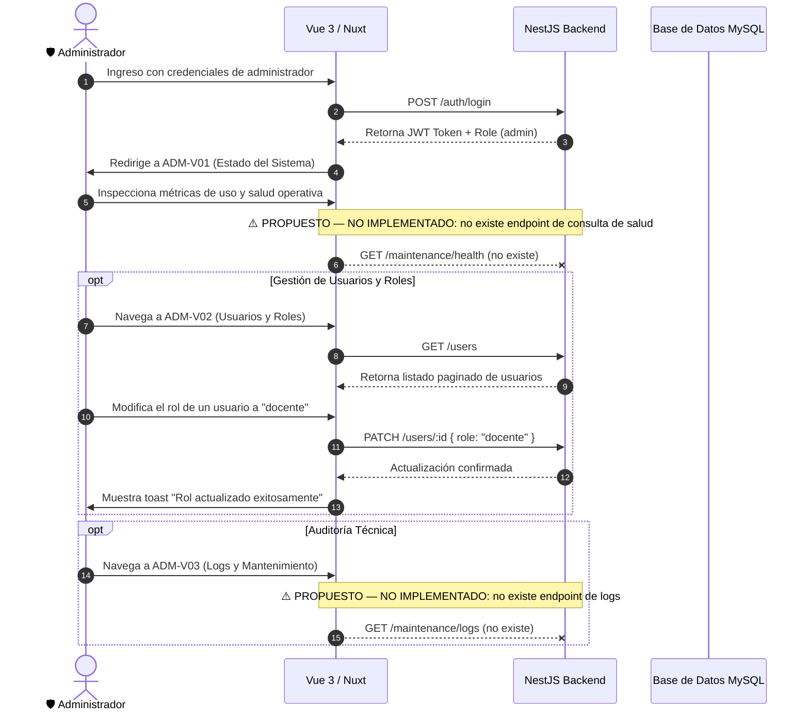

# 🛡️ MODESEC — Insumo Maestro: Rol Administrador

> **Documento de Especificación para Diseño en Figma, Implementación Nuxt 3 y Validación Backend.**  
> **Actor:** Administrador (`role: 'admin'`) | **Vistas Asociadas:** `ADM-V01` a `ADM-V03`
> ⚠️ **`ADM-V01` y `ADM-V03` son REQUERIDO — PENDIENTE DE BACKEND (D-03, FASE CC-04):** el
> endpoint `GET /maintenance` que documenta esta ficha para ambas **no existe** — el único
> endpoint real de `MaintenanceController` es `POST /maintenance/cleanup`. No se construye backend
> nuevo en esta fase; la especificación de diseño se conserva para cuando se implemente.
> **Nomenclatura Oficial:** Estandarizada según [NAMING_STIRE.md](../../NAMING_STIRE.md)  
> **Fecha de Actualización:** 2 de septiembre de 2026 | **Versión:** 2.0 Multi-Rol

---

## 1. Perfil y Objetivos del Administrador

### 1.1 Misión y Propósito Institucional
El administrador es el responsable de la gobernanza, supervisión técnica y estabilidad operativa de STIRE-Soft. Su labor garantiza que los usuarios cuenten con los roles y permisos apropiados, que los servicios del sandbox y la base de datos operen con latencias seguras, y que se registren debidamente los eventos de auditoría y seguridad.

### 1.2 Responsabilidades
* Gestionar el ciclo de vida de los usuarios (altas, bajas lógicas, asignación y revocación de roles).
* Supervisar la salud de la infraestructura en tiempo real (consumo de memoria del sandbox, estado de la base de datos).
* Auditar los registros de actividad técnica y anomalías de seguridad.

### 1.3 Matriz de Permisos (RBAC)
* **Permitido:** Supervisión global irrestricta. Listar todos los usuarios (`GET /users`), actualizar roles y estados (`PATCH /users/:id`), ver todas las clases y contenidos del sistema. Consultar métricas técnicas y de mantenimiento: ⚠️ PROPUESTO — NO IMPLEMENTADO (no existe endpoint de consulta; solo `POST /maintenance/cleanup`, una acción, no una consulta de estado).
* **Restricciones:** No interviene en la resolución de ejercicios como estudiante ni altera calificaciones pedagógicas individuales sin trazabilidad.

---

## 2. Flujo Principal del Administrador (User Journey)

---

## 3. Especificación Detallada de Pantallas

### `ADM-V01` · Panel de Control y Salud del Sistema *(Nombre visible en UI: Estado del Sistema)* — ⚠️ REQUERIDO — PENDIENTE DE BACKEND (D-03)
* **Ruta Nuxt:** `/admin/dashboard`
* **Layout:** `layouts/admin.vue`
* **Objetivo:** Ofrecer una vista panorámica del volumen de uso, usuarios registrados y disponibilidad técnica de STIRE.
* **Información Visual Requerida:**
  * Tarjetas KPI: Total de Usuarios (desglosado por Estudiantes y Docentes), Total de Clases Activas, Total de Ejecuciones en Sandbox Hoy.
  * Tarjeta de Estado del Servidor: Uptime, estado de conexión a MySQL, modo de Sandbox activo (`HardenedProcessSandboxAdapter`).
* **Acciones Principales:** `[Actualizar métricas]`, `[Ir a gestión de usuarios]`, `[Ver logs de sistema]`.
* **Endpoints Backend:** ⚠️ PROPUESTO — NO IMPLEMENTADO. No existe endpoint de consulta de salud/métricas; el único endpoint real de `MaintenanceController` es `POST /maintenance/cleanup` (una acción de limpieza, no una consulta de estado).
* **Componentes Vue:** `KpiGrid.vue`, `ServiceHealthCard.vue`, `RecentActivitySummary.vue`.

---

### `ADM-V02` · Directorio y Gestión de Usuarios *(Nombre visible en UI: Usuarios y Roles)*
* **Ruta Nuxt:** `/admin/usuarios`
* **Layout:** `layouts/admin.vue`
* **Objetivo:** Directorio centralizado para buscar usuarios, asignar roles y controlar el estado de acceso.
* **Información Visual Requerida:**
  * Tabla Paginada de Usuarios: Nombre Completo, Correo Institucional, Rol Actual (`estudiante`, `docente`, `admin`), Estado (`Activo` / `Inactivo`), Fecha de Registro.
  * Barra de búsqueda por nombre o correo y filtro rápido por rol.
  * Modal de Edición de Usuario: Selector de Rol y conmutador de estado de cuenta.
* **Acciones Principales:** `[Filtrar por rol]`, `[Cambiar rol de usuario]`, `[Activar / Desactivar cuenta]`, `[Buscar usuario]`.
* **Endpoints Backend:** `GET /users`, `PATCH /users/:id`.
* **Estados de Interfaz:**
  * *Confirmación:* Modal con advertencia de seguridad al asignar permisos de `admin`.
* **Componentes Vue:** `UsersTable.vue`, `ChangeRoleModal.vue`, `UserStatusToggle.vue`, `UserSearchInput.vue`.

---

### `ADM-V03` · Auditoría Técnica y Parámetros *(Nombre visible en UI: Logs y Mantenimiento)* — ⚠️ REQUERIDO — PENDIENTE DE BACKEND (D-03)
* **Ruta Nuxt:** `/admin/sistema`
* **Layout:** `layouts/admin.vue`
* **Objetivo:** Monitorear logs de eventos técnicos, parámetros de configuración y límites del entorno seguro.
* **Información Visual Requerida:**
  * Visor de Logs con scroll infinito o paginación: Timestamp, Nivel (`INFO`, `WARN`, `ERROR`), Módulo emisor, Mensaje.
  * Resumen de Parámetros Globales: Límites del Sandbox (Timeout: 2000 ms, Memoria Heap: 128 MB), Throttle global (100 req/min), Throttle del Tutor (20 req/min).
* **Acciones Principales:** `[Filtrar logs por nivel]`, `[Descargar registro de logs]`, `[Verificar estado de servicios]`.
* **Endpoints Backend:** ⚠️ PROPUESTO — NO IMPLEMENTADO. No existe endpoint de consulta de logs; el único endpoint real de `MaintenanceController` es `POST /maintenance/cleanup`.
* **Componentes Vue:** `SystemLogsViewer.vue`, `SandboxConfigCard.vue`, `LogLevelFilter.vue`.

---

## 4. Criterios de Aceptación para Testing / QA

1. **Restricción de Acceso Estricta:** Cualquier petición a `/admin/*` sin un token JWT que contenga `role: 'admin'` debe ser rechazada inmediatamente por el middleware de Nuxt y por el `RolesGuard` de NestJS (`403 Forbidden`).
2. **Persistencia de Roles en ADM-V02:** Al modificar el rol de un usuario de `estudiante` a `docente` mediante `PATCH /users/:id`, la respuesta debe retornar el usuario con el nuevo rol y sus próximos inicios de sesión deben redirigir a `/docente/dashboard`.
3. **Manejo Seguro de Errores en Logs:** Ningún log expuesto en `ADM-V03` debe revelar variables sensibles de entorno (`OPENAI_API_KEY`, `JWT_SECRET`, contraseñas en texto plano).
