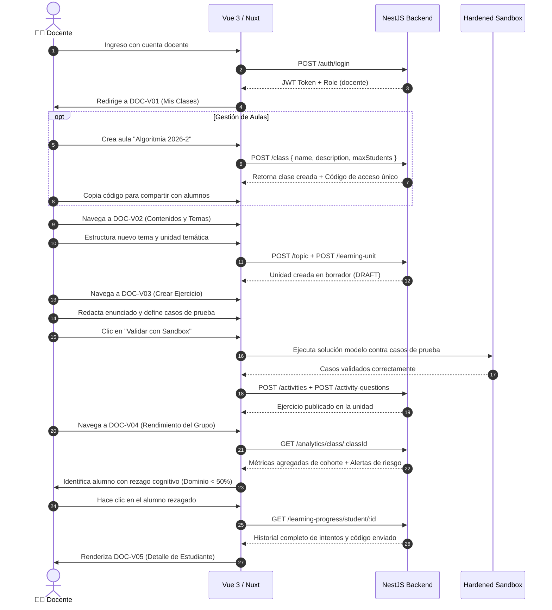

# 👨‍🏫 MODESEC — Insumo Maestro: Rol Docente

> **Documento de Especificación para Diseño en Figma, Implementación Nuxt 3 y Validación Backend.**  
> **Actor:** Docente (`role: 'docente'`) | **Vistas Asociadas:** `DOC-V01` a `DOC-V05`  
> **Nomenclatura Oficial:** Estandarizada según [NAMING_STIRE.md](../../NAMING_STIRE.md)  
> **Fecha de Actualización:** 2 de septiembre de 2026 | **Versión:** 2.0 Multi-Rol

---

## 1. Perfil y Objetivos del Docente

### 1.1 Misión y Propósito Pedagógico
El docente es el diseñador curricular y facilitador del proceso de enseñanza en STIRE-Soft. Su misión es estructurar las asignaturas en módulos, temas y unidades de aprendizaje, diseñar bancos de problemas con rúbricas y casos de prueba automatizados, y supervisar el avance cognitivo de sus cohortes mediante analíticas de riesgo que le permitan intervenir a tiempo ante rezagos académicos.

### 1.2 Responsabilidades
* Crear y gestionar las clases/aulas virtuales y distribuir los códigos de acceso a los estudiantes.
* Estructurar el árbol curricular (Módulos $\to$ Temas $\to$ Unidades de Aprendizaje).
* Redactar enunciados de problemas y configurar casos de prueba públicos y privados para el Sandbox.
* Supervisar la analítica agregada de la cohorte y detectar estudiantes en riesgo de reprobación.
* Realizar seguimiento forense individual al código y los intentos de cada estudiante.

### 1.3 Matriz de Permisos (RBAC & BOLA)
* **Permitido:** Crear y actualizar sus propias clases (`POST /class`, `PATCH /class/:id`), consultar alumnos de su clase (`GET /enrollment/class/:classId`), gestionar tópicos y unidades (`POST /topic`, `POST /learning-unit`, `PATCH /learning-unit/:id`), crear actividades y preguntas (`POST /activities`, `POST /activity-questions`), consultar analíticas de sus cohortes (`GET /analytics/class/:classId`) y progreso de sus alumnos matriculados (`GET /learning-progress/student/:id`).
* **Restringido (Bloqueo 403 Forbidden):** Matricularse como estudiante en una clase, modificar clases de otros docentes, consultar métricas de estudiantes no vinculados a sus aulas, o alterar roles de usuarios.

---

## 2. Flujo Principal del Docente (User Journey)

---

## 3. Especificación Detallada de Pantallas

### `DOC-V01` · Panel de Gestión de Clases *(Nombre visible en UI: Mis Clases)*
* **Ruta Nuxt:** `/docente/dashboard` o `/docente/clases`
* **Layout:** `layouts/teacher.vue`
* **Objetivo:** Administrar las aulas vigentes, crear nuevas cohortes y acceder a las métricas del grupo.
* **Información Visual Requerida:**
  * Tarjetas de clases con: Nombre, código de acceso alfanumérico, total de alumnos inscritos, promedio de dominio de la cohorte.
  * Botón para crear nueva clase.
  * Modal de creación: Nombre, descripción, fecha límite, capacidad máxima.
* **Acciones Principales:** `[Crear clase]`, `[Copiar código de acceso]`, `[Ver rendimiento del grupo]`, `[Editar información]`, `[Archivar]`.
* **Endpoints Backend:** `GET /class/my-classes`, `POST /class`, `PATCH /class/:id`.
* **Estados de Interfaz:**
  * *Vacío:* "Aún no has creado ninguna clase. Comienza creando tu primera aula virtual [Crear clase]".
  * *Carga:* Skeletons de tarjetas de aula.
* **Componentes Vue:** `ClassCardGrid.vue`, `CreateClassModal.vue`, `CopyAccessCodeButton.vue`.

---

### `DOC-V02` · Gestor Curricular de Unidades *(Nombre visible en UI: Contenidos y Temas)*
* **Ruta Nuxt:** `/docente/contenidos`
* **Layout:** `layouts/teacher.vue`
* **Objetivo:** Organizar la jerarquía pedagógica (Módulos $\to$ Temas $\to$ Unidades) y controlar la publicación de contenidos.
* **Información Visual Requerida:**
  * Árbol desplegable interactivo: Módulos con temas anidados y unidades asociadas.
  * Indicador de estado por unidad: `Borrador (DRAFT)` o `Publicado (PUBLISHED)`.
  * Formulario / Modal para crear o editar Unidades de Aprendizaje (Título, descripción, nivel de dificultad, orden).
* **Acciones Principales:** `[Crear tema]`, `[Crear unidad]`, `[Publicar / Guardar borrador]`, `[Editar contenido Markdown]`, `[Eliminar]`.
* **Endpoints Backend:** `GET /topic`, `POST /topic`, `POST /learning-unit`, `PATCH /learning-unit/:id`.
* **Estados de Interfaz:**
  * *Actualización Exitosa:* Toast flotante "Unidad publicada exitosamente".
* **Componentes Vue:** `TopicTreeAccordion.vue`, `LearningUnitRow.vue`, `PublishToggle.vue`, `UnitEditModal.vue`.

---

### `DOC-V03` · Diseñador de Ejercicios y Casos de Prueba *(Nombre visible en UI: Crear Ejercicio)*
* **Ruta Nuxt:** `/docente/ejercicios/crear` (y `/docente/ejercicios/:id/editar`)
* **Layout:** `layouts/teacher.vue`
* **Objetivo:** Crear problemas de programación con rúbricas de evaluación y casos de prueba para el Sandbox.
* **Información Visual Requerida:**
  * Formulario de actividad: Título, unidad temática asociada, dificultad, puntaje máximo, intentos permitidos.
  * Enunciado en Markdown con previsualización en vivo.
  * Editor de código con solución de referencia (para comprobación previa).
  * Tabla de Casos de Prueba:
    * Columna Entrada (`stdin`), Salida Esperada (`stdout`), Peso de puntaje, Conmutador `Es Privado (Oculto)`.
    * Botón "Agregar caso de prueba".
  * Consola de Prueba Sandbox: Botón "Validar solución docente" para confirmar que la solución propuesta pasa el 100% de los casos.
* **Acciones Principales:** `[Agregar caso de prueba]`, `[Ejecutar verificación en Sandbox]`, `[Guardar ejercicio]`.
* **Endpoints Backend:** `POST /activities`, `POST /activity-questions`.
* **Componentes Vue:** `ExerciseForm.vue`, `TestCasesEditorTable.vue`, `SandboxTestButton.vue`, `MarkdownLivePreview.vue`.

---

### `DOC-V04` · Analítica de Cohorte y Alertas *(Nombre visible en UI: Rendimiento del Grupo)*
* **Ruta Nuxt:** `/docente/clase/:id/analitica`
* **Layout:** `layouts/teacher.vue`
* **Objetivo:** Visualizar el rendimiento grupal de una clase, identificar alumnos rezagados y consultar el roster.
* **Información Visual Requerida:**
  * Tarjetas KPI: Promedio de Dominio de la Clase, Tasa de Aprobación Global, Alumnos en Riesgo Crítico.
  * Tabla de Roster / Estudiantes Matriculados:
    * Nombre, Correo, Dominio Acumulado %, Total de Envíos, Última Actividad, Badge de Estado (`Normal` / `Rezago`).
  * Filtro rápido: "Ver solo alumnos con Dominio < 50%".
* **Acciones Principales:** `[Filtrar por riesgo]`, `[Ver detalle de estudiante]`, `[Exportar reporte CSV]`.
* **Endpoints Backend:** `GET /analytics/class/:id`, `GET /enrollment/class/:id`.
* **Componentes Vue:** `CohortMetricsCard.vue`, `StudentRankingsTable.vue`, `RiskAlertBadge.vue`, `ExportReportButton.vue`.

---

### `DOC-V05` · Seguimiento Individual de Estudiante *(Nombre visible en UI: Detalle de Estudiante)*
* **Ruta Nuxt:** `/docente/estudiante/:id`
* **Layout:** `layouts/teacher.vue`
* **Objetivo:** Inspeccionar el desempeño detallado de un alumno particular para asesorías y retroalimentación personalizada.
* **Información Visual Requerida:**
  * Cabecera con datos del estudiante y clase compartida.
  * Gráfico de dominio por unidad temática.
  * Tabla de Historial de Envíos con visor de código enviado (inspección de sintaxis y errores del compilador).
  * Registro de actividad en repasos SM-2.
* **Acciones Principales:** `[Inspeccionar código de entrega]`, `[Ver evolución SM-2]`, `[Volver a Rendimiento del Grupo]`.
* **Endpoints Backend:** `GET /learning-progress/student/:id`, `GET /analytics/student/:id`.
* **Componentes Vue:** `StudentDetailCard.vue`, `SubmissionCodeInspector.vue`, `MasteryBarChart.vue`.

---

## 4. Criterios de Aceptación para Testing / QA

1. **Aislamiento de Clases:** Un docente no puede editar ni consultar analíticas de clases creadas por otros docentes (`403 Forbidden` garantizado por `AuthorizationService`).
2. **Validación de Casos de Prueba en DOC-V03:** No se debe permitir publicar una actividad de programación sin al menos un caso de prueba público y un caso de prueba privado.
3. **Cómputo de Alertas en DOC-V04:** Todo estudiante matriculado en la clase con un promedio de dominio inferior a 50% debe recibir de forma automática la marca visual `RiskAlertBadge` ("Alerta Cognitiva").
4. **Visor de Código en DOC-V05:** El inspector de código debe renderizar exactamente el string entregado por el estudiante en su último envío con resaltado de sintaxis y formato seguro anti-XSS.
